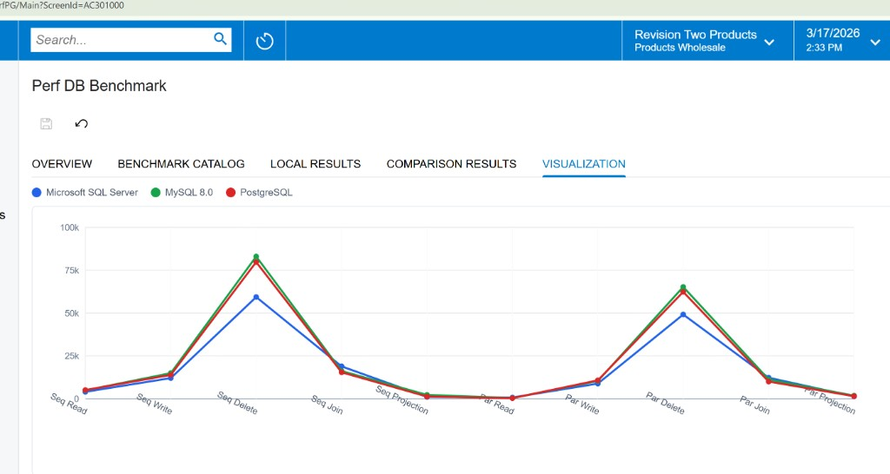
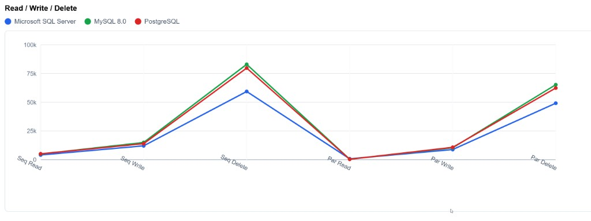
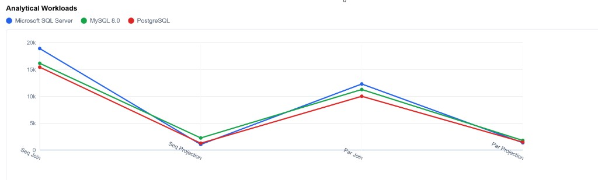
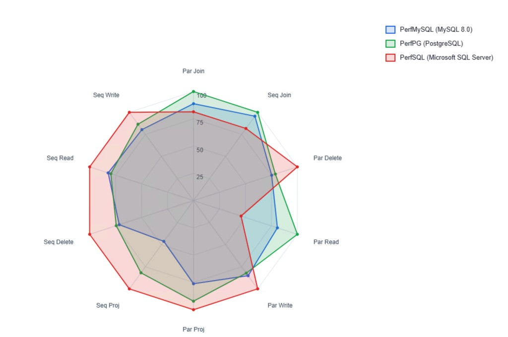

# PerfDBBenchmark

`PerfDBBenchmark` is a DLL-based Acumatica 2026 R1 benchmark customization for comparing database behavior across PostgreSQL, MySQL 8.0, and Microsoft SQL Server by running the same Acumatica workloads on each instance.

Created by AcuPower LTD for performance analysis. Company website: [acupowererp.com](https://acupowererp.com)

## Benchmark Results

### All Operations Overview



Elapsed time (ms) across all 10 benchmark categories for all three databases. The two prominent peaks correspond to Delete operations, which are consistently the most expensive across every engine. SQL Server (blue) tends to sit below MySQL and PostgreSQL on Delete-heavy workloads, while Read and Projection operations cluster tightly for all three engines.

### Read / Write / Delete



A focused view of the six CRUD benchmarks (sequential and parallel Read, Write, Delete). Read operations are nearly identical across engines. Write operations show moderate separation, with SQL Server completing slightly faster. Delete operations reveal the largest gap: MySQL and PostgreSQL reach 80-85k ms while SQL Server stays around 50-60k ms for the same record count and iteration settings.

### Analytical Workloads (Complex BQL Join and PXProjection)



Zoomed into the analytical benchmark categories: Sequential Join, Sequential Projection, Parallel Join, and Parallel Projection. SQL Server (blue) shows higher elapsed time on the Join benchmarks, while PostgreSQL (red) is consistently the fastest on Projection queries. Sequential Projection times are very close across all three engines, suggesting the database optimizer produces similar plans for the flattened projection view.

### Spider Chart (Normalized Comparison)



A radar chart normalizing every benchmark category to a 0-100 scale so the overall performance "shape" of each database is visible at a glance. A larger footprint means more time consumed. SQL Server (red) extends outward on Write and Delete axes, while PostgreSQL (green) and MySQL (blue) trade advantages depending on the operation type.

## What It Includes

- Screen `AC301000` with responsive tabs, charts, result highlighting, hardware-based recommendations, and current database detection.
- Benchmarks for sequential read, sequential write, sequential delete, parallel read, parallel write, parallel delete, complex FBQL joins, and `PXProjection` analysis.
- Cross-instance comparison snapshots written to `App_Data\PerfDBBenchmark`.
- A precompiled `.NET Framework 4.8` DLL that uses modern C# features so the customization is intended to be deployed as a compiled assembly, not runtime-compiled inside Acumatica.
- A built-in access-rights bootstrap for `AC301000` that copies `RolesInGraph` entries from a stock Acumatica screen at runtime, so the screen permissions are delivered by the customization DLL itself instead of a separate SQL script.

## FBQL Queries and Tables

All benchmarks use Acumatica Fluent BQL (FBQL) through `SelectFrom<>` syntax. The queries exercise both custom benchmark tables and stock Acumatica Inventory tables, covering single-table CRUD, multi-table analytical joins, and read-only projected views.

### Custom Benchmark Tables

| DAC | Underlying Table | Purpose |
|-----|-------------------|---------|
| `PerfBenchmarkFilter` | `PerfBenchmarkFilter` | Single-row control record that stores benchmark parameters (record count, iterations, batch size, max threads), detected hardware info, recommended settings, and the status of the last benchmark request. |
| `PerfTestRecord` | `PerfTestRecord` | Rows inserted, read, and deleted during Read/Write/Delete benchmarks. Each record carries a `BatchID`, `Sequence` index, `PayloadText`, and `PayloadValue` to simulate realistic ERP row sizes. |
| `PerfTestResult` | `PerfTestResult` | Persisted benchmark results with elapsed time, parameters, database type, instance name, and capture timestamp. |

### Stock Acumatica Tables Used by Analytical Benchmarks

| DAC | Purpose in Benchmark |
|-----|---------------------|
| `InventoryItem` | Base table for stock items. Filtered to stock items only (`StkItem = true`). |
| `INItemClass` | Joined via `ItemClassID` to retrieve item class metadata. |
| `INSiteStatus` | Left-joined via `InventoryID` to retrieve warehouse-level quantity on hand and available quantity. |
| `INSite` | Left-joined via `SiteID` to retrieve warehouse code. |
| `Branch` (GL) | Left-joined via `BranchID` to retrieve the branch associated with each warehouse. |

### Read / Write / Delete Queries

These benchmarks operate on the `PerfTestRecord` table using parameterized FBQL:

**Read** -- selects records by `BatchID` and `Sequence` range, ordered ascending:
```csharp
SelectFrom<PerfTestRecord>
    .Where<PerfTestRecord.batchID.IsEqual<@P.AsString>
        .And<PerfTestRecord.sequence.IsGreaterEqual<@P.AsInt>>
        .And<PerfTestRecord.sequence.IsLessEqual<@P.AsInt>>>
    .OrderBy<PerfTestRecord.sequence.Asc>
    .View.ReadOnly
    .Select(this, batchId, startIndex, endIndex)
```

**Write** -- inserts records into `PerfTestRecord` through the Acumatica cache in batches of 200, flushing with `Save.Press()` between batches.

**Delete** -- first seeds rows for each iteration, then selects and deletes them through the cache:
```csharp
SelectFrom<PerfTestRecord>
    .Where<PerfTestRecord.batchID.IsEqual<@P.AsString>
        .And<PerfTestRecord.sequence.IsGreaterEqual<@P.AsInt>>
        .And<PerfTestRecord.sequence.IsLessEqual<@P.AsInt>>>
    .OrderBy<PerfTestRecord.sequence.Asc>
    .View
    .Select(this, batchId, startIndex, endIndex)
```

### Complex BQL Join Query

A five-table INNER/LEFT join that simulates a realistic Acumatica inventory analytical query:

```csharp
SelectFrom<InventoryItem>
    .InnerJoin<INItemClass>.On<INItemClass.itemClassID.IsEqual<InventoryItem.itemClassID>>
    .LeftJoin<INSiteStatus>.On<INSiteStatus.inventoryID.IsEqual<InventoryItem.inventoryID>>
    .LeftJoin<INSite>.On<INSite.siteID.IsEqual<INSiteStatus.siteID>>
    .LeftJoin<GLBranch>.On<GLBranch.branchID.IsEqual<INSite.branchID>>
    .Where<InventoryItem.stkItem.IsEqual<True>.And<INSite.siteID.IsNotNull>>
    .OrderBy<InventoryItem.inventoryCD.Asc, INSite.siteCD.Asc>
    .View.ReadOnly
    .SelectWindowed(this, offset, windowSize)
```

A secondary lookup per unique inventory ID hits `INSiteStatus` to count warehouse rows:

```csharp
SelectFrom<INSiteStatus>
    .Where<INSiteStatus.inventoryID.IsEqual<@P.AsInt>>
    .View.ReadOnly
    .SelectWindowed(this, 0, 25, inventoryId)
```

### PXProjection Query

The `PerfBenchmarkProjection` DAC is a read-only projected view defined with `[PXProjection]`. It flattens the same five-table join into a single DAC so the Acumatica framework generates the SQL join at the database level:

```csharp
[PXProjection(typeof(
    SelectFrom<InventoryItem>
        .InnerJoin<INItemClass>.On<INItemClass.itemClassID.IsEqual<InventoryItem.itemClassID>>
        .LeftJoin<INSiteStatus>.On<INSiteStatus.inventoryID.IsEqual<InventoryItem.inventoryID>>
        .LeftJoin<INSite>.On<INSite.siteID.IsEqual<INSiteStatus.siteID>>
        .LeftJoin<GLBranch>.On<GLBranch.branchID.IsEqual<INSite.branchID>>
        .Where<InventoryItem.stkItem.IsEqual<True>>), Persistent = false)]
public sealed class PerfBenchmarkProjection : PXBqlTable, IBqlTable { ... }
```

The benchmark queries this projection with windowed pagination:

```csharp
SelectFrom<PerfBenchmarkProjection>
    .Where<PerfBenchmarkProjection.siteID.IsNotNull>
    .OrderBy<PerfBenchmarkProjection.inventoryCD.Asc, PerfBenchmarkProjection.siteCD.Asc>
    .View.ReadOnly
    .SelectWindowed(this, offset, windowSize)
```

## How Testing Works

1. **Parameter Setup** -- the user configures Number of Records, Iterations, Batch Size, and Max Threads on screen `AC301000`, or applies hardware-detected recommended settings with a single button.
2. **Benchmark Execution** -- each benchmark action runs inside `PXLongOperation` so the UI remains responsive. Sequential benchmarks run in a single-threaded loop. Parallel benchmarks split work into `PerfBenchmarkTask` items and execute them through `PXProcessing.ProcessItemsParallel`, which uses Acumatica's built-in parallel processing infrastructure.
3. **Timing** -- a `Stopwatch` wraps the entire benchmark body. The elapsed time in milliseconds is persisted to `PerfTestResult`.
4. **Checksums** -- Read, Join, and Projection benchmarks compute an analytical checksum from field values (e.g., `QtyOnHand + QtyAvail + InventoryCD.Length`) to force the database to actually read and transmit row data, preventing the optimizer from short-circuiting the query.
5. **Snapshot & Comparison** -- after each benchmark completes, the latest results are written as a JSON snapshot to `App_Data\PerfDBBenchmark\<InstanceName>.json`. When multiple instance snapshots exist, the Comparison Results tab and Visualization tab merge them for side-by-side analysis.

## Hardcoded Instance Names

The scripts default to three local Acumatica instances, each backed by a different database engine:

| Instance Name | Database Engine | Default URL |
|---------------|----------------|-------------|
| `PerfPG` | PostgreSQL | `http://localhost/PerfPG` |
| `PerfMySQL` | MySQL 8.0 | `http://localhost/PerfMySQL` |
| `PerfSQL` | Microsoft SQL Server | `http://localhost/PerfSQL` |

These names appear as default parameter values in every script. The local instance root defaults to `E:\Instances2\26.100.0168`. All of these can be overridden via script parameters -- for example:

```powershell
-Instances @("MyPostgres", "MyMySQL", "MySQLServer")
-InstanceRoot "D:\AcumaticaSites\2026R1"
```

The scripts also accept a `PerfrMySQL` / `PerfrSQL` alternate spelling as a candidate folder name for auto-detection, in case the instance was created with a typo.

## Project Layout

- `src/PerfDBBenchmark.Core`: compiled DACs, graph, support services, and page code-behind.
- `customization/PerfDBBenchmark`: Acumatica customization source folder containing the ASPX page and generated `project.xml`.
- `scripts/`: PowerShell automation scripts (see below).
- `docs/images/`: benchmark result screenshots.

## PowerShell Scripts

### `Build-PerfDBBenchmarkPackage.ps1`

Builds the customization package from source.

- Compiles `PerfDBBenchmark.Core.csproj` with `dotnet build` targeting `.NET Framework 4.8` in Release mode.
- Locates a reference Acumatica instance under `$InstanceRoot` (default `E:\Instances2\26.100.0168\PerfSQL`) to resolve framework assembly references.
- Regenerates `customization/PerfDBBenchmark/project.xml` from the current page and DLL content.
- Copies the compiled DLL into the customization package folder.
- Produces `artifacts/PerfDBBenchmark.zip` ready for upload.

```powershell
powershell -ExecutionPolicy Bypass -File .\scripts\Build-PerfDBBenchmarkPackage.ps1
```

### `Publish-PerfDBBenchmark.ps1`

Publishes the package to all three local benchmark instances.

- Builds the package first unless `-SkipPackageBuild` is supplied.
- Auto-detects the local benchmark sites under the configured `$InstanceRoot`.
- Publishes to `PerfPG`, `PerfMySQL`, and `PerfSQL` using Acumatica's `PX.CommandLine.exe`.
- Uses `/merge` and `/skipPreviouslyExecutedDbScripts` by default for safer repeated publishes.
- Writes diagnostics to `artifacts\publish-diagnostics` and decompiles reference assemblies through `dnSpy.Console.exe` if publication fails, so assembly versions can be compared and binding redirects can be added if needed.
- Ships the dedicated `PerfDBBenchmark` REST endpoint together with the screen, DAC schema, and visible benchmark buttons.

```powershell
powershell -ExecutionPolicy Bypass -File .\scripts\Publish-PerfDBBenchmark.ps1
```

### `Run-PerfDBBenchmarkEndpointSuite.ps1`

The main test runner. Authenticates to each Acumatica instance through the REST API and executes all benchmarks programmatically.

- Authenticates through `/entity/auth/login` and uses the dedicated `/entity/PerfDBBenchmark/26.100.001` endpoint.
- Refreshes control status, optionally applies recommended settings (`-UseRecommendedSettings`), then updates benchmark parameters before running tests.
- Executes all selected benchmark actions sequentially on one instance, waits for completion by polling the persisted control request state, then moves to the next action or instance.
- Can clear prior benchmark data on each instance before a rerun with `-ClearExistingData`.
- Writes a customer-friendly HTML report with an embedded spider chart and a matching JSON artifact.

```powershell
powershell -ExecutionPolicy Bypass -File .\scripts\Run-PerfDBBenchmarkEndpointSuite.ps1 -Username admin
```

If `-Password` is omitted, the script securely prompts for it. Useful examples:

```powershell
powershell -ExecutionPolicy Bypass -File .\scripts\Run-PerfDBBenchmarkEndpointSuite.ps1 -Username admin -UseRecommendedSettings
```

```powershell
powershell -ExecutionPolicy Bypass -File .\scripts\Run-PerfDBBenchmarkEndpointSuite.ps1 -Username admin -Instances PerfSQL -IncludeTests SEQ_WRITE,PAR_WRITE -NumberOfRecords 1000 -Iterations 2 -BatchSize 50 -MaxThreads 4
```

```powershell
powershell -ExecutionPolicy Bypass -File .\scripts\Run-PerfDBBenchmarkEndpointSuite.ps1 -Username admin -ClearExistingData
```

Generated artifacts:

- `artifacts\benchmark-reports\PerfDBBenchmark-<timestamp>.html`
- `artifacts\benchmark-reports\PerfDBBenchmark-<timestamp>.json`

### `Test-PerfDBBenchmark.ps1`

A browser-based smoke test that drives Chrome in headless mode via the Chrome DevTools Protocol (CDP).

- Launches a headless Chrome instance, navigates to each Acumatica instance login page, authenticates, and opens screen `AC301000`.
- Runs a small subset of benchmarks (low record count, single iteration) through the UI to verify that the customization is deployed and functional.
- Validates that benchmark results appear in the Local Results grid and that the Comparison Results tab populates after all instances complete.

```powershell
powershell -ExecutionPolicy Bypass -File .\scripts\Test-PerfDBBenchmark.ps1
```

## Required web.config Settings

Parallel benchmark actions require Acumatica parallel processing to be enabled in each benchmark website's `web.config`.

```xml
<add key="EnableAutoNumberingInSeparateConnection" value="true" />
<add key="ParallelProcessingDisabled" value="false" />
<add key="ParallelProcessingMaxThreads" value="6" />
<add key="ParallelProcessingBatchSize" value="10" />
<add key="IsParallelProcessingSkipBatchExceptions" value="True" />
```

Tune the thread and batch settings to the hardware available on each server. The screen also displays recommended values derived from detected CPU cores and RAM.

## Notes

- The publish script works directly against local website roots through `PX.CommandLine.exe`, so HTTP login credentials are not required for the CLI-based publish flow.
- Screen permissions for `AC301000` are now self-registered by the customization on authenticated requests, so no manual `RolesInGraph` SQL patch is required after publish.
- The package description, screen text, and benchmark notes include AcuPower attribution and `acupowererp.com` for repository and GitHub visibility.
