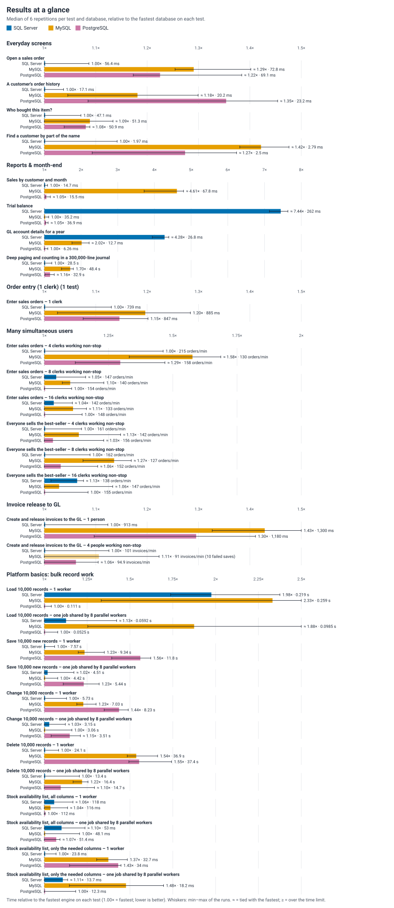
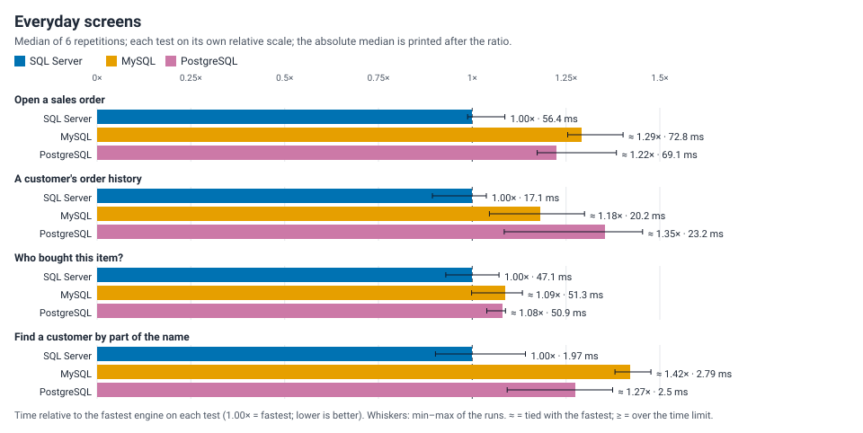
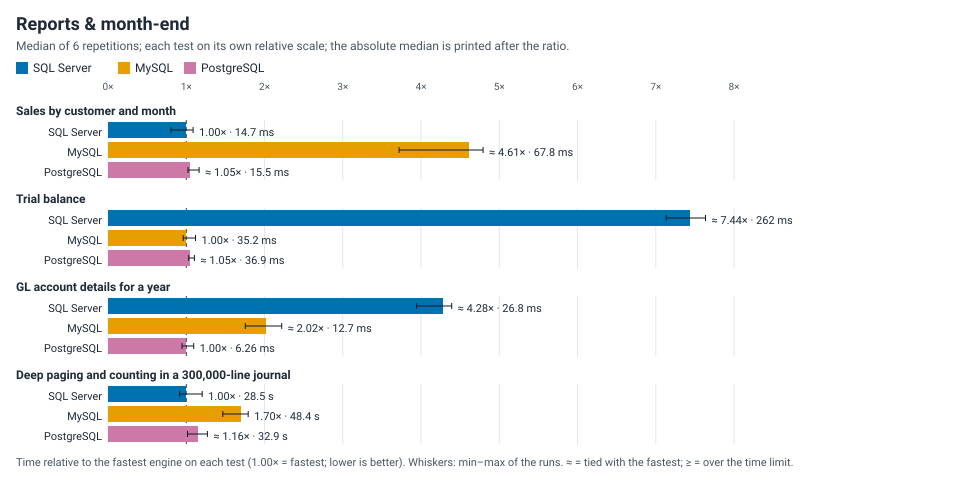
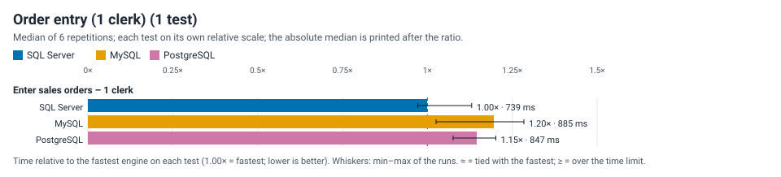
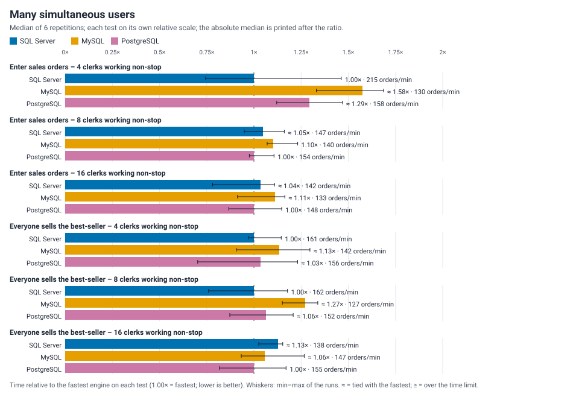
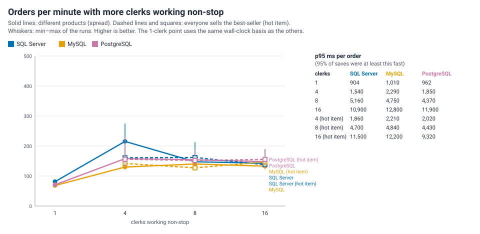
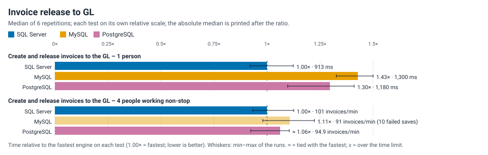
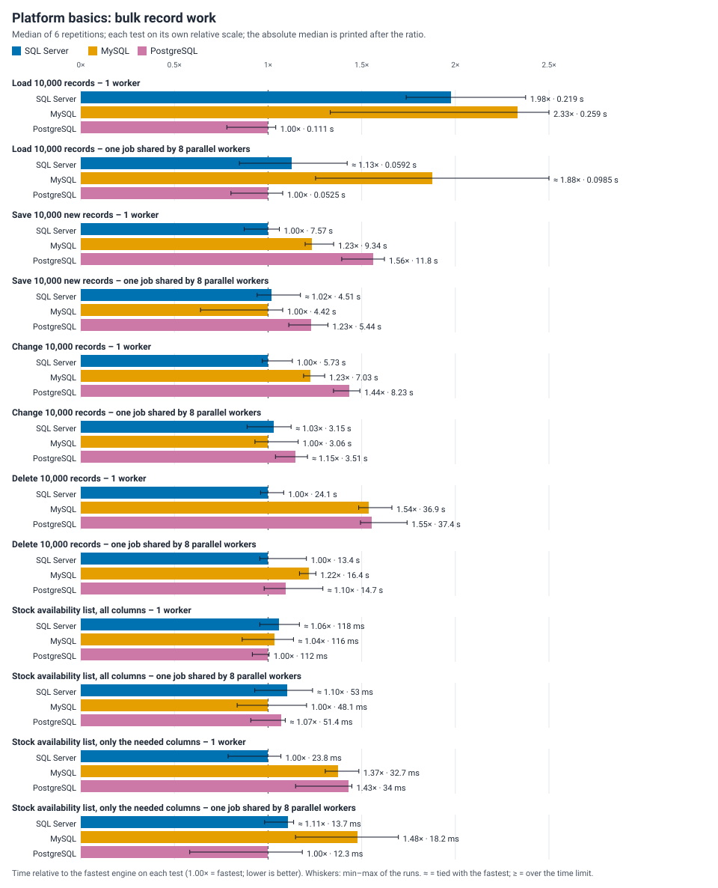
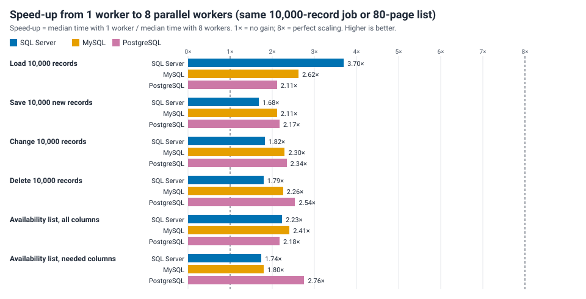

# PerfDBBenchmark: Acumatica 2026 R2 on SQL Server, MySQL and PostgreSQL

We ran the same Acumatica 2026 R2 (build 26.200.0334) workloads against **SQL Server 2025, MySQL 8.0.46 and PostgreSQL 18.6** on one laptop (24-core hybrid CPU, 63.4 GB of RAM), with each database given the same amount of memory (about 8 GB). The data is Acumatica's SalesDemo demo company (SQL Server 2.7 GB in its data file, plus a transaction log pre-sized to 8 GB; MySQL 2.4 GB; PostgreSQL 1.9 GB; as each database reports its size; about 302,000 general-ledger lines and 11,000 sales orders), so compare it with the size of your own company. The workloads are the things people actually do in Acumatica: loading what screens show, running month-end report and inquiry queries, entering sales orders with up to 16 clerks at once, releasing invoices to the general ledger, and plain bulk record work (the raw cost of loading, saving, changing and deleting many records, and of reading lists). This page is for business owners, finance and operations managers, IT leads and Acumatica partners who need to choose, or confirm, the database under Acumatica. It shows where the databases really differ, where the difference is too small to notice, and what else to weigh besides speed. In short: SQL Server was in the fastest group in every family and led two of them (one clerk entering orders, and invoice release by one person); the three were effectively tied on everyday screens, reports and many people entering orders at once; in plain bulk record work SQL Server was in the fastest group on all six save, change and delete tests, and across all 12 platform-basics tests PostgreSQL and MySQL were typically 1.19 and 1.31 times slower than the fastest database on each test; MySQL was the only database with failed saves (10, all deadlocks, when four people released invoices at once); and in most families the differences come mostly from how Acumatica works with each database on one shared machine, so a separate database server may shrink them.

By [AcuPower LTD](https://acupowererp.com) · 2026 R2 edition, October 2026 · campaign `158169ad-ebb1-4c0a-920d-84a8eb311cea`

> The numbers on this page replace the results published for Acumatica 2026 R1 (build 26.100.0168, March 2026). Do not compare the two. The earlier runs timed data setup together with the measured operation, re-read cached query results instead of the database, ran about two parallel workers while reporting twelve, used different database memory settings, and ran each test once. They are kept for reference in [docs/history/2026R1-results.md](docs/history/2026R1-results.md) (git commit 9fb66d2).

## Contents

- [Which database should I choose? Conclusions for business users](#which-database-should-i-choose-conclusions-for-business-users)
- [What changed in this edition](#what-changed-in-this-edition)
- [How to read the results](#how-to-read-the-results)
- [Results at a glance](#results-at-a-glance)
- [Results by family](#results-by-family)
- [How we measured](#how-we-measured)
- [Test environment and fairness](#test-environment-and-fairness) · [Methodology appendix](#methodology-appendix)
- [Limits of this test](#limits-of-this-test)
- [Not measured here: other things to weigh](#not-measured-here-other-things-to-weigh)
- [How to reproduce](#how-to-reproduce) · [Technical reference](#technical-reference) · [History](#history) · [Credits](#credits)

---

## Which database should I choose? Conclusions for business users

Start with **Step 0** (which databases you can use at all), then read the situation that sounds most like your company. Everything in this section comes from the measured results further down, **except Step 0 and the notes marked "Beyond speed"**. Those summarise published facts that this test did not measure; every source is listed under [Sources](#sources), all accessed on 3 October 2026.

> **How to read this section.** "Faster" needs a clear and consistent difference ([the rule](#how-we-decide-faster)); differences too small to notice count as ties. **Fastest group** = the databases that were fastest or tied with the fastest. **Family index** 1.00 = fastest on every test of the family; 1.20 = typically 20% slower. **Hot-item penalty** 1.30× = the same clerks saved 1.3 times as many orders per minute when they sold different products as when everyone sold the same best-seller (about 23% fewer orders with the best-seller). **p95** = 95% of orders were saved at least this fast. More terms are under [Words we use](#words-we-use).

### Step 0: Which databases can you use?

| | SQL Server | MySQL | PostgreSQL |
|---|---|---|---|
| Version tested | 2025 **Enterprise Developer** edition (every Enterprise feature; free, but not licensed for production) | 8.0.46 Community | 18.6 |
| Listed by Acumatica for 2026 R2? | Yes: SQL Server 2022 and 2025 (2026 R2 dropped 2016 SP1, 2017 and 2019) | Yes: MySQL Community Server 8.0 (64-bit) only | **Yes, for production, new in 2026 R2:** 18.1 and later (a preview in 2026 R1) |
| Vendor support | Microsoft: until 7 January 2031 (mainstream) and 7 January 2036 (extended) | **End of life since April 2026:** 8.0.46 is the last release; no more fixes or security patches | PostgreSQL community: until 14 November 2030 |
| Licence | Standard and Enterprise: paid, per core; Express: free but limited | Free, open source (GPL); Oracle also sells a commercial edition with support | Free, open source (PostgreSQL License); paid support from many companies |

Sources: [Acumatica 2026 R2 system requirements](https://help.acumatica.com/Wiki/Show.aspx?pageid=5cf164e5-889f-458b-8757-320c96598ab7); [Acumatica 2026 R2 release notes](https://builds.acumatica.com/builds/26.2/ReleaseNotes/AcumaticaERP_2026R2_ReleaseNotes.pdf), pp. 9 and 459; [Microsoft lifecycle: SQL Server 2025](https://learn.microsoft.com/en-us/lifecycle/products/sql-server-2025); [MySQL 8.0 release notes](https://dev.mysql.com/doc/relnotes/mysql/8.0/en/); [Oracle's MySQL EOL notice](https://www.mysql.com/support/eol-notice.html); [PostgreSQL versioning policy](https://www.postgresql.org/support/versioning/); [SQL Server 2025 pricing](https://cdn-dynmedia-1.microsoft.com/is/content/microsoftcorp/microsoft/bade/documents/products-and-services/en-us/cloud/SQL-Server-2025-Pricing.pdf); [MySQL Community Edition](https://www.mysql.com/products/community/); [PostgreSQL licence](https://www.postgresql.org/about/licence/); all accessed 2026-10-03.

- **MySQL:** MySQL 8.0 reached end of life in April 2026. 8.0.46, released on 21 April 2026, is the last release, and Oracle no longer publishes fixes or security patches for it ([MySQL 8.0 release notes](https://dev.mysql.com/doc/relnotes/mysql/8.0/en/); [Oracle EOL notice](https://www.mysql.com/support/eol-notice.html); [Oracle Lifetime Support Policy](https://www.oracle.com/us/assets/lifetime-support-technology-069183.pdf), p. 5). Oracle recommends moving to MySQL 8.4 LTS or 9.7 LTS. But Acumatica 2026 R1 and R2 list only MySQL 8.0 ([2026 R2](https://help.acumatica.com/Wiki/Show.aspx?pageid=5cf164e5-889f-458b-8757-320c96598ab7) and [2026 R1](https://help-2026r1.acumatica.com/Wiki/Show.aspx?pageid=5cf164e5-889f-458b-8757-320c96598ab7) system requirements), and neither release's notes mention MySQL 8.4 ([2026 R2](https://builds.acumatica.com/builds/26.2/ReleaseNotes/AcumaticaERP_2026R2_ReleaseNotes.pdf) and [2026 R1](https://acumatica-builds.s3.amazonaws.com/builds/26.1/ReleaseNotes/AcumaticaERP_2026R1_ReleaseNotes.pdf) release notes). **Choosing MySQL today means running a database version that no longer gets security fixes, with no upgrade path listed by Acumatica yet.**
- **PostgreSQL:** Acumatica supports PostgreSQL for production starting with 2026 R2, for version 18.1 and later, so the 18.6 tested here is covered. In 2026 R1 it was only a preview and not recommended for production ([2026 R2 release notes, p. 459](https://builds.acumatica.com/builds/26.2/ReleaseNotes/AcumaticaERP_2026R2_ReleaseNotes.pdf); [2026 R1 system requirements](https://help-2026r1.acumatica.com/Wiki/Show.aspx?pageid=5cf164e5-889f-458b-8757-320c96598ab7)). Because 2026 R2 is the first release with production support, check that the features, customizations and add-ons you rely on are supported on PostgreSQL. For example, the 2026 R2 note on the new project generic inquiries names only SQL Server and MySQL (release notes, p. 377; we did not test those forms).
- **SQL Server edition:** SQL Server was measured on the Enterprise Developer edition, which has every Enterprise feature but may not be used in production. (Microsoft also offers a free Standard Developer edition for testing Standard behaviour; it was not tested.) **Standard edition:** its memory and CPU limits (256 GB of cache; 4 sockets or 32 cores) are far above what this test used (8 GB, 24 logical CPUs), so they would not have slowed it. But some features that can speed up large report queries exist only in Enterprise ([Microsoft's edition comparison](https://learn.microsoft.com/en-us/sql/sql-server/editions-and-components-of-sql-server-2025); the feature names are in [Table 2](#table-2-database-settings)). In our runs no report query on SQL Server used batch mode (none of the 65 query plans checked in the final rehearsal used it; they are the plans of every query that read GL lines, GL balances, AR lines or sales-order lines in its full-size runs), so the Enterprise-only batch-mode features did not affect any result; the deep-paging and GL-account-details queries ran in parallel on up to 8 cores without batch mode. Whether the other Enterprise-only features (read-ahead, advanced scanning, memory-grant feedback) helped was not checked, so Standard may still be slower on large report queries. **Express edition** is limited to about 1.4 GB of cache, 4 cores and 50 GB per database: expect it to be slower than shown, and it cannot hold a database larger than 50 GB.
- **Scope:** the results apply to Acumatica with the database drivers it ships and the settings in [Table 2](#table-2-database-settings).

### The short answer

- **Everyday screens:** all three in the fastest group; loading a screen's data differed by less than 17 ms, which nobody will notice. **Saving an order (one clerk):** SQL Server led, 0.74 s against 0.85 s (PostgreSQL) and 0.88 s (MySQL).
- **Many people entering orders:** effectively tied as a family (differences within 20%, typical, family index; one test-level exception: with 8 clerks MySQL was 1.10× slower than PostgreSQL). With 16 clerks working non-stop the three saved 133–148 orders per minute, no database had a failed save, and everyone selling the same best-seller caused no noticeable slow-down on any database. With fewer clerks the best-seller did slow two of them: with 4 clerks SQL Server saved about 25% fewer orders (215 → 161 per minute; its 215 comes from noisy runs), and with 8 clerks MySQL about 9% fewer (140 → 127).
- **Month-end:** no database led both families. The reports were tied (the trial balance and GL account details differed by less than a quarter of a second, which nobody will notice; MySQL was 1.70× slower on deep paging through the 302,000-line journal). Invoice release: SQL Server led with one person (0.91 s per invoice against 1.18–1.30 s); with four people SQL Server and PostgreSQL were tied, and MySQL was not ranked because 10 of its saves failed (deadlocks).
- **Bulk loads without business logic:** SQL Server in the fastest group on all six save, change and delete tests; MySQL was faster than PostgreSQL on three of them (saving with 1 and with 8 workers, changing with 1 worker) and never slower. Across all 12 platform-basics tests, which also include loading records and lists, PostgreSQL was typically 1.19× and MySQL 1.31× slower than the fastest database on each test.
- **Search results:** the same answers on every test where they could be compared (not the 4-person invoice test, where MySQL had failed saves), except accent search: MySQL also finds "Québec" when users type "quebec"; SQL Server and PostgreSQL do not.

In most families the database used less than 30% of the processor time, so the differences there come mostly from how Acumatica works with each database on a shared machine; a separate database server may shrink them. SQL Server was in the fastest group in every family; still read Step 0 and the "Beyond speed" notes before deciding.

**By situation, at a glance** (speed rows are measured; the last row is published facts, not measured):

| Your situation | SQL Server | MySQL | PostgreSQL |
|---|---|---|---|
| Small team, everyday screens | fastest group | 1.20× slower (typical; order entry by 1 clerk; screens tied) | 1.15× slower (typical; order entry by 1 clerk; screens tied) |
| Many people entering orders | fastest group | tied as a family with 4–16 clerks (with 8 clerks 1.10× slower than PostgreSQL); 1.20× slower with 1 clerk (typical) | tied as a family with 4–16 clerks; 1.15× slower with 1 clerk (typical) |
| Month-end reports and invoice release | fastest group | **10 failed saves** with 4 people (not ranked on that test); 1.43× slower (typical) with 1 person; reports tied | 1.30× slower (typical) with 1 person; tied with SQL Server with 4 people; reports tied |
| Bulk data loads (no business logic; the 6 save, change and delete tests) | fastest group on all 6 | fastest group on 2 of 6; slower than SQL Server on 4 (save, change and delete with 1 worker, delete with 8) | fastest group on 2 of 6; slower than SQL Server on 3 (save, change and delete with 1 worker) and than MySQL on 3 (save with 1 and 8 workers, change with 1) |
| Search results (same answer?) | same answer | different answer: also finds "Québec" when you type "quebec" | same answer |
| *Beyond speed (not measured)* | supported by Microsoft until 2031 (mainstream) and 2036 (extended); paid licence per core (Express free but limited) | **end of life since April 2026: no more security fixes**; free | supported until November 2030; production support by Acumatica new in 2026 R2; free |

**Before you decide:**
1. Check [Step 0](#step-0-which-databases-can-you-use): can you use the database at all, and how long will it get security fixes?
2. Find your situation below.
3. Compare the differences in your own units (seconds per report, orders per minute), not only in percent.
4. Test your heaviest reports on your own data.
5. Ask your partner which database they can run, monitor and support.

### Your situation

#### 1. A small company, or a small team working mostly in everyday screens

**Look at:** [Everyday screens](#everyday-screens) and [Order entry (1 clerk)](#order-entry-1-clerk-1-test).

**What we measured:** Everyday screens: all three in the fastest group; Order entry (1 clerk): SQL Server in the fastest group; largest difference: Enter sales orders – 1 clerk, 739 ms vs 885 ms per order saved. Differences here come mostly from how Acumatica works with each database on a shared machine; a separate database server may shrink them.

**Key numbers:**
- Loading a sales order's data on the server (one person): **Not noticeable:** SQL Server was faster than MySQL (56.4 ms vs 72.8 ms per order opened), a difference nobody will notice. Open a sales order: 56.4–72.8 ms per order opened on all three; not noticeable.
- Saving a 3-line sales order (one person): **SQL Server was slightly faster than PostgreSQL:** 13% lower median time (SQL Server won 34 of 36 run pairings). MySQL was 1.20× slower than SQL Server (tied with PostgreSQL).

**What it means for you:** Any of the three will feel the same on everyday screens: the server-side work of loading a screen's data differed by less than 17 ms per action, far below the 0.1 s a person can notice. Saving a sales order took 0.74 s on SQL Server against 0.85 s on PostgreSQL and 0.88 s on MySQL, 0.11–0.15 s more per order, just above that threshold. Most of the processor work while saving orders was Acumatica's own (the database's share of the processor time was 11–16%); differences here come mostly from how Acumatica works with each database on a shared machine, so a separate database server may shrink the gap.

> **Beyond speed (not measured):** for a small team, the licence and who will look after the database usually weigh more than a few milliseconds per screen. SQL Server Express is free but limited to about 1.4 GB of cache memory, 4 cores and 50 GB per database ([Microsoft's edition comparison](https://learn.microsoft.com/en-us/sql/sql-server/editions-and-components-of-sql-server-2025)), and it was not tested. MySQL Community (GPL licence) and PostgreSQL (PostgreSQL License) are free, open-source software with no licence fee ([MySQL Community Edition](https://www.mysql.com/products/community/); [PostgreSQL licence](https://www.postgresql.org/about/licence/)). Check [Step 0](#step-0-which-databases-can-you-use) for support status: MySQL 8.0 no longer gets security fixes.

#### 2. Many people entering orders at the same time (order desks, sales teams, order-import integrations)

**Look at:** [Many simultaneous users](#many-simultaneous-users) and [Order entry (1 clerk)](#order-entry-1-clerk-1-test). Shipments, picking and receipts were not tested.

**What we measured:** All three handled 16 clerks working non-stop; differences were within 20% (typical, family index). Failed saves: SQL Server 0, MySQL 0, PostgreSQL 0. Hot-item penalty with 16 clerks: SQL Server 1.04×, PostgreSQL 0.95×, MySQL 0.90×. MySQL runs Acumatica's transactions at a stricter isolation level, which can lock more rows; the database driver Acumatica ships sets it on every transaction, so this is how Acumatica runs on MySQL. Differences here come mostly from how Acumatica works with each database on a shared machine; a separate database server may shrink them.

**Key numbers:**
- 16 clerks selling different products: **Tie:** all three within 11% (below the 17% threshold).
- 16 clerks all selling the same best-seller: **Tie:** all three within 13% (below the 21% threshold).
- Slow-down when everyone sells the best-seller: with 16 clerks, the same clerks saved 1.04 times as many orders per minute with different products as with the best-seller on SQL Server (142 → 138 per minute), 0.90 times on MySQL (133 → 147) and 0.95 times on PostgreSQL (148 → 155); a value below 1.00 means the best-seller runs were not slower.

Our clerks never pause between orders, so 16 of them load the system like a much larger real team. To compare with your own team: 16 non-stop clerks saved 133–148 orders per minute, depending on the database, with Acumatica limited to about 2 processor cores (its limit for a site without a licence). Your busiest hour needs its number of orders divided by 60 per minute; for example, 600 orders in an hour is 10 orders per minute. Because nobody here pauses, these numbers show the most this machine handled, not a typical day. A licensed server with more cores may handle more; this test does not show how much, so do not use this figure to size your servers.

The 2-core limit was the same on every database. Where Acumatica, not the database, is the bottleneck, it makes the differences between the databases smaller ([Limits](#limits-of-this-test)).

**Would tuning change this?** The follow-up tuning check (five MySQL settings changed; 3 runs per database, too few for a verdict) re-ran only the 4-clerk test, already a tie, and the three databases' ranges overlapped again; the 1-, 8- and 16-clerk and best-seller tests were not re-run ([situation 3](#3-heavy-month-end-close-and-financial-reporting)).

**What it means for you:** All three handled 16 clerks working non-stop; differences were within 20% (typical, family index), with one exception at test level: with 8 clerks MySQL was 1.10× slower than PostgreSQL. With 16 clerks the order rates (133–148 orders per minute) were tied, and no database had a failed save. With 16 clerks, everyone selling the same best-seller did not slow any database down noticeably (about 3% fewer orders per minute on SQL Server, and slightly more on MySQL and PostgreSQL); with fewer clerks it did on two databases: with 4 clerks SQL Server saved about 25% fewer orders with the best-seller (215 → 161 per minute; its 215 comes from noisy runs), and with 8 clerks MySQL about 9% fewer (140 → 127). MySQL needed automatic retries after deadlocks in the best-seller tests (1, 10 and 35 over the six runs with 4, 8 and 16 clerks), and every retried save succeeded. Most of the processor work in these tests was Acumatica's own (the database's share was 9.6–16%), with Acumatica limited to about 2 cores; differences here come mostly from how Acumatica works with each database on a shared machine, and a separate database server, or a licensed one with more cores, may change the picture.

> **Beyond speed (not measured):** under heavy load, what matters next is how quickly your team (or your partner) can see who is waiting for whom and fix it. That depends on the monitoring tools and experience you have for each database; see [Not measured here](#not-measured-here-other-things-to-weigh).

#### 3. Heavy month-end close and financial reporting

**Look at:** [Reports & month-end](#reports--month-end) and [Invoice release to GL](#invoice-release-to-gl).

**What we measured:** No database leads both families. Reports & month-end: SQL Server, MySQL and PostgreSQL in the fastest group; Invoice release to GL: SQL Server leads. Trial balance: **Not noticeable:** MySQL was much faster than SQL Server in relative terms (35.2 ms vs 262 ms per period), but nobody will notice the difference. Trial balance: 35.2–262 ms per period on all three; not noticeable. GL account details for a year: **Not noticeable:** PostgreSQL was much faster than SQL Server in relative terms (6.26 ms vs 26.8 ms per account), but nobody will notice the difference. GL account details for a year: 6.26–26.8 ms per account on all three; not noticeable. Sort spills and JIT use per report are listed in the methodology appendix. MySQL runs Acumatica's transactions at a stricter isolation level, which can lock more rows; the database driver Acumatica ships sets it on every transaction, so this is how Acumatica runs on MySQL. Differences here come mostly from how Acumatica works with each database on a shared machine; a separate database server may shrink them.

**Key numbers** (the database work behind each report or inquiry; report layout, rendering and export are not included):
- Trial balance: **Not noticeable:** MySQL was much faster than SQL Server in relative terms (35.2 ms vs 262 ms per period), but nobody will notice the difference. Trial balance: 35.2–262 ms per period on all three; not noticeable.
- GL account details for a year: **Not noticeable:** PostgreSQL was much faster than SQL Server in relative terms (6.26 ms vs 26.8 ms per account), but nobody will notice the difference. GL account details for a year: 6.26–26.8 ms per account on all three; not noticeable.
- Sales by customer and month: **Not noticeable:** SQL Server was much faster than MySQL in relative terms (14.7 ms vs 67.8 ms per yearly report), but nobody will notice the difference. Sales by customer and month: 14.7–67.8 ms per yearly report on all three; not noticeable.
- Deep paging and counting in a 300,000-line journal: **SQL Server and PostgreSQL tied**; MySQL was 1.70× slower.
- Releasing invoices to the GL, 1 person: **SQL Server was faster than PostgreSQL:** 23% lower median time (913 ms vs 1,180 ms per invoice). MySQL was 1.43× slower than SQL Server (tied with PostgreSQL).
- Releasing invoices to the GL, 4 people at once: MySQL: **10 failed saves**; not ranked on this test. **Tie:** within 6.2% (below the 16% threshold).

**Would tuning change this?** For the two MySQL transaction tests it re-ran (invoice release by one person, order entry with 4 clerks), possibly; for the reports, search and bulk tests it re-ran, no. This is an indication, not a result, and it changes no verdict on this page. A follow-up run after the campaign re-tested MySQL's 11 flagged tests (its median 1.3 times or more the fastest's: a selection rule, not a verdict; several were ties or differences nobody would notice) on all three databases, restored from the pre-campaign backups, with five MySQL settings changed (no data-safety change, no change to the 8 GB memory budget). It did not re-run the 4-person invoice release, so it says nothing about MySQL's 10 failed saves.
- Releasing invoices, 1 person: MySQL went from 1.43× to 1.11× slower than SQL Server (1.30 s → 1.02 s per invoice); PostgreSQL, not changed, also took 18% less time in the follow-up run.
- Entering orders, 4 clerks (already a tie): from 1.58× to 1.05× slower (130 → 153 orders per minute). More than half of this change is SQL Server's (161 orders per minute in the follow-up run against 215 in the campaign); against SQL Server's campaign time, MySQL would still be about 1.33× slower.
- The three re-run reports (sales by customer and month, GL account details, deep paging), the customer search and the five platform-basics tests (loading, deleting and listing records) stayed 1.3 times or more slower than the fastest. For the first two reports and the search these are differences of milliseconds that nobody notices, before and after. Deep paging, the one report gap you would notice, did not shrink (1.70× → 1.76×; MySQL 48 → 53 s per pass), and MySQL's own times on several of these tests were higher in the follow-up run.

Why only an indication: each database ran 3 times, below the 5 runs our tie rule needs before it calls anything faster or tied (the campaign ran 6), and the databases that were not changed also moved between the two runs. If your MySQL server handles heavy order entry or single-user invoice release, these five InnoDB settings (the values MySQL 8.4 uses by default, set on your MySQL 8.0 server; no upgrade involved) are worth testing on your own system; they did not shorten MySQL's deep paging, so re-check your reports too. Settings, sources and every number: [technical reference](docs/TECHNICAL.md#optional-tuning-check-e11-mysql).

The 4-person invoice release ran with Acumatica limited to about 2 processor cores on every database, which can narrow the differences between databases ([Limits](#limits-of-this-test)).

**What it means for you:** No database led both families. The report queries put all three in the fastest group: the trial balance took 35–37 ms per period on MySQL and PostgreSQL against 262 ms on SQL Server, and GL account details 6–27 ms per account, differences that are large in relative terms but that nobody will notice; the one report difference you would notice is deep paging and counting in the 302,000-line journal, where SQL Server (28.5 s) and PostgreSQL (32.9 s) tied and MySQL took 48.4 s per pass of 12 requests, and no report hit its time limit. Releasing invoices was faster on SQL Server with one person (0.91 s per invoice against 1.18 s on PostgreSQL and 1.30 s on MySQL, about 4.5–6.5 minutes more per 1,000 invoices released one by one); with four people SQL Server and PostgreSQL were tied, and MySQL was not ranked because 10 of its saves failed with deadlocks (8 of its 360 timed invoices and 2 untimed warm-up invoices). In invoice release the database's share of the processor time was 18–23%; differences here come mostly from how Acumatica works with each database on a shared machine, so a separate database server may shrink these gaps.

> **Beyond speed (not measured):** real month-end reports are often Generic Inquiries and Report Designer reports with more tables than ours, and month-end runs on a larger, older ledger than this demo company. Test your own heaviest reports on your own data before deciding on report speed alone.

#### 4. Bulk data loads and mass changes (no business logic)

**Look at:** [Platform basics: bulk record work](#platform-basics-bulk-record-work) (saving, changing and deleting 10,000 records, by 1 worker and by 8 workers sharing one job).

**What these tests are:** saving, changing and deleting 10,000 plain records in a simple table, with no validation, defaulting, pricing or posting. They show the platform's raw cost of writing data. Imports of real documents (sales orders, invoices, customers) run Acumatica's full business logic and behave more like the [Order entry](#order-entry-1-clerk-1-test) and [Invoice release](#invoice-release-to-gl) tests; look there too.

**What we measured:** SQL Server was in the fastest group on most insert, update and delete tests (6 of 6). 1 → 8 worker speed-up, Save 10,000 new records: SQL Server 1.68×, MySQL 2.11×, PostgreSQL 2.17×. 1 → 8 worker speed-up, Change 10,000 records: SQL Server 1.82×, MySQL 2.30×, PostgreSQL 2.34×. 1 → 8 worker speed-up, Delete 10,000 records: SQL Server 1.79×, MySQL 2.26×, PostgreSQL 2.54×.

**Key numbers:**
- Saving 10,000 new records with 8 workers: **MySQL and SQL Server tied**; PostgreSQL was 1.23× slower. PostgreSQL is slower than MySQL only.
- Changing 10,000 records with 8 workers: **Tie:** all three within 15% (below the 20% threshold).
- Deleting 10,000 records with 8 workers: **SQL Server and PostgreSQL tied**; MySQL was 1.22× slower. MySQL is slower than SQL Server only.

Acumatica ran on about 2 processor cores here (its limit for a site without a licence), so the gain from 8 workers is limited by Acumatica's 2 cores, not only by the database. On a licensed server with more cores it may be larger; this test does not show how much. The limit is the same for every database.

**What it means for you:** SQL Server was in the fastest group on all six save, change and delete tests: with one worker a 10,000-record job took 7.6 s to save, 5.7 s to change and 24.1 s to delete on SQL Server, against 9.3–11.8 s, 7.0–8.2 s and 36.9–37.4 s on the other two, and with 8 workers sharing the job the gaps narrowed (4.4–5.4 s, 3.1–3.5 s and 13.4–16.4 s on the three databases). Eight workers finished 1.7–1.8 times faster than one on SQL Server, 2.1–2.3 times on MySQL and 2.2–2.5 times on PostgreSQL; Acumatica ran on about 2 cores here, so these speed-ups are limited by Acumatica, not only by the database. These are bulk loads without business logic: for imports of real documents, look at Order entry and Invoice release.

#### 5. A mixed workload (a bit of everything)

**What we measured:** there is no overall winner: compare the families you run most in the [results-at-a-glance table](#results-at-a-glance). Running reports and order entry at the same time was not tested.

**What it means for you:** There is no overall winner: SQL Server was in the fastest group in every family, but where it was ahead the typical gap was 15–43% (0.1–0.4 s per order or invoice), and on everyday screens, reports and many simultaneous users the three were effectively tied. If most of your users' day is screens and order entry by many people, weight those families and let Step 0 and cost decide; if your bottleneck is month-end posting or bulk record work, weight Invoice release and Platform basics.

#### 6. Expecting your data to grow a lot

**What we measured:** not measured directly: every test used one dataset (SQL Server 2.7 GB in its data file, plus a transaction log pre-sized to 8 GB; MySQL 2.4 GB; PostgreSQL 1.9 GB; as each database reports its size) that fits in memory on all three, on a database server with 8 GB, Acumatica's smallest typical configuration. The closest hints are the GL account details and deep-paging tests on the 302,000-line ledger; test with your own data size.

**Key numbers:**
- GL account details for a year: **Not noticeable:** PostgreSQL was much faster than SQL Server in relative terms (6.26 ms vs 26.8 ms per account), but nobody will notice the difference. GL account details for a year: 6.26–26.8 ms per account on all three; not noticeable.
- Deep paging and counting: **SQL Server and PostgreSQL tied**; MySQL was 1.70× slower.

**What it means for you:** On the largest table here (302,000 GL lines), GL account details took under 30 ms per account on all three and deep paging 28–48 s per pass of 12 requests, with MySQL slowest; this test cannot tell how the three compare on a ledger many times larger, so test with your own data.

#### 7. Watching costs, or preferring open source

**Look at:** every comparable test.

**What we measured:** PostgreSQL was faster / tied / slower than SQL Server on 1 / 22 / 6 of 29 tests (faster: Load 10,000 records – 1 worker. slower: Enter sales orders – 1 clerk; Create and release invoices to the GL – 1 person; Save 10,000 new records – 1 worker; Change 10,000 records – 1 worker; Delete 10,000 records – 1 worker; Stock availability list, only the needed columns – 1 worker). MySQL was faster / tied / slower than SQL Server on 0 / 19 / 9 of 28 tests (slower: Deep paging and counting in a 300,000-line journal; Enter sales orders – 1 clerk; Create and release invoices to the GL – 1 person; Save 10,000 new records – 1 worker; Change 10,000 records – 1 worker; Delete 10,000 records – 1 worker; Delete 10,000 records – one job shared by 8 parallel workers; Stock availability list, only the needed columns – 1 worker; Stock availability list, only the needed columns – one job shared by 8 parallel workers). PostgreSQL was faster / tied / slower than MySQL on 4 / 21 / 3 of 28 tests (faster: Deep paging and counting in a 300,000-line journal; Enter sales orders – 8 clerks working non-stop; Load 10,000 records – 1 worker; Stock availability list, only the needed columns – one job shared by 8 parallel workers. slower: Save 10,000 new records – 1 worker; Save 10,000 new records – one job shared by 8 parallel workers; Change 10,000 records – 1 worker). SQL Server was measured on Developer edition, which has every Enterprise feature; Standard and Express limit memory, CPU and some query features.

**What it means for you:** Against SQL Server, PostgreSQL was faster on 1, tied on 22 and slower on 6 of 29 tests (slower: saving an order by one clerk, releasing invoices by one person and four single-worker bulk tests). MySQL was faster on 0, tied on 19 and slower on 9 of 28 tests (the 4-person invoice test is left out because of MySQL's failed saves). SQL Server was measured on the Enterprise Developer edition, which has every Enterprise feature; no report query used batch mode, so the Enterprise-only batch-mode features did not affect any result, but whether Standard's lack of read-ahead, advanced scanning and memory-grant feedback would slow the larger report queries was not tested.

> **Beyond speed (not measured):** SQL Server Standard and Enterprise need a paid licence: they are licensed per core and sold in 2-core packs, so the cost grows with the cores of the database server; Standard can also be licensed per server plus a licence for every user or device ([SQL Server 2025 pricing](https://cdn-dynmedia-1.microsoft.com/is/content/microsoftcorp/microsoft/bade/documents/products-and-services/en-us/cloud/SQL-Server-2025-Pricing.pdf)). The free Express edition is limited to about 1.4 GB of cache memory, 4 cores and 50 GB per database, and was not tested. The Enterprise Developer edition used here is free and has every Enterprise feature, but it is licensed for development and test only, not production ([Microsoft's edition comparison](https://learn.microsoft.com/en-us/sql/sql-server/editions-and-components-of-sql-server-2025)). MySQL Community (GPL licence) and PostgreSQL (PostgreSQL License) have no licence fee ([MySQL Community Edition](https://www.mysql.com/products/community/); [PostgreSQL licence](https://www.postgresql.org/about/licence/)). Paid support is available from many companies for PostgreSQL ([PostgreSQL professional services](https://www.postgresql.org/support/professional_support/)) and, for MySQL, from Oracle with its commercial MySQL Enterprise Edition ([MySQL Enterprise Edition](https://www.mysql.com/products/enterprise/)); Acumatica's requirements name the free MySQL Community Server.

#### 8. Search results and data correctness

**What we measured:** Any "different answer" outranks any speed result. Every database returned the same answer on every comparable test. Accent search: No. MySQL also finds accented names (such as 'Revenu Québec') when you search without the accent ('quebec'); SQL Server and PostgreSQL do not (accent-sensitive). Speed is reported separately. hits for quebec / Québec / QUÉBEC: SQL Server 0 / 1 / 1; MySQL 1 / 1 / 1; PostgreSQL 0 / 1 / 1.

**What it means for you:** Every database returned the same answer on every comparable test (in the 4-person invoice test, answers are compared only when every database saved every document, which MySQL did not). The exception is accent search: a user who types "quebec" finds "Revenu Québec" on MySQL but not on SQL Server or PostgreSQL, so users can get different search results on different databases. This is a property of each database's text rules as Acumatica uses them, not a defect; if your names contain accents, check how your users search.

#### 9. Choosing for the long term

Most of what matters here was **not measured** by this test:

- **Support and end of life:**
  - **MySQL 8.0** has been at end of life since April 2026: no more fixes or security patches. Acumatica 2026 R1 and R2 list only MySQL 8.0, and neither release's notes mention MySQL 8.4, so no upgrade path is listed by Acumatica yet.
  - **PostgreSQL 18** is supported by the PostgreSQL community until 14 November 2030. Acumatica supports PostgreSQL for production starting with 2026 R2 (18.1 and later); before that it was a preview.
  - **SQL Server 2025** is supported by Microsoft until 7 January 2031 (mainstream) and 7 January 2036 (extended).
  - Sources are in [Step 0](#step-0-which-databases-can-you-use) and under [Sources](#sources).
- **Growth:** see situation 6. This test did not measure larger data volumes.
- **Skills and partners:** pick the database your team or your Acumatica partner can back up, restore, monitor and upgrade with confidence.

**What it means for you:** For the long term, start from support status and skills: MySQL 8.0 no longer gets security fixes and Acumatica lists no newer MySQL version yet, while SQL Server 2025 is supported until 2031 (mainstream) and 2036 (extended) and PostgreSQL 18 until November 2030; then pick the database your team or partner can run with confidence. For speed, use the families above that match your workload.

### Is a speed difference worth a cost difference?

Only you can weigh it: the families you care about, how big the difference is in your own units (seconds per report, orders per minute), and the licence and operating cost of each database (see [Not measured here](#not-measured-here-other-things-to-weigh)).

---

## What changed in this edition

This is the second edition of the benchmark. The first one (Acumatica 2026 R1, March 2026) is archived in [docs/history/2026R1-results.md](docs/history/2026R1-results.md). For this edition we made the setup fairer, fixed how the original 12 tests measure, and added five new families of tests that look like real Acumatica work.

### 1. Every database now gets the same memory: about 8 GB

Each database keeps recently used data in memory so that it does not have to read it from disk. Before this campaign, the three database servers on this machine were allowed very different amounts of memory for this: SQL Server up to 30 GB, PostgreSQL only 128 MB for its own cache, MySQL 8 GB. A database could look faster or slower just because of that. Now each one gets about 8 GB:

| Database | Setting | Before this edition | Now | What the setting covers |
|---|---|---|---|---|
| SQL Server | max server memory | 30 GB (30,720 MB) | **8 GB (8,192 MB)** | SQL Server's data cache, query plans and working memory for queries |
| SQL Server | min server memory | 0 | **8 GB (8,192 MB)** | stops SQL Server from handing its cache back to Windows while it is idle between tests |
| PostgreSQL | shared_buffers | 128 MB | **2 GB** | PostgreSQL's own data cache |
| PostgreSQL | effective_cache_size | 4 GB | **8 GB** | not memory PostgreSQL takes, but a hint telling it how much cached data it can count on in total |
| MySQL | innodb_buffer_pool_size | 8 GB | **8 GB (unchanged)** | MySQL's data and index cache |

PostgreSQL works differently from the other two: it keeps part of its data in its own cache and relies on the Windows file cache for the rest. That is why its own cache is 2 GB and it is told it can count on about 8 GB in total.

For scale: 8 GB is Acumatica's published minimum for a database server and the memory of its smallest typical database virtual machine; its medium and large configurations use 32 GB, its largest 64–128 GB ([system requirements](https://help.acumatica.com/Wiki/Show.aspx?pageid=5cf164e5-889f-458b-8757-320c96598ab7); [typical hardware and VM configurations](https://help.acumatica.com/Wiki/ShowWiki.aspx?wikiname=HelpRoot_Install&PageID=54ef574c-0adf-48a0-b5be-d3438a6e5400), accessed 2026-10-03). So the results describe a small database server. The SalesDemo database fits in memory on all three databases (SQL Server 2.7 GB in its data file, plus a transaction log pre-sized to 8 GB; MySQL 2.4 GB; PostgreSQL 1.9 GB; as each database reports its size), so none of them had to wait for the disk because of its memory setting. All other database settings stay as installed; they are listed in [Table 2](#table-2-database-settings).

### 2. The same, production-like settings for the three Acumatica sites and the machine

| Change | Before | During the campaign | Why |
|---|---|---|---|
| Acumatica debug mode (`compilation debug`) | on | **off** | the production setting; debug mode slows every page |
| Acumatica's background scheduler (`DisableScheduleProcessor`) | running | **off** | scheduled jobs must not start in the middle of a timed run |
| Acumatica's worker thread pool (`ThreadPoolSize`) | 15 (default) | **32** | needed to run 16 clerks at the same time |
| Acumatica's SQL throttle for sites without a licence (`sqlThrottling:Enabled`) | on (Acumatica's default for a site that is not a licensed on-premises installation) | **off** on all three sites, set the same way | a licensed on-premises installation never starts this throttle. In our first rehearsal it slowed the SQL Server and PostgreSQL sites but not the MySQL site, which would have distorted the comparison ([details](#how-we-measured)) |
| The three sites' IIS application pools | could go idle and recycle | **always running, never recycled** | a site restart in the middle of a run would spoil it |
| The other 35 IIS application pools on this machine | running | **stopped** (restarted afterwards) | no background load from unrelated sites |
| Unused SQL Server services (Analysis Services, PolyBase, Launchpad, telemetry) | running | **stopped** (restarted afterwards) | Acumatica does not use them; they would add background load on SQL Server's side only |
| Database statistics (what each database knows about its data, used to plan queries) | as left by earlier work | **refreshed once on all three**, each with its own default method | every database starts from up-to-date knowledge of the data |
| Leftover test data from earlier runs | present | **removed** before the backups | every database starts from the same data |

Not changed, by our decision: the Windows power plan, sleep settings, the laptop's MSI Center performance mode and Windows Update (left as they were), and the antivirus policy (the same default policy on all three database data folders, which does not necessarily cost each database the same). These are disclosed in [Test environment and fairness](#decisions-that-affect-fairness).

Also kept as Acumatica ships them, the same on all three sites:

- **Acumatica's CPU limit for sites without a licence.** Each site's Acumatica process runs on 2 randomly chosen processor cores, picked again every minute. So Acumatica itself had about 2 cores on every database. Why we kept this limit but turned the SQL throttle off: the throttle's brake depends on how long each database takes to answer, so it held the databases back unequally. The CPU limit caps Acumatica the same way whatever the database does. See [Limits](#limits-of-this-test).
- **Acumatica's built-in telemetry and request profiler.** Acumatica 2026 R2 ships with it on for every request, so a default installation runs with it too. It is part of every measured time, on every database. Acumatica pays its cost for each database call, whichever database answers it. If Acumatica sends more calls for the same work on one database, that database's times include more of this cost; that is part of how Acumatica runs on it.
- **Business events.** Left on, as SalesDemo ships them.

### 3. The same kind of connection to every database

Acumatica talks to its database over a connection. In the previous setup the three connections were not alike: SQL Server used a same-machine shortcut (shared memory) that a separate database server cannot use, MySQL used its driver's default, which encrypts the connection when the server allows it, and PostgreSQL used a plain network connection. Now all three use the **same kind of connection: the machine's own loopback network address (127.0.0.1, or ::1, its IPv6 form) without encryption.** That is the closest a single machine can come to a separate database server.

- SQL Server: its network protocol was switched on, listening on 127.0.0.1 port 1433 only, with no firewall opening; Acumatica connects to `tcp:127.0.0.1,1433`.
- MySQL: `SslMode=None` (no encryption) plus `AllowPublicKeyRetrieval=True`. MySQL's standard login method needs to fetch the server's public key to protect the password when the connection is not encrypted ([MySQL manual](https://dev.mysql.com/doc/refman/8.0/en/caching-sha2-pluggable-authentication.html), accessed 2026-10-03); this setting allows that. It only affects how a new connection logs in; the connection itself stays unencrypted, like the other two.
- PostgreSQL: `SSL Mode=Disable` (it was already unencrypted). Its connection names `localhost`, which reached PostgreSQL over ::1, the IPv6 form of the loopback address (environment capture).

**Do not copy these connection settings into production.** They suit a single test machine where the database is reached only through the loopback address. On a real network, use an encrypted connection (TLS) and do not use `AllowPublicKeyRetrieval=True`: the MySQL driver's own documentation warns that it could let a malicious proxy capture the password ([MySqlConnector connection options](https://mysqlconnector.net/connection-options/), accessed 2026-10-03). Likewise, grant the `acumatica` database logins only the rights your installation needs once publishing is done (see [Table 2](#table-2-database-settings)).

How much the old shortcut and the encryption mattered was measured once in the dry run: on SQL Server, the old same-machine shortcut (shared memory) took 11% less time than the network connection now used for opening a sales order (59.7 ms against 67.3 ms), 28% less for the customer search and 30% less for saving 10,000 records (5.9 s against 8.4 s); on MySQL, the old encrypted connection took 4–6% more time than the unencrypted one now used (opening a sales order 84.1 ms against 80.9 ms). Medians of 3 runs each; PostgreSQL's connection was already unencrypted and was not compared.

### 4. The original 12 tests, fixed and measured again (re-baseline)

The 12 tests of the previous edition (read, write, update, delete, a multi-table list and a projected list, each "sequential" and "parallel") are still here, as the family **[Platform basics: bulk record work](#platform-basics-bulk-record-work)**. They were rebuilt because the old way of measuring had flaws. In plain words:

| Problem in the 2026 R1 tests | What we changed |
|---|---|
| **Setup was timed.** The stopwatch also ran while test data was being created and while the parallel workers were being set up. | **Setup is no longer timed.** Only the measured operation is timed. Creating test data, checking results and cleaning up happen outside the stopwatch; their duration is still recorded separately. |
| **Repeated reads did not reach the database.** Acumatica remembers the answers to queries it has just run, so repeated "reads" were answered from Acumatica's own memory instead of the database. | **Acumatica's query memory is cleared before every timed operation**, with the same Acumatica code on all three databases. The dry run checked it on SQL Server: in the two tests probed, every statement a test issued reached the database. |
| **"Parallel" was not really parallel.** The tests reported 12 threads, but the work was packed into about two batches, so about two workers ran. | **"Parallel" really runs 8 workers.** Exactly 8 workers start together behind a starting gate, and a run in which fewer than 8 start is marked invalid and run again. |
| **No warm-up.** The first test on a database paid for loading its caches. | **Every test has a warm-up.** Each run starts with an untimed warm-up, and each block of tests starts with a complete warm-up round that is discarded. |
| **One run per test.** A single measurement can be lucky or unlucky. | **Every number is the median of 6 runs, shown with its spread** (the lowest and highest run). The three databases take turns running first, second and third. |
| **Uneven amounts of work per save.** Some tests saved every 200 records; the sequential delete test committed all 15,000 deletions in one transaction. | **Every save writes 250 records**, with 1 worker and with 8 workers. |
| **Mostly empty list pages.** 56 of the 60 "pages" of the multi-table list returned nothing. | **80 real pages of 50 rows** per pass. |
| **Different sort rules.** List pages were sorted by item codes containing symbols, which the three databases sort differently, so they returned different pages. | Pages are sorted by numeric IDs, so **every database returns exactly the same rows**. |
| **The test table kept growing** (about 165,000 leftover rows after one run), so later tests worked on a bigger table. | Each pass removes what it created; **every test sees the same table size.** |
| **A 1% difference was declared a "win"**, and a radar chart mixed unrelated tests. | **A tie rule** decides what counts as faster ([How to read the results](#how-to-read-the-results)), and there is one chart per family. |

The tests also got new, plain names. Old name → new name (test code):

| 2026 R1 name | 2026 R2 name | Code |
|---|---|---|
| Sequential Read | Load 10,000 records – 1 worker | `CORE_READ_1U` |
| Parallel Read | Load 10,000 records – one job shared by 8 parallel workers | `CORE_READ_8U` |
| Sequential Write | Save 10,000 new records – 1 worker | `CORE_INSERT_1U` |
| Parallel Write | Save 10,000 new records – one job shared by 8 parallel workers | `CORE_INSERT_8U` |
| Sequential Update | Change 10,000 records – 1 worker | `CORE_UPDATE_1U` |
| Parallel Update | Change 10,000 records – one job shared by 8 parallel workers | `CORE_UPDATE_8U` |
| Sequential Delete | Delete 10,000 records – 1 worker | `CORE_DELETE_1U` |
| Parallel Delete | Delete 10,000 records – one job shared by 8 parallel workers | `CORE_DELETE_8U` |
| Complex BQL Join (Sequential) | Stock availability list, all columns – 1 worker | `CORE_JOIN_FULL_1U` |
| Complex BQL Join (Parallel) | Stock availability list, all columns – one job shared by 8 parallel workers | `CORE_JOIN_FULL_8U` |
| PXProjection Analysis (Sequential) | Stock availability list, only the needed columns – 1 worker | `CORE_JOIN_SLIM_1U` |
| PXProjection Analysis (Parallel) | Stock availability list, only the needed columns – one job shared by 8 parallel workers | `CORE_JOIN_SLIM_8U` |

**The numbers are not comparable with the 2026 R1 results.** The fixes above, the memory alignment and the new Acumatica build change every number. The old page stays available for reference only (see the notice at the top).

### 5. New test families that look like real Acumatica work

| Family | Tests | What it covers |
|---|---|---|
| [Everyday screens](#everyday-screens) | 4 | opening a sales order, a customer's order history, who bought an item, finding a customer by part of the name |
| [Reports & month-end](#reports--month-end) | 4 | sales by customer and month, trial balance, GL account details for a year, deep paging and counting in a 300,000-line journal |
| [Order entry (1 clerk)](#order-entry-1-clerk-1-test) | 1 | saving real 3-line sales orders with Acumatica's sales-order business logic (the test customers have no sales tax and no credit check) |
| [Many simultaneous users](#many-simultaneous-users) | 6 | 4, 8 and 16 clerks entering orders non-stop, for different products, and the same with everyone selling the same best-seller (a "hot item" that every order competes for) |
| [Invoice release to GL](#invoice-release-to-gl) | 2 | creating, releasing and posting customer invoices to the general ledger, by 1 person and by 4 people at once |
| [Platform basics: bulk record work](#platform-basics-bulk-record-work) | 12 | the original 12 tests, fixed and re-measured (above) |

That is 29 tests in total, each run 6 times on each database.

---

## How to read the results

### How we decide "faster"

> We call a database **faster** on a test only if its typical (median) result is at least 5% better (more when the test is noisy) **and** it won almost all (at least 86%) of the head-to-head comparisons between its runs and the other database's runs. Below a 20% difference we say **slightly faster**; **much faster** means at least 1.5 times as fast. When a difference is too small for a person to notice — for example less than a tenth of a second when opening a screen — we say so and count it as a tie in the summary. Everything else is a **tie**. The rule protects against run-to-run noise on this machine, not against differences in hardware or configuration. A database that returned a different answer or failed some saves is not ranked on that test; one that hit the time limit is ranked last.

The exact rule, with every threshold, is in [docs/TECHNICAL.md](docs/TECHNICAL.md#winner-and-tie-rule-formal-version).

### When is a difference "noticeable"?

A difference can be real and still not matter to anyone. We mark it **not noticeable**, and count it as a tie in every summary, when it is below these limits:

| Family | "Not noticeable" when the difference is less than |
|---|---|
| Everyday screens | 0.1 second (100 ms) per screen action |
| Reports & month-end | 1 second per report (per pass of 12 requests for deep paging), or 10% |
| Order entry (1 clerk); invoice release by 1 person | 0.1 second (100 ms) per saved document |
| Many simultaneous users; invoice release by 4 people | 10% in documents per minute |
| Platform basics | 10% |

### Reading the tables and charts

- **Table cells** show the median of the 6 runs and, in brackets, the lowest and highest run, in the unit of that test: milliseconds per screen, seconds per report, orders or invoices per minute, seconds per 10,000-record job, milliseconds per list page. For times, lower is better; for "per minute", higher is better.
- **"n = 5"** next to a value means only 5 of the 6 runs counted (for example, one run was spoiled and its re-run failed too).
- **"over the time limit"** means the database did not finish within the time allowed (for the trial balance: 60 seconds per period). It is a valid result and ranks last.
- **"different answer"** and **"N failed saves"** mean the database is not ranked on that test; correctness comes before speed.
- **Charts** show each database relative to the fastest one on the same test (1.00× = fastest), with a thin line from the lowest to the highest run. The label after each bar gives the ratio and the real median, for example "1.18× · 47 ms"; "≈" marks a tie and "≥" a time-limit result. SQL Server is blue, MySQL orange and PostgreSQL pink (colours chosen to be readable with colour blindness), and every bar is also labelled with the database name.
- **The family index** in the at-a-glance table summarises a family in one number per database: 1.00 means fastest on every test of the family, 1.20 means typically 20% slower. Tests that cannot be compared fairly (time limit, different answer, failed saves) are left out of the index and listed under the table.
- **"X is slower than Y only"** in a verdict means that X was noticeably slower than Y, while its difference to the third database did not pass the rule and counts as a tie.
- **Database share of CPU** tells how much of the processor time in a family was used by the database rather than by Acumatica itself. When it is below 30%, much of the time is spent in Acumatica rather than in the database; differences may then come mostly from how Acumatica works with each database on a shared machine, and the page says so. (Waiting for locks, the disk or a reply costs time but no processor time, so a low share does not prove where a difference comes from.)

### Words we use

- **median:** the middle of the six runs.
- **p95:** 95% of operations were at least this fast.
- **tie:** the difference is too small or too inconsistent to count.
- **not noticeable:** a real but very small difference.
- **parity:** every database returned the same answer.
- **retry:** Acumatica repeated a save after a database conflict.
- **deadlock:** two saves each wait for a row that the other one holds, so the database cancels one of them; Acumatica repeats some cancelled saves automatically (a retry).
- **failed save:** an operation (saving, releasing or posting a document) that ended with an error and was not completed; in the 4-person invoice test each one left a released invoice whose GL batch was not posted.
- **isolation level:** how strictly a database keeps simultaneous transactions apart.
- **worker / clerk working non-stop:** one of several work streams running at the same time inside Acumatica, with no pause between documents. 16 of them load the system like a much larger real team (how to compare with your own team: [situation 2](#2-many-people-entering-orders-at-the-same-time-order-desks-sales-teams-order-import-integrations)).
- **orders per minute (throughput):** how many documents all clerks together saved per minute; higher is better.
- **fastest group:** the databases that were fastest on a test or family, or tied with the fastest.
- **family index:** one number per database for a whole family; 1.00 = fastest on every test of the family, 1.20 = typically 20% slower.
- **hot-item penalty:** how many times more orders per minute the same clerks saved when they sold different products than when everyone sold the same best-seller; 1.00 = no slow-down.
- **Enterprise Developer edition:** a free SQL Server edition with every Enterprise feature, licensed for development and testing only, not production.
- **warm-up:** untimed work done first, so that every database starts a measurement with its caches filled.
- **rehearsal (dry run):** one full pass of every test before the campaign, to check the setup and set each test's time limit; no rehearsal result is part of the measured results.
- **site without a licence:** our three Acumatica test sites run without a licence key. Acumatica then limits them (2 users, about 2 processor cores, a SQL throttle); see [How we measured](#how-we-measured) for what we kept and what we turned off.
- **SQL throttle (sites without a licence):** a brake Acumatica puts on a site that is not a licensed on-premises installation: once the site has used a lot of database time, Acumatica delays its next database calls. A licensed on-premises installation does not have it. We turned it off on all three sites.
- **telemetry / request profiler:** Acumatica's built-in recording of every request and the database calls it makes, kept in memory. It is on in Acumatica 2026 R2 as shipped, and we left it on.
- **API read:** reading a document through Acumatica's web API, as an integration does.
- **retainage:** part of an invoice that the customer may hold back until the work is finished, common in construction and contracting.
- **pay by line:** an Acumatica setting that lets a customer pay an invoice line by line; Acumatica then keeps a balance for each line.

---

## Results at a glance

Each cell shows the family index (1.00 = fastest on every test, computed over the tests listed under the table) and the summary word: "Leads", "Tied" or "x.xx× slower (typical)". "Not noticeable" differences count as ties.

| Family | SQL Server | MySQL | PostgreSQL |
|---|---|---|---|
| Everyday screens | **Tied** (1.00) | **Tied** (1.24) | **Tied** (1.23) |
| Reports & month-end | **Tied** (2.38) | **Tied** (2.00) | **Tied** (1.06) |
| Order entry (1 clerk) *(1 test)* | **Leads** (1.00) | 1.20× slower (typical) | 1.15× slower (typical) |
| Many simultaneous users | **Tied** (1.03) | **Tied** (1.20) | **Tied** (1.06) |
| Invoice release to GL | **Leads** (1.00) | 1.43× slower (typical) | 1.30× slower (typical) |
| Platform basics: bulk record work | **Tied** (1.10) | 1.31× slower (typical) | 1.19× slower (typical) |

- **Everyday screens** index over: Open a sales order; A customer's order history; Who bought this item?; Find a customer by part of the name.
- **Reports & month-end** index over: Sales by customer and month; Trial balance; GL account details for a year; Deep paging and counting in a 300,000-line journal.
- **Order entry (1 clerk)** index over: Enter sales orders – 1 clerk.
- **Many simultaneous users** index over: Enter sales orders – 4 clerks working non-stop; Enter sales orders – 8 clerks working non-stop; Enter sales orders – 16 clerks working non-stop; Everyone sells the best-seller – 4 clerks working non-stop; Everyone sells the best-seller – 8 clerks working non-stop; Everyone sells the best-seller – 16 clerks working non-stop.
- **Invoice release to GL** index over: Create and release invoices to the GL – 1 person. Left out: Create and release invoices to the GL – 4 people working non-stop (failed saves (MySQL)).
- **Platform basics: bulk record work** index over: Load 10,000 records – 1 worker; Load 10,000 records – one job shared by 8 parallel workers; Save 10,000 new records – 1 worker; Save 10,000 new records – one job shared by 8 parallel workers; Change 10,000 records – 1 worker; Change 10,000 records – one job shared by 8 parallel workers; Delete 10,000 records – 1 worker; Delete 10,000 records – one job shared by 8 parallel workers; Stock availability list, all columns – 1 worker; Stock availability list, all columns – one job shared by 8 parallel workers; Stock availability list, only the needed columns – 1 worker; Stock availability list, only the needed columns – one job shared by 8 parallel workers.

**Reading the word and the index together.** "Tied" means the database was in the fastest group on at least 60% of the family's tests (differences too small to notice count as ties) while no single database led the family, so a "Tied" database can still have a high index. In Reports & month-end, SQL Server's 2.38 comes from the trial balance (262 ms per period against 35.2 ms on MySQL) and GL account details (26.8 ms per account against 6.26 ms on PostgreSQL), fractions of a second that nobody will notice. MySQL's 2.00 comes from sales by customer and month (67.8 ms per yearly report against 14.7 ms on SQL Server) and GL account details (12.7 ms against 6.26 ms), which nobody will notice either, and from deep paging (1.70× slower), the one report difference a person would notice. In Platform basics, SQL Server was in the fastest group on 11 of the 12 tests but does not lead the family, because PostgreSQL was much faster on one of them (Load 10,000 records – 1 worker).



---

## Results by family

### Everyday screens

**What this simulates:** Opening documents, looking up a customer's orders, finding who bought an item, searching customers: one person, no other load.

**Why it matters when choosing a database:** This is the delay people feel all day. These tests time the server-side work of loading what a screen shows — Acumatica's queries to the database and its processing of the answers — for one person with no other load. The browser, the network and page rendering are not included; they do not depend on which database you use, so the differences shown here are the differences a person would feel, but the totals are smaller than a full screen open.



| Test | SQL Server | MySQL | PostgreSQL | Verdict |
|---|---|---|---|---|
| Open a sales order <br>*ms per order opened* | 56.4 (55.7–61.3) | 72.8 (70.8–79.1) | 69.1 (66.2–78.1) | **Not noticeable:** SQL Server was faster than MySQL (56.4 ms vs 72.8 ms per order opened), a difference nobody will notice. Open a sales order: 56.4–72.8 ms per order opened on all three; not noticeable. |
| A customer's order history <br>*ms per lookup* | 17.1 (15.3–17.7) | 20.2 (17.9–22.2) | 23.2 (18.6–24.9) | **Not noticeable:** SQL Server was faster than PostgreSQL (17.1 ms vs 23.2 ms per lookup), a difference nobody will notice. A customer's order history: 17.1–23.2 ms per lookup on all three; not noticeable. |
| Who bought this item? <br>*ms per lookup* | 47.1 (43.8–50.4) | 51.3 (47–53.4) | 50.9 (48.9–51.3) | **Tie:** all three within 8.9% (below the 11% threshold). |
| Find a customer by part of the name <br>*ms per search* | 1.97 (1.77–2.24) | 2.79 (2.71–2.9) | 2.5 (2.15–2.7) | **Not noticeable:** SQL Server was faster than MySQL (1.97 ms vs 2.79 ms per search), a difference nobody will notice. Find a customer by part of the name: 1.97–2.79 ms per search on all three; not noticeable. |

**Correctness:**

- **Open a sales order:** identical answer on all three.
- **A customer's order history:** identical answer on all three.
- **Who bought this item?:** identical answer on all three.
- **Find a customer by part of the name:** identical answer on all three.
- **Find a customer by part of the name, same answer?** No. MySQL also finds accented names (such as 'Revenu Québec') when you search without the accent ('quebec'); SQL Server and PostgreSQL do not (accent-sensitive). Speed is reported separately. hits for quebec / Québec / QUÉBEC: SQL Server 0 / 1 / 1; MySQL 1 / 1 / 1; PostgreSQL 0 / 1 / 1.

**Database share of CPU** (database process CPU / (database + Acumatica CPU) over this family's runs): SQL Server 22%, MySQL 26%, PostgreSQL 27%.
Differences here come mostly from how Acumatica works with each database on a shared machine; a separate database server may shrink them.

#### What each test does

**Open a sales order** (`SCR_OPEN_SALES_ORDER`). *How fast does Acumatica load the data of a sales order (server side)?*
- What this simulates: Opening an existing order on the Sales Orders form (SO301000) with Acumatica's real sales-order logic and reading what the form shows: header, lines, taxes, shipments, payments, addresses, contacts, currency, commissions and discounts.
- Why it matters: Opening a document is what everyone does all day. It is not one big query but many small ones, so the fixed cost of each request to the database matters more than raw power. It times the server-side data load only (12 of the form's views), not the full page open in a browser.

**A customer's order history** (`SCR_CUSTOMER_ORDER_HISTORY`). *How fast does a customer's order list show the newest orders and the total count?*
- What this simulates: The Sales Orders list filtered to one customer: the 20 newest orders plus the 'N records' count in the grid footer.
- Why it matters: 'Find this customer's records, newest first, and tell me how many there are' is the most common list in any ERP. It tests whether the database can jump straight to one customer's rows, sort them and count them quickly.

**Who bought this item?** (`SCR_ITEM_BUYERS`). *How fast can I see the latest sales of a product and its totals?*
- What this simulates: A sales-history lookup for one item: the 50 most recent sales-order lines with order date and customer, plus total lines, quantity and amount.
- Why it matters: A classic 'find by product, then fetch each line's order and customer' lookup: many small key lookups joined together. It shows how efficiently each database follows relationships between tables, which most detail screens and inquiries rely on.

**Find a customer by part of the name** (`SCR_CUSTOMER_SEARCH`). *When I type part of a customer's name, how fast do matches appear, and does every database find the same customers?*
- What this simulates: The quick search in the customer selector: a 'contains' search on customer ID and name, all matches returned.
- Why it matters: The customer list is small, so speed differences here mostly reflect the fixed cost of each request to the database. The bigger message is about answers: a wildcard search cannot use a normal index on any of these databases, and the three treat accented letters differently. If your names contain accents, users can see different search results depending on the database.

### Reports & month-end

**What this simulates:** Sales analysis, trial balance, account drill-down on the 302,000-line ledger, and paging through or counting very large lists.

**Why it matters when choosing a database:** Month-end and management reports ask the database for the most work per click. These tests time the database work behind each report or inquiry inside Acumatica. Report layout, rendering, export to PDF or Excel and the browser are not included.



| Test | SQL Server | MySQL | PostgreSQL | Verdict |
|---|---|---|---|---|
| Sales by customer and month <br>*ms per yearly report* | 14.7 (11.8–16) | 67.8 (54.6–70.4) | 15.5 (15–17.1) | **Not noticeable:** SQL Server was much faster than MySQL in relative terms (14.7 ms vs 67.8 ms per yearly report), but nobody will notice the difference. Sales by customer and month: 14.7–67.8 ms per yearly report on all three; not noticeable. |
| Trial balance <br>*ms per period* | 262 (251–269) | 35.2 (33.8–39.3) | 36.9 (36.3–38.8) | **Not noticeable:** MySQL was much faster than SQL Server in relative terms (35.2 ms vs 262 ms per period), but nobody will notice the difference. Trial balance: 35.2–262 ms per period on all three; not noticeable. |
| GL account details for a year <br>*ms per account* | 26.8 (24.7–27.5) | 12.7 (11–13.9) | 6.26 (5.92–6.86) | **Not noticeable:** PostgreSQL was much faster than SQL Server in relative terms (6.26 ms vs 26.8 ms per account), but nobody will notice the difference. GL account details for a year: 6.26–26.8 ms per account on all three; not noticeable. |
| Deep paging and counting in a 300,000-line journal <br>*s per pass of 12 requests* | 28.5 (26.1–34.3) | 48.4 (41.8–51.1) | 32.9 (28.9–36.2) | **SQL Server and PostgreSQL tied**; MySQL was 1.70× slower. |

**Correctness:**

- **Sales by customer and month:** identical answer on all three.
- **Trial balance:** identical answer on all three.
- **GL account details for a year:** identical answer on all three.
- **Deep paging and counting in a 300,000-line journal:** identical answer on all three.

**Database share of CPU** (database process CPU / (database + Acumatica CPU) over this family's runs): SQL Server 36%, MySQL 29%, PostgreSQL 14%.
Differences here come mostly from how Acumatica works with each database on a shared machine; a separate database server may shrink them.

In the rehearsal, some report queries needed temporary disk space to sort their data: the deep-paging report on PostgreSQL and MySQL, SQL Server's GL-account-details query, and, to a small degree, MySQL's other three report queries. Such disk work is part of each database's measured time; the counters are in [Table 2](#table-2-database-settings).

#### What each test does

**Sales by customer and month** (`RPT_SALES_BY_CUSTOMER_MONTH`). *How long does the data for a yearly "sales by customer by month" report take to load?*
- What this simulates: A sales analysis report or dashboard widget: released invoice and memo lines grouped by customer and financial period for one year.
- Why it matters: Pure analytics: read a whole table, group it, add it up. Databases differ in how they read and total many rows and in whether they use several CPU cores for one query. If your business lives on sales dashboards and management reports, this is a simple proxy (real dashboards are usually Generic Inquiries with more joins).

**Trial balance** (`RPT_TRIAL_BALANCE`). *How long does the balance query behind a month-end trial balance take?*
- What this simulates: The trial balance / account summary logic: for every branch, account and subaccount, take the latest general-ledger balance at or before the chosen period, using Acumatica's own GLHistoryByPeriod view.
- Why it matters: Month-end close runs many balance reports like this. For every account it must find the latest balance at or before the chosen month, a demanding kind of question that databases can handle in very different ways. If finance runs many balance reports at close, watch this test.
- Time limit: 60 seconds per period. A database that needs longer is shown as "over 60 s per period" and ranked last.

**GL account details for a year** (`RPT_GL_ACCOUNT_DETAILS`). *How long does it take to load a year of transactions for a GL account, with its opening balance?*
- What this simulates: The Account Details inquiry (GL404000) for one account and fiscal year on the biggest table, GLTran (302,000 rows): opening balance plus every posted line with its batch.
- Why it matters: Accountants drill into accounts constantly, and the general ledger is where a company's data grows fastest. This test shows how each database handles a year of lines for one account in the largest table in this dataset (302,000 lines). It does not show what happens at ten times that size.

**Deep paging and counting in a 300,000-line journal** (`RPT_LARGE_LIST_PAGING`). *When an integration or report pages deep into a very large list, or asks "how many records?", how long does it wait?*
- What this simulates: Integrations, API clients ($skip paging) and reports that page deep into the 302,000-line Journal Transactions list in two sort orders, plus the record counts that grids show in their footers. (Acumatica's own grids reach the last page by reversing the sort, not by skipping 300,000 rows.)
- Why it matters: Skipping rows costs time in proportion to the skip on every database, and counting a large table costs more on some databases than on others. Integrations that page through big lists, and every grid footer that shows '1–100 of 302,062', depend on it.

### Order entry (1 clerk) *(1 test)*

**What this simulates:** Saving real 3-line sales orders through Acumatica's full business logic.

**Why it matters when choosing a database:** The everyday write path of order desks and integrations.



| Test | SQL Server | MySQL | PostgreSQL | Verdict |
|---|---|---|---|---|
| Enter sales orders – 1 clerk <br>*ms per order saved* | 739 (718–836) | 885 (758–949) | 847 (795–888) | **SQL Server was slightly faster than PostgreSQL:** 13% lower median time (SQL Server won 34 of 36 run pairings). MySQL was 1.20× slower than SQL Server (tied with PostgreSQL). |

**Correctness:**

- **Enter sales orders – 1 clerk:** identical answer on all three.

**Database share of CPU** (database process CPU / (database + Acumatica CPU) over this family's runs): SQL Server 11%, MySQL 16%, PostgreSQL 15%.
Differences here come mostly from how Acumatica works with each database on a shared machine; a separate database server may shrink them.

#### What the test does

**Enter sales orders – 1 clerk** (`ORD_SO_ENTRY_U01`). *How long does saving a typical 3-line sales order take?*
- What this simulates: A clerk entering an order on the Sales Orders form with the full business logic: defaults, pricing, availability, the inventory plan, numbering and save — many database statements across several tables in one transaction.
- Why it matters: This is the everyday write that order desks and integrations do thousands of times a day. One person's save time is mostly Acumatica's own work; any remaining gap between databases is the cost of many small reads and writes inside one business transaction plus how fast each database commits.
- The test customers have no tax zone (so no sales tax) and credit checking switched off, and only stock items are ordered, so tax calculation and credit checks are not part of the timed work.
- The orders are deleted again after each pass (untimed), so every run starts from the same data.

### Many simultaneous users

**What this simulates:** 4, 8 and 16 clerks entering orders non-stop, with no pause between orders, spread over different products or all selling the same best-seller.

**Why it matters when choosing a database:** Shows how far each database scales on this machine and how it behaves at hot spots. Because nobody pauses, 16 clerks here load the system like a much larger real team. MySQL runs Acumatica's transactions at a stricter isolation level, which can lock more rows; the database driver Acumatica ships sets it on every transaction, so this is how Acumatica runs on MySQL.

Acumatica ran on about 2 processor cores on every database (its limit for a site without a licence), so where Acumatica is the bottleneck the differences between the databases are smaller than they could be ([Limits](#limits-of-this-test)).



| Test | SQL Server | MySQL | PostgreSQL | Verdict |
|---|---|---|---|---|
| Enter sales orders – 4 clerks working non-stop <br>*orders per minute* | 215 (140–275), noisy | 130 (121–154) | 158 (139–182) | **Tie:** all three within 58% (below the 75% threshold). |
| Enter sales orders – 8 clerks working non-stop <br>*orders per minute* | 147 (133–162) | 140 (125–144) | 154 (139–158) | **PostgreSQL and SQL Server tied**; MySQL was 1.10× slower. MySQL is slower than PostgreSQL only. |
| Enter sales orders – 16 clerks working non-stop <br>*orders per minute* | 142 (133–189) | 133 (127–162) | 148 (129–170) | **Tie:** all three within 11% (below the 17% threshold). |
| Everyone sells the best-seller – 4 clerks working non-stop <br>*orders per minute* | 161 (140–166) | 142 (124–177) | 156 (131–229) | **Tie:** all three within 13% (below the 26% threshold). |
| Everyone sells the best-seller – 8 clerks working non-stop <br>*orders per minute* | 162 (137–213), noisy | 127 (121–141) | 152 (134–185) | **Tie:** all three within 27% (below the 43% threshold). |
| Everyone sells the best-seller – 16 clerks working non-stop <br>*orders per minute* | 138 (135–151) | 147 (123–166) | 155 (133–190) | **Tie:** all three within 13% (below the 21% threshold). |

**Correctness:**

- **Enter sales orders – 4 clerks working non-stop:** identical answer on all three.
- **Enter sales orders – 8 clerks working non-stop:** identical answer on all three.
- **Enter sales orders – 16 clerks working non-stop:** identical answer on all three.
- **Everyone sells the best-seller – 4 clerks working non-stop:** identical answer on all three.
- **Everyone sells the best-seller – 8 clerks working non-stop:** identical answer on all three.
- **Everyone sells the best-seller – 16 clerks working non-stop:** identical answer on all three.

*In the list below, the first nine lines are the tests with different products and the last nine the best-seller tests.*

**Concurrency details** (p95 wait, failed saves, retries, deadlocks, steady-state throughput):

- With 4 clerks working non-stop, SQL Server processed 215 orders/min (95% of orders saved within 1,540 ms); failed saves: 0; automatic retries: 0; deadlocks: 0; steady-state 216 orders/min.
- With 4 clerks working non-stop, MySQL processed 130 orders/min (95% of orders saved within 2,290 ms); failed saves: 0; automatic retries: 0; deadlocks: 0; steady-state 128 orders/min.
- With 4 clerks working non-stop, PostgreSQL processed 158 orders/min (95% of orders saved within 1,850 ms); failed saves: 0; automatic retries: 0; deadlocks: 0; steady-state 159 orders/min.
- With 8 clerks working non-stop, SQL Server processed 147 orders/min (95% of orders saved within 5,160 ms); failed saves: 0; automatic retries: 0; deadlocks: 0; steady-state 143 orders/min.
- With 8 clerks working non-stop, MySQL processed 140 orders/min (95% of orders saved within 4,750 ms); failed saves: 0; automatic retries: 0; deadlocks: 0; steady-state 135 orders/min.
- With 8 clerks working non-stop, PostgreSQL processed 154 orders/min (95% of orders saved within 4,370 ms); failed saves: 0; automatic retries: 0; deadlocks: 0; steady-state 149 orders/min.
- With 16 clerks working non-stop, SQL Server processed 142 orders/min (95% of orders saved within 10,900 ms); failed saves: 0; automatic retries: 0; deadlocks: 0; steady-state 140 orders/min.
- With 16 clerks working non-stop, MySQL processed 133 orders/min (95% of orders saved within 12,800 ms); failed saves: 0; automatic retries: 0; deadlocks: 0; steady-state 121 orders/min.
- With 16 clerks working non-stop, PostgreSQL processed 148 orders/min (95% of orders saved within 11,900 ms); failed saves: 0; automatic retries: 0; deadlocks: 0; steady-state 134 orders/min.
- With 4 clerks working non-stop, SQL Server processed 161 orders/min (95% of orders saved within 1,860 ms); failed saves: 0; automatic retries: 0; deadlocks: 0; steady-state 161 orders/min.
- With 4 clerks working non-stop, MySQL processed 142 orders/min (95% of orders saved within 2,210 ms); failed saves: 0; automatic retries: 1; deadlocks: 1; steady-state 140 orders/min.
- With 4 clerks working non-stop, PostgreSQL processed 156 orders/min (95% of orders saved within 2,020 ms); failed saves: 0; automatic retries: 0; deadlocks: 0; steady-state 157 orders/min.
- With 8 clerks working non-stop, SQL Server processed 162 orders/min (95% of orders saved within 4,700 ms); failed saves: 0; automatic retries: 0; deadlocks: 0; steady-state 158 orders/min.
- With 8 clerks working non-stop, MySQL processed 127 orders/min (95% of orders saved within 4,840 ms); failed saves: 0; automatic retries: 10; deadlocks: 10; steady-state 129 orders/min.
- With 8 clerks working non-stop, PostgreSQL processed 152 orders/min (95% of orders saved within 4,430 ms); failed saves: 0; automatic retries: 0; deadlocks: 0; steady-state 152 orders/min.
- With 16 clerks working non-stop, SQL Server processed 138 orders/min (95% of orders saved within 11,500 ms); failed saves: 0; automatic retries: 0; deadlocks: 0; steady-state 130 orders/min.
- With 16 clerks working non-stop, MySQL processed 147 orders/min (95% of orders saved within 12,200 ms); failed saves: 0; automatic retries: 35; deadlocks: 35; steady-state 131 orders/min.
- With 16 clerks working non-stop, PostgreSQL processed 155 orders/min (95% of orders saved within 9,320 ms); failed saves: 0; automatic retries: 0; deadlocks: 0; steady-state 156 orders/min.

Clerks and people here work non-stop with no pause between documents, so they load the system like a much larger real team.

**Database share of CPU** (database process CPU / (database + Acumatica CPU) over this family's runs): SQL Server 9.6%, MySQL 15%, PostgreSQL 16%.
Differences here come mostly from how Acumatica works with each database on a shared machine; a separate database server may shrink them.

**More clerks, more orders?** The chart shows orders per minute for 1, 4, 8 and 16 clerks: solid lines for clerks selling different products, dashed lines for everyone selling the best-seller.



**The best-seller effect.** How much fewer orders per minute the same number of clerks managed when every order contained the same best-selling item:

**Hot-item penalty** (orders per minute with spread products – everyone selling the best-seller; higher = bigger penalty):

| Clerks | SQL Server | MySQL | PostgreSQL |
|---|---|---|---|
| 4 | 1.34× (215 → 161/min) | 0.92× (130 → 142/min) | 1.01× (158 → 156/min) |
| 8 | 0.91× (147 → 162/min) | 1.10× (140 → 127/min) | 1.02× (154 → 152/min) |
| 16 | 1.04× (142 → 138/min) | 0.90× (133 → 147/min) | 0.95× (148 → 155/min) |

#### What each test does

**Enter sales orders – 4, 8 and 16 clerks working non-stop** (`ORD_SO_ENTRY_U04`, `ORD_SO_ENTRY_U08`, `ORD_SO_ENTRY_U16`). *When more people enter orders at the same time, how many orders per minute does the system handle, and how much longer does each person wait?*
- What this simulates: A busy order desk: 4, 8 or 16 clerks each entering orders non-stop, with no pause between orders, for different customers and products. The only shared rows are the order-number counter and system bookkeeping.
- Why it matters: This is the scaling question that matters most for a growing company. A database that handles parallel work well keeps raising orders per minute from 1 to 16 clerks with only a modest rise in each clerk's wait. Because nobody pauses, 16 clerks here stand for a much larger real team.

**Everyone sells the best-seller – 4, 8 and 16 clerks working non-stop** (`ORD_SO_HOTITEM_U04`, `ORD_SO_HOTITEM_U08`, `ORD_SO_HOTITEM_U16`). *What happens when everyone sells the same popular product at the same moment?*
- What this simulates: The same busy order desk, but every order includes the best-selling item from the same warehouse, so every save must update the same stock-availability row and saves queue behind each other.
- Why it matters: Real businesses have hot spots: one bestseller, one warehouse, one GL account. Compare with the spread version at the same number of people: it shows whether each database's locking makes people wait in an orderly line, hit deadlocks that Acumatica must retry, or fail outright.

The "clerks" are work streams inside one Acumatica site, not separate logins: the test instances are unlicensed, which allows only 2 users and 2 API users (see [Limits](#limits-of-this-test)).

### Invoice release to GL

**What this simulates:** Creating, releasing and posting AR invoices, by 1 and 4 people.

**Why it matters when choosing a database:** It is one of the heaviest routine accounting writes and a large part of month-end processing; other close steps (payments, AP, period closing, revaluation) were not tested, and neither were invoices with retainage. MySQL runs Acumatica's transactions at a stricter isolation level, which can lock more rows; the database driver Acumatica ships sets it on every transaction, so this is how Acumatica runs on MySQL.



| Test | SQL Server | MySQL | PostgreSQL | Verdict |
|---|---|---|---|---|
| Create and release invoices to the GL – 1 person <br>*ms per invoice* | 913 (840–1,030) | 1,300 (1,210–1,390) | 1,180 (1,000–1,290) | **SQL Server was faster than PostgreSQL:** 23% lower median time (913 ms vs 1,180 ms per invoice). MySQL was 1.43× slower than SQL Server (tied with PostgreSQL). |
| Create and release invoices to the GL – 4 people working non-stop <br>*invoices per minute* | 101 (89.4–108) | 91 (82.3–103) — 10 failed saves | 94.9 (91.1–109) | MySQL: **10 failed saves**; not ranked on this test. **Tie:** within 6.2% (below the 16% threshold). |

**Correctness:**

- **Create and release invoices to the GL – 1 person:** identical answer on all three.
- **Create and release invoices to the GL – 4 people working non-stop:** Answers are compared only when every database saved every document (failed saves on MySQL).

**Concurrency details** (p95 wait, failed saves, retries, deadlocks, steady-state throughput):

- With 4 people working non-stop, SQL Server processed 101 invoices/min (95% of invoices released within 3,040 ms); failed saves: 0; automatic retries: 0; deadlocks: 0; steady-state 101 invoices/min.
- With 4 people working non-stop, MySQL processed 91 invoices/min (95% of invoices released within 3,260 ms); failed saves: 10; automatic retries: 21; deadlocks: 21; steady-state 88 invoices/min.
- With 4 people working non-stop, PostgreSQL processed 94.9 invoices/min (95% of invoices released within 2,980 ms); failed saves: 0; automatic retries: 0; deadlocks: 0; steady-state 92.7 invoices/min.

Clerks and people here work non-stop with no pause between documents, so they load the system like a much larger real team.

**Database share of CPU** (database process CPU / (database + Acumatica CPU) over this family's runs): SQL Server 18%, MySQL 23%, PostgreSQL 23%.
Differences here come mostly from how Acumatica works with each database on a shared machine; a separate database server may shrink them.

**Failed saves on MySQL (4 people).** All 10 failed saves were deadlocks reported by MySQL ("Deadlock found when trying to get lock"): none was a lock-wait time-out or any other error, and SQL Server and PostgreSQL had none. They occurred in five of MySQL's six runs (2, 1, 5, 0, 1 and 1): 8 in the timed invoices, in four of the runs (MySQL's timed passes saved 352 of 360 invoices), and 2 in the untimed warm-up invoices. Every database got identical work: the same 60 invoices per run (plus 12 untimed warm-up invoices) for the same four customers, items and amounts. Because of the failed saves, MySQL is not ranked on this test and the test is left out of the family index ([Results at a glance](#results-at-a-glance)).

These tests write permanent accounting data (invoices, customer balances, GL batches and balances), so they ran last, after full backups of all three databases. Over the whole campaign 743 invoices were created and released on each database (exact table counts), and all of them were posted to the GL except 10 on MySQL. The Block D data check found the same number of GL lines, GL balance rows, AR lines and AR documents on all three databases, and the same totals of GL debits, GL credits and AR line amounts; it does not compare the amounts in the GL balance rows. On MySQL, the 10 invoices whose save failed in the 4-person test were released and have their GL lines, but their GL batches were left unposted, so MySQL's GL balances for period 202606 received 3,500.00 (10 × 350.00) less posted debit than on the other two databases, as the test's own balance checks show ([details](docs/TECHNICAL.md#invoice-release-to-gl-inv)).

#### What each test does

**Create and release invoices to the GL – 1 person** (`INV_RELEASE_TO_GL_U01`). *How long does it take to create a customer invoice, release it and post it to the general ledger?*
- What this simulates: Invoices and Memos (AR301000) followed by Release with automatic GL posting: the invoice, customer balance, AR history, a new GL batch and the GL balances for this period and all later periods are written.
- Why it matters: Releasing and posting documents is the heaviest routine write in accounting. Each release updates running totals that many documents share. The 1-person number shows the raw cost of posting; if month-end close is your bottleneck, weight this family most.
- The invoices have two non-stock lines, no sales tax and a manual discount that keeps every total at 350.00, so tax calculation and stock updates are not part of the timed work.
- **One test customer has two special settings.** Customer BNRCONTRAC, used by one person in the 4-person test, normally holds back 10% of each invoice as retainage, and it allows pay by line. We switched retainage off on every invoice, so every invoice is a plain 350.00 invoice with three GL lines; this adds a little timed work for that customer. We left pay by line on, so that customer's invoices take a slightly different release path with the same amounts and GL lines. Both are identical on every database ([details](docs/TECHNICAL.md#invoice-release-to-gl-inv)).

**Create and release invoices to the GL – 4 people working non-stop** (`INV_RELEASE_TO_GL_U04`). *Can four people release and post invoices at the same time, or do they queue?*
- What this simulates: Four people releasing invoices for different customers at once; all post to the same AR and sales accounts, so they share the same GL balance rows — the real contention of a month-end mass release.
- Why it matters: Month-end batches are often released side by side. This shows whether posting scales with more people or turns into a queue, and whether any database has to retry or fails.

### Platform basics: bulk record work

**What this simulates:** Loading, saving, changing and deleting 10,000 plain records, and a multi-table list, by 1 worker and by one job shared among 8 workers.

**Why it matters when choosing a database:** The platform's basic costs. They help explain the differences in the other families.

These are the original 12 tests of the previous edition, fixed and re-measured; see [what changed](#4-the-original-12-tests-fixed-and-measured-again-re-baseline) and the table of old and new names there. They use a simple custom table and run no business logic, so they show the platform's raw cost of reading and writing data. Imports of real documents behave more like [Order entry](#order-entry-1-clerk-1-test) and [Invoice release](#invoice-release-to-gl).



| Test | SQL Server | MySQL | PostgreSQL | Verdict |
|---|---|---|---|---|
| Load 10,000 records – 1 worker <br>*s per 10,000-record job* | 0.219 (0.193–0.263) | 0.259 (0.148–0.342), noisy | 0.111 (0.0865–0.115) | **PostgreSQL was much faster than SQL Server:** 1.98× (median 0.111 s vs 0.219 s per 10,000-record job). MySQL was 2.33× slower than PostgreSQL (tied with SQL Server). |
| Load 10,000 records – one job shared by 8 parallel workers <br>*s per 10,000-record job* | 0.0592 (0.0445–0.0747), noisy | 0.0985 (0.0659–0.25), noisy | 0.0525 (0.0421–0.0567) | **Tie:** all three within 88% (below the 97% threshold). |
| Save 10,000 new records – 1 worker <br>*s per 10,000-record job* | 7.57 (6.6–8.02) | 9.34 (9.07–10.2) | 11.8 (10.5–12.3) | **SQL Server was faster than MySQL:** 19% lower median time (7.57 s vs 9.34 s per 10,000-record job). PostgreSQL was 1.56× slower than SQL Server. |
| Save 10,000 new records – one job shared by 8 parallel workers <br>*s per 10,000-record job* | 4.51 (4.16–5.19) | 4.42 (2.83–4.77) | 5.44 (4.91–5.84) | **MySQL and SQL Server tied**; PostgreSQL was 1.23× slower. PostgreSQL is slower than MySQL only. |
| Change 10,000 records – 1 worker <br>*s per 10,000-record job* | 5.73 (5.56–6.48) | 7.03 (6.82–7.46) | 8.23 (7.73–8.54) | **SQL Server was faster than MySQL:** 18% lower median time (5.73 s vs 7.03 s per 10,000-record job). PostgreSQL was 1.44× slower than SQL Server. |
| Change 10,000 records – one job shared by 8 parallel workers <br>*s per 10,000-record job* | 3.15 (2.72–3.44) | 3.06 (2.85–3.55) | 3.51 (3.18–3.71) | **Tie:** all three within 15% (below the 20% threshold). |
| Delete 10,000 records – 1 worker <br>*s per 10,000-record job* | 24.1 (23.1–26.1) | 36.9 (35.7–40) | 37.4 (35.9–41.9) | **SQL Server was much faster than MySQL:** 1.54× (median 24.1 s vs 36.9 s per 10,000-record job). PostgreSQL was 1.55× slower than SQL Server (tied with MySQL). |
| Delete 10,000 records – one job shared by 8 parallel workers <br>*s per 10,000-record job* | 13.4 (12.8–16.2) | 16.4 (15.7–16.8) | 14.7 (13.1–17.3) | **SQL Server and PostgreSQL tied**; MySQL was 1.22× slower. MySQL is slower than SQL Server only. |
| Stock availability list, all columns – 1 worker <br>*ms per list page* | 118 (107–131) | 116 (96.5–127) | 112 (103–113) | **Tie:** all three within 5.7% (below the 19% threshold). |
| Stock availability list, all columns – one job shared by 8 parallel workers <br>*ms per list page* | 53 (44.7–59.5) | 48.1 (40.1–58), noisy | 51.4 (43.6–52.5) | **Tie:** all three within 10% (below the 33% threshold). |
| Stock availability list, only the needed columns – 1 worker <br>*ms per list page* | 23.8 (18.7–25.4) | 32.7 (31.1–35.3) | 34 (27.3–34.4) | **SQL Server was faster than MySQL:** 27% lower median time (23.8 ms vs 32.7 ms per list page). PostgreSQL was 1.43× slower than SQL Server (tied with MySQL). |
| Stock availability list, only the needed columns – one job shared by 8 parallel workers <br>*ms per list page* | 13.7 (12.1–14) | 18.2 (14.1–20.9) | 12.3 (7.18–14.6), noisy | **PostgreSQL and SQL Server tied**; MySQL was 1.48× slower. |

**Correctness:**

- **Load 10,000 records – 1 worker:** identical answer on all three.
- **Load 10,000 records – one job shared by 8 parallel workers:** identical answer on all three.
- **Save 10,000 new records – 1 worker:** identical answer on all three.
- **Save 10,000 new records – one job shared by 8 parallel workers:** identical answer on all three.
- **Change 10,000 records – 1 worker:** identical answer on all three.
- **Change 10,000 records – one job shared by 8 parallel workers:** identical answer on all three.
- **Delete 10,000 records – 1 worker:** identical answer on all three.
- **Delete 10,000 records – one job shared by 8 parallel workers:** identical answer on all three.
- **Stock availability list, all columns – 1 worker:** identical answer on all three.
- **Stock availability list, all columns – one job shared by 8 parallel workers:** identical answer on all three.
- **Stock availability list, only the needed columns – 1 worker:** identical answer on all three.
- **Stock availability list, only the needed columns – one job shared by 8 parallel workers:** identical answer on all three.

**Database share of CPU** (database process CPU / (database + Acumatica CPU) over this family's runs): SQL Server 32%, MySQL 35%, PostgreSQL 35%.

**Does sharing a job among 8 workers help?** The chart shows how many times faster each job finished with 8 workers than with 1, per database. Acumatica ran on about 2 processor cores here (its limit for a site without a licence), so the gain from 8 workers is limited by Acumatica's 2 cores, not only by the database. On a licensed server with more cores it may be larger; this test does not show how much. The limit is the same for every database.



#### What each test does

Each test runs in two versions: by **1 worker**, and as **one job shared by 8 parallel workers** (the same 10,000 records or 80 list pages, split 8 ways, not 8 people each doing the whole job).

**Load 10,000 records** (`CORE_READ_1U`, `CORE_READ_8U`). *How fast does Acumatica pull plain records out of the database and turn them into objects?*
- What this simulates: The data layer under every screen, report and import: a BQL query reads records in chunks of 250 and Acumatica builds an object for each row. No business logic runs.
- Why it matters: This is the raw cost of moving data from the database into Acumatica. Every screen, report and import pays it. With 8 workers sharing one job, the 1-worker/8-worker pair shows how well reads scale on this machine.

**Save 10,000 new records** (`CORE_INSERT_1U`, `CORE_INSERT_8U`). *How quickly can Acumatica save brand-new records (imports, integrations, bulk entry)?*
- What this simulates: The import and API create path without business logic: records go through Acumatica's cache with audit fields and are committed 250 at a time.
- Why it matters: Imports, integrations and nightly syncs are mostly 'save many new records'. The 1-worker/8-worker pair also shows whether a database lets several writers work at once or makes them queue, which matters if you run heavy integrations next to interactive users.

**Change 10,000 records** (`CORE_UPDATE_1U`, `CORE_UPDATE_8U`). *How quickly can Acumatica change existing records?*
- What this simulates: Mass updates and API updates: read 250 records, change two fields, save them through the cache with Acumatica's concurrency check, repeat.
- Why it matters: Most ERP writes change existing data: statuses, quantities, balances. The databases keep the previous version of a changed record in different ways and clean it up at different times. This test shows what that costs once Acumatica's own work is included.

**Delete 10,000 records** (`CORE_DELETE_1U`, `CORE_DELETE_8U`). *How quickly can Acumatica delete records?*
- What this simulates: Deleting through the cache, as screens and cleanup processes do, 250 records per save. Acumatica also checks every deleted record for attached files, as it does for every document.
- Why it matters: Deleting in Acumatica is not one SQL statement: it is a lookup and a delete per record, plus attachment housekeeping. This shows how each database copes with many small statements in one transaction. Cleanup jobs and 'delete and re-import' integrations depend on it.

**Stock availability list, all columns** (`CORE_JOIN_FULL_1U`, `CORE_JOIN_FULL_8U`). *How fast does a typical multi-table list (items × warehouses × quantities) load page by page?*
- What this simulates: An inventory availability grid: five tables joined, every column of each table read, 50 rows per page, plus a detail lookup for up to 10 items on each page.
- Why it matters: Most Acumatica screens join several tables and read all of their columns. The cost is per-query planning and execution repeated many times, not one heavy query. The full-versus-slim pair shows how much of that cost is just the width of what is fetched.

**Stock availability list, only the needed columns** (`CORE_JOIN_SLIM_1U`, `CORE_JOIN_SLIM_8U`). *How much faster is the same list when only the needed columns are fetched?*
- What this simulates: The same availability list read through a 10-column projection (Acumatica's tool for lists that fetch only the columns they show).
- Why it matters: It shows whether a database's advantage survives when the application asks for less data. If the gap shrinks a lot here, the difference was in moving wide rows, not in the database's query engine.

### Correctness: did every database return the same answer?

Before any speed comparison, we check that the three databases gave the same answer: the same rows, totals and counts. A database that gives a different answer is not ranked on that test.

| Test | Same answer on every database? |
|---|---|
| Open a sales order | identical on all three |
| A customer's order history | identical on all three |
| Who bought this item? | identical on all three |
| Find a customer by part of the name | identical on all three |
| Same answer? (Find a customer by part of the name, accent probe) | No. MySQL also finds accented names (such as 'Revenu Québec') when you search without the accent ('quebec'); SQL Server and PostgreSQL do not (accent-sensitive). Speed is reported separately. hits for quebec / Québec / QUÉBEC: SQL Server 0 / 1 / 1; MySQL 1 / 1 / 1; PostgreSQL 0 / 1 / 1. |
| Sales by customer and month | identical on all three |
| Trial balance | identical on all three |
| GL account details for a year | identical on all three |
| Deep paging and counting in a 300,000-line journal | identical on all three |
| Enter sales orders – 1 clerk | identical on all three |
| Enter sales orders – 4 clerks working non-stop | identical on all three |
| Enter sales orders – 8 clerks working non-stop | identical on all three |
| Enter sales orders – 16 clerks working non-stop | identical on all three |
| Everyone sells the best-seller – 4 clerks working non-stop | identical on all three |
| Everyone sells the best-seller – 8 clerks working non-stop | identical on all three |
| Everyone sells the best-seller – 16 clerks working non-stop | identical on all three |
| Create and release invoices to the GL – 1 person | identical on all three |
| Create and release invoices to the GL – 4 people working non-stop | Answers are compared only when every database saved every document (failed saves on MySQL). |
| Load 10,000 records – 1 worker | identical on all three |
| Load 10,000 records – one job shared by 8 parallel workers | identical on all three |
| Save 10,000 new records – 1 worker | identical on all three |
| Save 10,000 new records – one job shared by 8 parallel workers | identical on all three |
| Change 10,000 records – 1 worker | identical on all three |
| Change 10,000 records – one job shared by 8 parallel workers | identical on all three |
| Delete 10,000 records – 1 worker | identical on all three |
| Delete 10,000 records – one job shared by 8 parallel workers | identical on all three |
| Stock availability list, all columns – 1 worker | identical on all three |
| Stock availability list, all columns – one job shared by 8 parallel workers | identical on all three |
| Stock availability list, only the needed columns – 1 worker | identical on all three |
| Stock availability list, only the needed columns – one job shared by 8 parallel workers | identical on all three |

---

## How we measured

- **Blocks.** The tests ran in four blocks: A (everyday screens and reports, read-only), B (platform basics), C (order entry and many users; every order is deleted again after each pass) and D (invoice release, the only block that permanently adds business documents). Block D ran last, after full backups, and was set to start on its own only if automated checks of blocks A–C had passed; otherwise the campaign would stop and wait for a person. The blocks ran back-to-back, planned at about 14–15 hours, instead of over two nights. The campaign ran from 5 October 2026, 12:12 UTC, to 6 October 2026, 03:09 UTC (about 15 hours); blocks A–C took about 14 hours. The automated checks then held Block D, because two of the 43 checks failed, both for the same reason: in Block B the quiet-machine wait had reached its limit on 53 of 252 runs (21.0%), above the 20% limit (one check tests that share, the other reports the suite's warnings, and this was its only warning; see "Desktop use during the campaign" below). Following the owner's standing decision that the run must not depend on an idle PC, a helper re-ran the checks with only that limit relaxed and that one warning tolerated; all 43 checks after blocks A–C and all 17 checks before Block D then passed, and Block D started on its own at 02:23 UTC, without a manual approval, and ended at 03:09 UTC.
- **Warm-up and repetitions.** Each block started with a warm-up round that was thrown away, then 6 measured repetitions. In every repetition the three databases took a different turn order, test by test: PostgreSQL → MySQL → SQL Server; MySQL → SQL Server → PostgreSQL; SQL Server → PostgreSQL → MySQL; SQL Server → MySQL → PostgreSQL; MySQL → PostgreSQL → SQL Server; PostgreSQL → SQL Server → MySQL. So every database ran first, second and third equally often.
- **What is timed.** Every run warms up first (untimed). Only the measured operation is timed: setup, data preparation, result checks and cleanup are not.
- In the order-entry tests the measured pass starts right after the untimed deletion of the warm-up orders, with no pause, on every database; background clean-up that a database does after those deletes can overlap the measured pass.
- **Several users.** With several workers, a pass is timed from the common start to the last worker's finish, so it also includes each worker's screen reset between two documents (as when a clerk opens a fresh screen); that reset runs a small bookkeeping query once per document, whose cost differs slightly between the databases.
- **Which runs count.** Each value is the median of the 6 repetitions: a failed run is replaced by its re-run, which always repeats all three databases in the same order; outliers are flagged but never re-run or dropped.
- With several users, deadlocks, lock waits and time-outs are part of the result (shown as failed saves). A run in which an operation failed for any other reason, or in which nothing succeeded, is invalid: the test itself is broken there, so the run is flagged and not re-run automatically.
- **The tie rule in one sentence.** A database is faster only when its median is at least 5% better (more for noisy tests) and it won at least 86% of the run pairings; differences too small to notice count as ties ([details](#how-we-decide-faster)).
- **A quiet machine before every run.** The suite waits until the processor and disk are quiet (for blocks B–D also until the other two databases have finished their own background work), and pauses 20 seconds after runs with 8 or more workers. During part of the campaign the PC was in desktop use, so this wait often reached its limit (next bullet).
- **Desktop use during the campaign.** The PC was in normal desktop use during part of the campaign; the owner decided to keep going, and that the run must not depend on an idle PC. The quiet-machine wait then often reached its limit: in Block A on 24 of 168 runs (14.3%), in Block B on 53 of 252 (21.0%), in Block C on 8 of 147 (5.4%) and in Block D on 2 of 42 (4.8%). Such a run waited the maximum (60 s in Block A, 90 s in blocks B–D) and then ran anyway. The databases took turns in a rotating order, so this load was spread over all three, slightly more on SQL Server and MySQL (measured runs whose wait timed out: SQL Server 22, MySQL 21, PostgreSQL 15). More noise raises each test's tie threshold (twice the test's own run-to-run noise, at least 5%), so it tends to hide a small difference rather than create one; a load that fell more on one database's runs than on another's could still shift a result, which the rotating order makes less likely. The report's appendix shows slightly lower shares (13%, 19%, 4.8%, 3.2%) because it also counts the short environment captures ([details](docs/TECHNICAL.md#what-happened-during-the-campaign)).
- **Same data everywhere.** Before every repetition, the suite checks on all three sites that the data and master data are identical (by comparing counts and totals of the main tables), that no test leftovers remain, and that the same customization build is installed.
- The results describe Acumatica running on each database on this machine, not raw database speed.
- Deleting a record includes Acumatica's attachment check for that record, as on every document.
- Document numbers come from a separate connection, so every saved document commits twice (numbering and document).
- Client connection: all three databases were reached over the machine's own loopback address (127.0.0.1 or its IPv6 form ::1) without encryption.
- "Users" are worker threads inside one Acumatica process (the instances are unlicensed: 2 users / 2 API users), working with no think time.

**Rehearsal, restored databases and Acumatica's own limits**

- **A full rehearsal first.** Before the campaign, every test ran once in a rehearsal ("dry run") that checked the setup and set each test's time limit; whenever code or settings changed after a rehearsal, all three databases were restored from the pre-campaign backups and the rehearsal was started again from the beginning. This happened twice, on 4 and 5 October 2026: the rehearsal after the first restore stopped at step 3d, and the one after the second restore ran in full and is the final rehearsal. Only the final rehearsal's evidence is used, and no rehearsal run is part of the results ([details](docs/TECHNICAL.md#restores-and-the-repeated-rehearsal)).
- **Acumatica's SQL throttle was off.** In our first rehearsal this brake for sites without a licence held back the SQL Server and PostgreSQL sites but not the MySQL site, so we discarded those results and turned it off on all three sites the same way, as on a licensed on-premises installation. It cannot favour one database: it removes a brake that hit them unequally, and every environment capture of the campaign showed it off (figures in the [methodology appendix](#methodology-appendix); [details](docs/TECHNICAL.md#acumaticas-limits-for-sites-without-a-licence)).
- **Acumatica's CPU limit was kept.** Without a licence, Acumatica runs each site on 2 randomly chosen processor cores, picked again every minute, so Acumatica had about 2 cores on every database. It is the same for all three databases, but it makes short tests noisier and the differences smaller in multi-user tests where Acumatica is the bottleneck ([Limits](#limits-of-this-test)).
- **Acumatica's telemetry was kept as shipped.** It records every request and its database calls in memory, identical on all three sites, as on a default installation, so its cost is part of every measured time ([fairness](#decisions-that-affect-fairness)).
- **How warm each database was at the start.** All three database services were restarted the same way right before the campaign; SQL Server then starts with an empty cache, while MySQL reloads part of its cache and PostgreSQL may still find its data in Windows' file cache. Warm-up rounds and warm-up passes put them on an equal footing; any effect left is small and, if anything, favours PostgreSQL and, to a lesser degree, MySQL over SQL Server.
- **Automatic start.** The campaign started on its own once the final rehearsal had finished without a failed check. Warnings did not stop it: the expected ones had been accepted beforehand under written rules, and each warning was reviewed after the campaign ([methodology appendix](#methodology-appendix)); two manual follow-ups of the rehearsal were not done (a look at Acumatica's trace log, and a check of the other tests' durations against their estimates). None of the reviewed warnings affected a measured result.

---

## Test environment and fairness

Client, Acumatica and all three databases share this one machine; only one database is busy at a time.

### Table 1: host and application

| Item | Value |
|---|---|
| Machine | Micro-Star International (MSI) Titan 18 HX AI A2XWIG (a laptop) |
| CPU | Intel Core Ultra 9 285HX: 24 cores (8 performance + 16 efficiency), 24 logical processors, no hyper-threading |
| RAM | 63.4 GB (as captured from Windows) |
| Storage | Intel RAID 0 volume (SSD), 5,723 GB |
| Operating system | Microsoft Windows 11 Pro 10.0.26300 (build 26300.9457) |
| Power plan | Balanced (not changed for this test; the laptop's MSI Center performance mode was also left as it was) |
| Sleep and Windows Update | not changed or paused during the campaign (our decision). A restart of the machine would have been recorded, and the affected runs repeated on all three databases as a set (see [Environment changes during the campaign](#environment-changes-during-the-campaign)); none occurred: the machine was last started on 3 October 2026 |
| Acumatica | 2026 R2, build 26.200.0334 |
| Acumatica site settings | compilation debug off; scheduler off (`DisableScheduleProcessor=True`); `ThreadPoolSize` 32; `EnableAutoNumberingInSeparateConnection=true`; parallel processing on (`ParallelProcessingMaxThreads` 6, `ParallelProcessingBatchSize` 10; the benchmark sets its own worker count of 1, 4, 8 or 16); no `QueryCacheLevel`; business events left on, as installed. Captured: `compilationDebug=False; DisableScheduleProcessor=True; ParallelProcessingDisabled=false; ParallelProcessingMaxThreads=6; ParallelProcessingBatchSize=10; IsParallelProcessingSkipBatchExceptions=True; EnableAutoNumberingInSeparateConnection=true; CompilePages=True; ThreadPoolSize=32; ThreadPoolSizeSource=web.config; QueryCacheLevel=(default graph)` |
| Acumatica telemetry and request profiler | **as shipped**: on for every request on all three sites (in-memory SQL capture), identical on all three; PX.Telemetry `LogSQL="True"` switches the in-memory request and SQL profiler on with every request (nothing is saved to the database); observed in the environment captures of the final rehearsal: IsEnabled=True, SqlProfilerEnabled=True, TraceEnabled=False on SQL Server, MySQL and PostgreSQL |
| IIS application pools | one per site, always running, no idle timeout, no periodic recycle; all other application pools stopped |
| Customization | PerfDBBenchmark DLL SHA-256 `84a5b54db4ed7ed44d6e41c8c0f95c87500746a88003cda5f23d0be2af715a7f`, repository commit `902534a900066cc23865f940ef6d2ae093befd2f`, methodology `2026R2-M2` |
| Dataset | SalesDemo company (tenant 2) at the start of the campaign: GLTran 302,107, ARTran 26,881, SOLine 24,299, SOOrder 11,198 rows (SalesDemo as installed has 302,062 GL lines and 26,851 AR lines; the 45 and 30 extra rows belong to the 15 invoices left by the final rehearsal's invoice check, the same on all three); data fingerprint `20:f5bfd60a94ac248a` at the start, identical on all three databases at every environment capture of the campaign (it changes by design when Block B seeds its records and when Block D posts invoices) |
| Licence | **none** (a site without a licence): 2 users / 2 API users, so the "users" in these tests are threads inside Acumatica. The next three rows are Acumatica's limits for such a site |
| Acumatica's SQL throttle for sites without a licence | **off on all three sites**, set the same way (`sqlThrottling:Enabled=false` in web.config), as on a licensed on-premises installation. Every environment capture showed it off; Acumatica's monitoring recorded no SQL throttling and no reduced mode on any site at any checkpoint (0 ms after blocks A–C, before Block D and after Block D) during the campaign |
| Acumatica's CPU limit for sites without a licence | **kept as shipped**: 2 randomly chosen cores per site, picked again every minute (briefly 4), so Acumatica had about 2 cores on every database. After a site restart the next measured run waits until 150 s after the restart, so no database gets a new process's first, unlimited 2 minutes |
| Licence limits and violations | Acumatica's usage counter logged that the benchmark went over the limits of a site without a licence ("violations" is Acumatica's term). This only shows a banner and slowed nothing: expected on an unlicensed site (Limit 0); no runtime effect (3 rows on each site dated 5 October 2026, as read in the final rehearsal; by the end of the campaign each site had 3 more (exact table counts: 3 → 6 on all three; the dates of the new rows were not read)). The API counters (throttled, rejected and rejected-login requests) were not read during the campaign; in both readings taken before the restores they were 0 on all three sites; Acumatica's reduced mode was off on all three sites |
| Campaign | 158169ad-ebb1-4c0a-920d-84a8eb311cea, 5 October 2026, 12:12 UTC to 6 October 2026, 03:09 UTC, profile Full |

### Table 2: database settings

| Setting | SQL Server | MySQL | PostgreSQL |
|---|---|---|---|
| Version and edition | 2025, 17.0.1135.8 (RTM-GDR, KB5122770), **Enterprise Developer edition: every Enterprise feature.** Standard's memory and CPU limits do not bind here; Enterprise-only query features may make Standard slower on report-style queries (see [Step 0](#step-0-which-databases-can-you-use)): batch mode on rowstore, batch-mode adaptive joins, memory-grant feedback, read-ahead and advanced scanning are Enterprise-only, and Standard limits batch-mode parallelism to 2 ([Microsoft's edition comparison](https://learn.microsoft.com/en-us/sql/sql-server/editions-and-components-of-sql-server-2025), accessed 2026-10-03) | 8.0.46 Community | 18.6 |
| Set at install (before this campaign) | engine defaults (max server memory had been 30 GB) | partly from Acumatica's installation guidance (the 2018 R1 guide, the latest Acumatica guide we found that lists MySQL settings): buffer pool 8G, redo log capacity 1G, log buffer 16M, read_rnd_buffer 1M, max_allowed_packet 64M; flush_log_at_trx_commit 1 (the durable default; the guide suggests 2); lower_case_table_names 1, utf8mb4, log_bin_trust_function_creators 1; persisted explicit_defaults_for_timestamp OFF and information_schema_stats_expiry 0 | engine defaults |
| Changed for this campaign | max and min server memory 8 GB; TCP/IP switched on (127.0.0.1:1433) and used | none in the server; `SslMode=None` and `AllowPublicKeyRetrieval=True` in Acumatica's connection | shared_buffers 2 GB (was 128 MB), effective_cache_size 8 GB (was 4 GB); `SSL Mode=Disable` in Acumatica's connection |
| Acumatica's documented requirement | 2022 or 2025; database server at least 8 GB RAM and 2 cores. The 2026 R2 system requirements list no engine settings | MySQL Community Server 8.0 (64-bit); same minimum hardware; no engine settings in the 2026 R2 system requirements; Acumatica's only published MySQL settings we found are in its 2018 R1 installation guide | 18.1 or later; same minimum hardware; no engine settings in the 2026 R2 system requirements |
| Memory setting and what it covers | max server memory 8,192 MB (min 8,192 MB): covers the buffer pool, plan cache and query memory | innodb_buffer_pool_size 8,589,934,592 bytes (8 GB): covers the data and index cache only | shared_buffers 262,144 × 8 kB (2 GB) is the database's own cache; the Windows file cache adds to it without a limit; effective_cache_size 1,048,576 × 8 kB (8 GB) is only a planner hint |
| Database size | 10,952 MB in files: the data file 2,760 MB plus the transaction log, pre-sized to 8,192 MB; the data fits in memory | 2,485 MB (data and indexes); fits in memory | 1,924 MB; fits in memory |
| Client connection | TCP to 127.0.0.1:1433, not encrypted (`Encrypt=False`) | TCP/IP to `localhost`, no TLS (`SslMode=None`; TLS cipher: none) | TCP to `localhost` (sessions from ::1, the IPv6 loopback address), no SSL (`SSL Mode=Disable`) |
| Driver shipped with Acumatica | Microsoft.Data.SqlClient (file version 5.22.24240.06) | MySqlConnector 1.3.14 | Npgsql 6.0.13 |
| Isolation Acumatica actually runs with | READ COMMITTED with read-committed snapshot (captured: ReadCommitted; read-committed snapshot on) | REPEATABLE READ: set by the driver on every transaction Acumatica opens; server default REPEATABLE-READ | READ COMMITTED (captured: read committed) |
| Commit durability | FULL recovery as installed, log flushed at every commit. The transaction-log chain became active when the databases were restored from the pre-campaign backups, so the log was pre-sized to 8 GB once and backed up between test blocks and before the invoice block (SQL Server only, never during a run): log backups after Block A (5 October 2026, 14:28 UTC), after Block B (19:45 UTC) and before Block D (6 October, 02:21 UTC); the 8 GB pre-size was made before the final rehearsal | flush_log_at_trx_commit=1; binary log ON, sync_binlog=1 | synchronous_commit=on; wal_level=replica |
| Query parallelism | MAXDOP 8, cost threshold 5; which report queries ran in parallel or in batch mode: [methodology appendix](#methodology-appendix) (SQL Server plan check) | none for ordinary queries | max_parallel_workers_per_gather=2; JIT setting on, but this Windows build ships without the LLVM JIT library, so JIT was never used |
| Sort/hash memory per query | dynamic grant | sort_buffer_size 262,144 bytes (256 KB) | work_mem 4,096 kB (4 MB) |
| Reports that spilled to disk (dry run 3d) | RPT_SALES_BY_CUSTOMER_MONTH: no spill; RPT_TRIAL_BALANCE: no spill; RPT_GL_ACCOUNT_DETAILS: spilled to tempdb (total_spills +32); RPT_LARGE_LIST_PAGING: no spill | RPT_SALES_BY_CUSTOMER_MONTH: Created_tmp_disk_tables +0, Sort_merge_passes +32; RPT_TRIAL_BALANCE: Created_tmp_disk_tables +0, Sort_merge_passes +48; RPT_GL_ACCOUNT_DETAILS: Created_tmp_disk_tables +0, Sort_merge_passes +66; RPT_LARGE_LIST_PAGING: Created_tmp_disk_tables +0, Sort_merge_passes +6,780 | RPT_SALES_BY_CUSTOMER_MONTH: temp_files 0; JIT not used; RPT_TRIAL_BALANCE: temp_files 0; JIT not used; RPT_GL_ACCOUNT_DETAILS: temp_files 0; JIT not used; RPT_LARGE_LIST_PAGING: temp_files +96 (2,850 MB); JIT not used (JIT: not available in this build) |
| Statistics refresh before the campaign | UPDATE STATISTICS, default sampling, every table, before the backups (restored with them) | ANALYZE TABLE, every table, before the backups (restored with them) | VACUUM (ANALYZE), default target, before the backups (restored with them). PostgreSQL's activity counters restarted at the restore; its statistics did not ([details](docs/TECHNICAL.md#restores-and-the-repeated-rehearsal)) |
| Instrumentation on during the campaign | Query Store READ_WRITE (default). Acumatica's telemetry, as shipped, reads Query Store every 20 minutes; only SQL Server does this extra background work | performance_schema ON (default); no counterpart of the telemetry's Query Store read | none (pg_stat_statements only in the dry run); no counterpart of the telemetry's Query Store read |
| Collation / text search (two layers: the database default, and the rules Acumatica sets for its own columns and searches) | **Database default:** SQL_Latin1_General_CP1_CI_AS. **Acumatica's columns:** SQL_Latin1_General_CP1_CI_AS (12,790 text columns, including the searched name column BAccount.AcctName; 1 column SQL_Latin1_General_CP1_CS_AS). Case-insensitive, accent-sensitive. **Names found when searching "quebec" / "Québec" / "QUÉBEC":** 0 / 1 / 1 | **Database default:** server utf8mb4_0900_ai_ci; the `perfmysql` schema utf8mb4_unicode_ci. **Acumatica's columns:** utf8mb4_unicode_ci (6,738 text columns, including BAccount.AcctName), latin1_general_ci (6,052), ascii_general_ci (4,298), ascii_bin (1). **Searches** (LIKE) use utf8mb4_unicode_ci: case- and accent-insensitive. **Names found when searching "quebec" / "Québec" / "QUÉBEC":** 1 / 1 / 1 | **Database default:** libc English_United States.1252 (UTF8). **Acumatica's text columns:** Acumatica's ICU collation latin1_general_ci_ai (provider icu, nondeterministic; 8,101 text columns, including BAccount.AcctName); 4,691 columns use the database default. **Searches:** LIKE becomes ILIKE under the database default: case-insensitive, accent-sensitive. **Names found when searching "quebec" / "Québec" / "QUÉBEC":** 0 / 1 / 1 |
| Login used by Acumatica (test setting, not a production recommendation) | Windows login IIS APPPOOL\PerfSQL | `acumatica` (ALL privileges on the `perfmysql` schema; needed to publish the customization) | `acumatica` (SUPERUSER; needed to publish the customization) |
| Antivirus exclusion of data folder; scheduled scans | same default real-time antivirus policy on all three data folders (not individually verified); no exclusion added or removed; scheduled scans not changed | same | same |
| Background work left behind (per block): the database's processor time during the other two databases' runs, as a share of its processor time in its own runs | A 43%, B 82%, C 10%, D 4.6% | A 2%, B 1.2%, C 2.2%, D 1.8% | A 1.1%, B 0.4%, C 0.8%, D 1% |

All other settings are as installed (listed in full in the campaign JSON); none was tuned for this test.

SQL Server did far more work than the other two while it was not being tested (82% of its own-run processor time in Block B). In blocks B–D the quiet-machine check before each run also waits until the other two databases use less than 3% of one processor core: they did before 436 of the 441 runs; the exceptions were four runs of the discarded warm-up rounds and one measured run (Stock availability list, only the needed columns – 1 worker, on PostgreSQL in repetition 5, which started after a timed-out wait). The check looks only at the moment before a run starts; whether SQL Server's later background work slowed the other two databases' runs was not measured.

Because of the collation rows above, searching for "quebec" finds "Revenu Québec" on MySQL but not on SQL Server or PostgreSQL. This is a property of each database's text rules, not a defect.

### Table 3: test parameters

| Parameter | Value |
|---|---|
| Platform basics | N = 10,000 records, C = 250 records per save, W = 8 workers for the shared-job version; 1 warm-up pass + 3 measured passes per run |
| Repetitions | 6 measured repetitions per test and database + one discarded warm-up repetition per block |
| Turn order | PostgreSQL → MySQL → SQL Server; MySQL → SQL Server → PostgreSQL; SQL Server → PostgreSQL → MySQL; SQL Server → MySQL → PostgreSQL; MySQL → PostgreSQL → SQL Server; PostgreSQL → SQL Server → MySQL |
| Blocks | A → B → C → D, test by test within a repetition; Block D last, after backups |
| Schedule | back-to-back, planned at about 14–15 hours, instead of the two nights our protocol planned; Block D (the only block that permanently adds business documents) starts on its own only if the automated checks of blocks A–C pass, otherwise the campaign stops and waits for a person |
| Quiet-machine check before every run | CPU < 10%, disk < 20 MB/s over 3 s (at least 3 s wait, at most 60 s); blocks B–D also the other database processes < 3% of one core and < 5 MB/s (at most 90 s); 20 s cool-down after runs with 8 or more workers; after any Acumatica site restart, the next measured run on that site waits until 150 s after the restart. A run whose wait reaches the limit starts anyway (shares per block: [How we measured](#how-we-measured)) |
| Pinned business date | 2026-06-30 (period 202606), branch PRODWHOLE, warehouse WHOLESALE, ledger ACTUAL, best-seller AACOMPUT01 |
| Run time limit | the same on every database: four times the test's longest rehearsal run, at least 2 and at most 15 minutes; the invoice tests use the 15-minute default; the trial balance also has 60 s per period. Least headroom: the 16-clerk order tests, whose limit is held at the 15-minute ceiling: 3.4 times their longest rehearsal run for order entry (264 s, MySQL) and 4.0 times for the best-seller test (226 s, PostgreSQL); every other calibrated test had at least 4 times. A run that hits its limit is shown as "over the time limit" and ranked last. Per test: Open SO 348 s; Cust orders 120 s; Item buyers 120 s; Cust search 120 s; Sales/month 120 s; Trial bal. 120 s; Acct details 120 s; Paging+count 758 s; SO 1u 400 s; SO 4u 262 s; SO 8u 488 s; SO 16u 900 s; Hot 4u 261 s; Hot 8u 513 s; Hot 16u 900 s; Load 1u 120 s; Load 8u 120 s; Insert 1u 171 s; Insert 8u 120 s; Update 1u 130 s; Update 8u 120 s; Delete 1u 650 s; Delete 8u 323 s; Join 1u 163 s; Join 8u 120 s; Slim join 1u 120 s; Slim join 8u 120 s; the two invoice tests 900 s (default) |
| Many-users test sizes | 80, 160 and 320 orders per run for 4, 8 and 16 clerks, the same on every database. Kept although the order-entry block took about 3.2 times longer than planned in the final rehearsal (about 16 minutes per database per round instead of 3–5), almost all of it in the many-clerk tests, mainly because each order took about twice as long to save as our plan assumed. Our protocol said to shorten such tests; we chose to keep the full sizes so that the waiting-time figures rest on enough samples. It cannot favour one database: every database ran the same sizes |
| Fixed samples | 500 sales orders, 78 customers, 91 items, 20 search fragments, 14 years, 12 periods, 56 GL accounts; 20 customers and 613 stock items for order entry; 72 non-stock items for invoices |
| Tie rule | gap ≥ max(5%, 2 × robust CV) and U ≤ ⌊0.14 · nA · nB⌋; slightly faster below 20%; much faster at 1.5×; at least 5 valid runs per database |
| "Not noticeable" limits | screens 100 ms; reports 1 s or 10%; order entry and 1-person invoice release 100 ms; many users and 4-person invoice release 10%; platform basics 10% |

<details>
<summary>Per-test parameters (29 tests)</summary>

| Test | Code | Users | Operations per pass | Warm-up | Measured passes per run | Unit |
|---|---|---|---|---|---|---|
| Open a sales order | `SCR_OPEN_SALES_ORDER` | 1 | 500 orders | 1 pass | 1 | ms per order opened |
| A customer's order history | `SCR_CUSTOMER_ORDER_HISTORY` | 1 | 78 customers | 1 pass | 2 | ms per lookup |
| Who bought this item? | `SCR_ITEM_BUYERS` | 1 | 91 items | 1 pass | 2 | ms per lookup |
| Find a customer by part of the name | `SCR_CUSTOMER_SEARCH` | 1 | 100 searches | 1 pass | 1 | ms per search |
| Sales by customer and month | `RPT_SALES_BY_CUSTOMER_MONTH` | 1 | 14 years | 1 pass | 3 | ms per yearly report |
| Trial balance | `RPT_TRIAL_BALANCE` | 1 | 12 periods | 1 pass | 3 | ms per period (limit 60 s) |
| GL account details for a year | `RPT_GL_ACCOUNT_DETAILS` | 1 | 56 accounts | 1 pass | 2 | ms per account |
| Deep paging and counting in a 300,000-line journal | `RPT_LARGE_LIST_PAGING` | 1 | 12 requests | 1 pass | 3 | s per pass of 12 requests |
| Enter sales orders – 1 clerk | `ORD_SO_ENTRY_U01` | 1 | 60 orders | 10 orders | 1 | ms per order saved |
| Enter sales orders – 4 clerks working non-stop | `ORD_SO_ENTRY_U04` | 4 | 80 orders | 5 per clerk | 1 | orders per minute |
| Enter sales orders – 8 clerks working non-stop | `ORD_SO_ENTRY_U08` | 8 | 160 orders | 5 per clerk | 1 | orders per minute |
| Enter sales orders – 16 clerks working non-stop | `ORD_SO_ENTRY_U16` | 16 | 320 orders | 5 per clerk | 1 | orders per minute |
| Everyone sells the best-seller – 4 clerks working non-stop | `ORD_SO_HOTITEM_U04` | 4 | 80 orders | 5 per clerk | 1 | orders per minute |
| Everyone sells the best-seller – 8 clerks working non-stop | `ORD_SO_HOTITEM_U08` | 8 | 160 orders | 5 per clerk | 1 | orders per minute |
| Everyone sells the best-seller – 16 clerks working non-stop | `ORD_SO_HOTITEM_U16` | 16 | 320 orders | 5 per clerk | 1 | orders per minute |
| Create and release invoices to the GL – 1 person | `INV_RELEASE_TO_GL_U01` | 1 | 40 invoices | 10 invoices | 1 | ms per invoice |
| Create and release invoices to the GL – 4 people working non-stop | `INV_RELEASE_TO_GL_U04` | 4 | 60 invoices | 3 per person | 1 | invoices per minute |
| Load 10,000 records – 1 worker / 8 workers | `CORE_READ_1U` / `_8U` | 1 / 8 | 40 chunks of 250 | 1 pass | 3 | s per 10,000-record job |
| Save 10,000 new records – 1 worker / 8 workers | `CORE_INSERT_1U` / `_8U` | 1 / 8 | 40 chunks of 250 | 1 pass | 3 | s per 10,000-record job |
| Change 10,000 records – 1 worker / 8 workers | `CORE_UPDATE_1U` / `_8U` | 1 / 8 | 40 chunks of 250 | 1 pass | 3 | s per 10,000-record job |
| Delete 10,000 records – 1 worker / 8 workers | `CORE_DELETE_1U` / `_8U` | 1 / 8 | 40 chunks of 250 | 1 pass | 3 | s per 10,000-record job |
| Stock availability list, all columns – 1 worker / 8 workers | `CORE_JOIN_FULL_1U` / `_8U` | 1 / 8 | 80 pages of 50 | 1 pass | 3 | ms per list page |
| Stock availability list, only the needed columns – 1 worker / 8 workers | `CORE_JOIN_SLIM_1U` / `_8U` | 1 / 8 | 80 pages of 50 | 1 pass | 3 | ms per list page |

</details>

### Table 4: where the CPU went

Per family and database: database CPU per operation, Acumatica (w3wp) CPU per operation and the database share, over the analysis-set runs (whole run, untimed phases included, divided by every operation the run executed). The untimed phases include data preparation and cleanup, for example re-creating the 10,000 records before each delete pass and deleting the orders after each order-entry pass, so these figures are upper bounds of the CPU per measured operation.

| Family | SQL Server: DB ms/op | SQL Server: Acumatica ms/op | SQL Server: DB share | MySQL: DB ms/op | MySQL: Acumatica ms/op | MySQL: DB share | PostgreSQL: DB ms/op | PostgreSQL: Acumatica ms/op | PostgreSQL: DB share |
|---|---|---|---|---|---|---|---|---|---|
| Everyday screens | 13.8 | 50.1 | 22% | 19.9 | 58.1 | 26% | 18.7 | 50.5 | 27% |
| Reports & month-end | 237 | 418 | 36% | 232 | 573 | 29% | 71.5 | 429 | 14% |
| Order entry (1 clerk) | 137 | 1,140 | 11% | 240 | 1,270 | 16% | 203 | 1,180 | 15% |
| Many simultaneous users | 125 | 1,180 | 9.6% | 231 | 1,320 | 15% | 234 | 1,210 | 16% |
| Invoice release to GL | 241 | 1,130 | 18% | 390 | 1,280 | 23% | 350 | 1,200 | 23% |
| Platform basics: bulk record work | 84.5 | 179 | 32% | 109 | 198 | 35% | 111 | 202 | 35% |

<details>
<summary>Engine statement counter per operation (final rehearsal; compares tests within one database only, never databases)</summary>

Engine statement counter per operation (whole run incl. warm-up, Prepare, Verify, polling): SQL Server Batch Requests, MySQL Questions, PostgreSQL pg_stat_statements calls; the counters count different things, so compare tests within one engine, not engines. Dry run 3f (final rehearsal, step 3f; not measured in the campaign runs): SCR_OPEN_SALES_ORDER PostgreSQL 76.59, MySQL 119.52, SQL Server 38.26; SCR_CUSTOMER_ORDER_HISTORY PostgreSQL 14.54, MySQL 23.89, SQL Server 7.21; SCR_ITEM_BUYERS PostgreSQL 16.58, MySQL 25.85, SQL Server 8.31; SCR_CUSTOMER_SEARCH PostgreSQL 2.75, MySQL 4.22, SQL Server 1.34; RPT_SALES_BY_CUSTOMER_MONTH PostgreSQL 4.41, MySQL 9.04, SQL Server 2.2; RPT_TRIAL_BALANCE PostgreSQL 5.15, MySQL 9.54, SQL Server 4.63; RPT_GL_ACCOUNT_DETAILS PostgreSQL 5.24, MySQL 9.66, SQL Server 2.92; RPT_LARGE_LIST_PAGING PostgreSQL 19.27, MySQL 81.46, SQL Server 10.92; CORE_READ_1U PostgreSQL 2.86, MySQL 5.31, SQL Server 1.43; CORE_READ_8U PostgreSQL 3.52, MySQL 5.83, SQL Server 1.87; CORE_INSERT_1U PostgreSQL 1510.41, MySQL 1015.75, SQL Server 505.23; CORE_INSERT_8U PostgreSQL 1509.84, MySQL 1014.76, SQL Server 505.33; CORE_UPDATE_1U PostgreSQL 811.77, MySQL 391.88, SQL Server 281.24; CORE_UPDATE_8U PostgreSQL 811.63, MySQL 392.18, SQL Server 281.15; CORE_DELETE_1U PostgreSQL 4775.48, MySQL 4287.43, SQL Server 1762.18; CORE_DELETE_8U PostgreSQL 4772.28, MySQL 4283.98, SQL Server 1761.91; CORE_JOIN_FULL_1U PostgreSQL 24.01, MySQL 36.07, SQL Server 11.89; CORE_JOIN_FULL_8U PostgreSQL 23.19, MySQL 35.65, SQL Server 11.63; CORE_JOIN_SLIM_1U PostgreSQL 22.97, MySQL 34.74, SQL Server 11.48; CORE_JOIN_SLIM_8U PostgreSQL 22.96, MySQL 34.9, SQL Server 11.37; ORD_SO_ENTRY_U01 PostgreSQL 894.73, MySQL 1092.37, SQL Server 407.1; ORD_SO_ENTRY_U04 PostgreSQL 893.81, MySQL 1074.09, SQL Server 403.82; ORD_SO_ENTRY_U08 PostgreSQL 878.72, MySQL 1056.74, SQL Server 396.47; ORD_SO_ENTRY_U16 PostgreSQL 895.98, MySQL 1070.85, SQL Server 403.05; ORD_SO_HOTITEM_U04 PostgreSQL 866.99, MySQL 1040.89, SQL Server 393.4; ORD_SO_HOTITEM_U08 PostgreSQL 867.58, MySQL 1049.29, SQL Server 394.02; ORD_SO_HOTITEM_U16 PostgreSQL 872.41, MySQL 1058.79, SQL Server 395.9.

</details>

Notes on Table 4:
- Acumatica's own processor time was measured with Acumatica limited to about 2 randomly drawn cores on every database (its default for a site without a licence; see [How we measured](#how-we-measured)).
- The engine statement counter per operation was measured once in the final rehearsal (dry run), not in the campaign runs. It counts different things on each database: SQL Server's batch requests, MySQL's questions and PostgreSQL's statement calls, over the whole run (warm-up, setup, checks and polling included). Use it to compare tests within one database only, never to compare databases. These counters are a diagnostic for technical readers; they say nothing about which database is faster.

### Decisions that affect fairness

Everything that could favour one database is listed here, including the things we chose not to change.

| Topic | What we did | Why, and what it means for the results |
|---|---|---|
| Database memory | aligned to about 8 GB each (min and max for SQL Server) | see [What changed](#1-every-database-now-gets-the-same-memory-about-8-gb) |
| Client connection | all three over the loopback address (127.0.0.1 or its IPv6 form ::1) without encryption | see [What changed](#3-the-same-kind-of-connection-to-every-database); the dry-run comparison is in the [appendix](#methodology-appendix) |
| Power plan, sleep, Windows Update | **not changed** (our decision): Windows "Balanced" power plan, sleep settings, the laptop's MSI Center performance mode and Windows Update left as they were | Taking turns spreads changes over time (heat, background updates) evenly across the three databases. It cannot rule out that the Balanced plan's core scheduling on this hybrid CPU (8 performance and 16 efficiency cores) affects one database more than another. The drift check in the [appendix](#methodology-appendix) (repetitions 1–3 against 4–6) shows whether speed changed during the campaign |
| Antivirus | **not changed**: the same default real-time antivirus policy on all three database data folders (not individually verified); no exclusion added or removed; scheduled scans not paused. The benchmark's own helper scripts, logs and backups were kept in an excluded folder | The same policy does not necessarily cost the same: a database that creates or touches more files can be slowed more by real-time scanning. Acumatica recommends no antivirus software on dedicated Acumatica servers ([Acumatica hardware guidance](https://help.acumatica.com/Wiki/ShowWiki.aspx?wikiname=HelpRoot_Install&PageID=54ef574c-0adf-48a0-b5be-d3438a6e5400), accessed 2026-10-03) |
| Settings made at install | MySQL: settings partly from Acumatica's installation guidance (redo log 1 GB, a few buffers) plus the options Acumatica requires; SQL Server and PostgreSQL: engine defaults apart from memory | Acumatica's only published MySQL settings we found are in its 2018 R1 installation guide, and its 2026 R2 system requirements list no engine settings for any of the three. MySQL also keeps its binary log on with a flush at every commit (its default; needed for point-in-time recovery), which adds work to every save. Details in [Table 2](#table-2-database-settings) |
| Business events | **left on**, as SalesDemo ships them | the dry run checked them for errors or follow-up work: no business-event history row was written on any site in the final rehearsal (BPEventHistory stayed empty), and it was still empty at the end of the campaign |
| MySQL isolation level | **kept at REPEATABLE READ** (MySQL's default) | Acumatica publishes no MySQL isolation recommendation (its [2026 R2 system requirements](https://help.acumatica.com/Wiki/Show.aspx?pageid=5cf164e5-889f-458b-8757-320c96598ab7) list no such setting), its own setup check treats REPEATABLE READ as correct for MySQL, and the MySQL driver that Acumatica ships sets REPEATABLE READ on every transaction anyway (the driver behaviour is documented in [MySqlConnector issue #1442](https://github.com/mysql-net/MySqlConnector/issues/1442); both accessed 2026-10-03). It can lock more rows than the READ COMMITTED level the other two use, which can matter when many people save at once; this is how Acumatica runs on MySQL |
| MySQL `AllowPublicKeyRetrieval=True` | added to Acumatica's MySQL connection | MySQL's standard login method (caching_sha2_password) needs the server's public key when the connection is not encrypted; it only affects logging in, and the connection stays unencrypted. A test setting: on a real network, use an encrypted connection instead ([see the note](#3-the-same-kind-of-connection-to-every-database)) |
| Database rights for publishing | PostgreSQL login `acumatica` made SUPERUSER; MySQL login `acumatica` given ALL privileges on the `perfmysql` schema | publishing the benchmark customization runs database scripts that need these rights (on PostgreSQL it updates a system catalog, which only a superuser may do); it is a permission, not a performance setting. A test setting, not a production recommendation |
| Unlicensed instances | the three sites run without a licence: 2 users and 2 API users | separate logins for 4–16 people were not possible, so the "clerks" are work streams inside one Acumatica site, with no pause between documents |
| Acumatica's SQL throttle for sites without a licence | **turned off** on all three sites, set the same way (`sqlThrottling:Enabled=false` in web.config) | Acumatica starts this throttle on every site that does not count as a licensed on-premises installation (here: no licence); a licensed on-premises installation never does. In the first rehearsal it held back the SQL Server and PostgreSQL sites but not the MySQL site (figures in the [methodology appendix](#methodology-appendix)). Whether a run is held back depends on the database, the run order and the time since the last site restart, so leaving it on would have distorted the comparison. Turning it off departs from Acumatica's default for a site without a licence and matches a licensed on-premises installation. The first rehearsal's results were discarded; every environment capture of the campaign showed the throttle off on all three sites (Table 1) |
| Acumatica's CPU limit for sites without a licence | **kept**: each site's Acumatica process runs on 2 randomly chosen cores, picked again every minute (briefly 4) | we kept Acumatica's default: unlike the throttle, it caps Acumatica the same way whatever the database does. The turn order and 6 repetitions spread the random picks over all three databases. It adds noise to short tests (a pick can land on performance or efficiency cores) and makes the differences smaller in multi-user tests where Acumatica is the bottleneck. A new Acumatica process runs on all cores for about its first 2 minutes; after any site restart the benchmark waits until 150 s after the restart before the next measured run, so no database gets that window |
| Licence limits and violations | left as they are: no licence, Acumatica's default limits | violation rows are expected on a site without a licence and only show a banner; they do not delay, reject or throttle any work, and Acumatica's reduced mode was off on all three sites (Table 1). They cannot favour one database |
| Acumatica thread pool | `ThreadPoolSize` 32 on all three sites | needed for 16 simultaneous workers; checked in the dry run: 16 of 16 workers started together on all three sites (16 operations in flight at once; thread pool 32).  |
| Statistics and maintenance | statistics refreshed once on all three before the backups; no manual maintenance during the campaign | background maintenance (cleanup of old row versions, checkpoints) is each database's real cost; the quiet-machine check keeps one database's leftover work out of the next database's run, and the leftover is disclosed in Table 2 |
| PostgreSQL activity counters after the restore | not reset by hand | PostgreSQL's activity counters restarted at the restore; its planner statistics did not. We did not re-analyze PostgreSQL alone, which would have given it newer statistics than the other two ([details](docs/TECHNICAL.md#restores-and-the-repeated-rehearsal)) |
| SQL Server transaction log | backed up between test blocks and before the invoice block (SQL Server only) | SQL Server keeps its installed full-recovery logging. Its log chain became active when the database was restored, so without log backups the log would keep growing through the long order-entry block. The backups run between blocks, never during a run, and the quiet-machine check runs before the next run, so they add no time to a measured run; they are extra background work that only SQL Server does (Table 2) |
| Cache state at the start of the campaign | all three database services restarted the same way right before the campaign; a discarded warm-up round per block and warm-up passes in every run | the three restart differently: SQL Server with an empty cache, MySQL reloading about a quarter of its cache (as installed), PostgreSQL possibly keeping data in the Windows file cache. The warm-ups, not the restart, put them on an equal footing. Data that only a measured run touches can still come from memory on PostgreSQL (and on MySQL for what its startup reload brought in) and from disk on SQL Server; the effect is small and, if anything, favours PostgreSQL and, to a lesser degree, MySQL over SQL Server |
| Invoice customers | retainage switched off on every invoice; payment by line left on for the one customer that has it (BNRCONTRAC) | every invoice is a plain 350.00 invoice with three GL lines on every database. Switching retainage off adds a little timed work for that one customer, and its invoices take Acumatica's pay-by-line release path; both are identical on every database, so neither can favour one ([Invoice release](#invoice-release-to-gl)) |
| Many-users test sizes | kept at 80, 160 and 320 orders per run, although the block ran longer than planned | the same sizes on every database; see [Table 3](#table-3-test-parameters) |
| Schedule and automatic start | back-to-back (planned at about 14–15 hours) instead of two nights; the campaign started on its own after the final rehearsal; Block D only after automated checks | taking turns spreads time-of-day effects evenly over the three databases. In this campaign two automated checks failed, both because Block B's quiet-machine wait reached its limit on 21.0% of runs, above 20% (the share check, and the check that reports the same warning); as the owner had decided, a helper started Block D with only that limit relaxed and that one warning tolerated, and every other check passed; see [How we measured](#how-we-measured) |
| Desktop use during the campaign | **kept going** (the owner's decision): the PC was in normal desktop use during part of the campaign, and the run was set up not to depend on an idle PC | the quiet-machine wait reached its limit on 14.3%, 21.0%, 5.4% and 4.8% of the runs in blocks A–D, and those runs started after the maximum wait anyway. The rotating turn order spread this load over all three databases, but it makes the results noisier |
| Instrumentation | left at the defaults: Query Store on (SQL Server), performance_schema on (MySQL); PostgreSQL's statement statistics only during the dry run | the defaults are what a production server runs with |
| Acumatica telemetry and Request Profiler | kept as shipped and identical on all three sites: PX.Telemetry `LogSQL="True"` switches the in-memory request and SQL profiler on with every request (nothing is saved to the database); observed in the environment captures of the final rehearsal: IsEnabled=True, SqlProfilerEnabled=True, TraceEnabled=False on SQL Server, MySQL and PostgreSQL | we measure Acumatica as you install it: a default 2026 R2 installation runs with it too. The shipped telemetry setting (`Bin\PX.Telemetry.config`, `LogSQL="True"`) records every SQL statement of every request in memory, so its cost grows with the number of statements a screen sends; it is not a database setting and is the same on all three sites. Acumatica pays this cost for each database call, whichever database answers it; if Acumatica sends more calls for the same work on one database, that database's times include more of it, and that is part of how Acumatica runs on it. Acumatica's telemetry also reads SQL Server's Query Store every 20 minutes (`SqlPlanEnabled`, as shipped); MySQL and PostgreSQL have no counterpart, so only SQL Server does that extra background work |
| SQL Server edition | Enterprise Developer (every Enterprise feature) | Standard may be slower on report-style queries (Enterprise-only features; see [Step 0](#step-0-which-databases-can-you-use)); Express is much more limited |
| Backups and permanent data | full backups of all three databases before the dry run; all three restored from them at the same point, each with its own method, before each repeated rehearsal (twice, on 4 and 5 October 2026), the last time right before the final rehearsal; invoice tests ran last | The Block D data check found the same number of GL lines, GL balance rows, AR lines and AR documents on all three databases, and the same totals of GL debits, GL credits and AR line amounts; it does not compare the amounts in the GL balance rows. On MySQL, the 10 invoices whose save failed in the 4-person test were released and have their GL lines, but their GL batches were left unposted, so MySQL's GL balances for period 202606 received 3,500.00 (10 × 350.00) less posted debit than on the other two databases, as the test's own balance checks show ([details](docs/TECHNICAL.md#invoice-release-to-gl-inv)). |
| Tuning check (optional) | **run after the campaign, for MySQL only**: the database with the most tests whose median was 1.3× or more the fastest's (11; a selection rule on raw medians, not a verdict). Five MySQL InnoDB settings set to the values MySQL 8.4 uses by default (no durability change and no change to the 8 GB memory budget; the larger log buffer adds 48 MiB outside it); the 11 tests re-run on all three databases with 3 measured repetitions, after a restore from the pre-campaign backups (taken before the dry run, so the starting data was not exactly the campaign's, which also held the final rehearsal's 15 invoices); then the settings reverted and checked after a restart. SQL Server and PostgreSQL were not tuned | indicative only: 3 runs per database, below the 5 the tie rule needs, and the unchanged databases' times also moved between the two runs. "Would tuning change this?" is never used in the verdicts above. Result in [situation 3](#3-heavy-month-end-close-and-financial-reporting); details in [docs/TECHNICAL.md](docs/TECHNICAL.md#optional-tuning-check-e11-mysql) |

### Environment changes during the campaign

The environment captured at the end of the campaign differed from the one at the start in 42 recorded items (the list below shows 40; all 42 are in `analysis.json`): database sizes, statistics dates and row counts that the tests change by design, SQL Server's log state after its log backups and its number of open sessions, and two Windows services that were running at the end but not at the start (`CodexSandboxService.OpenAI.Codex` and `W32Time`, the Windows time service). When and why these two services started was not recorded; the PC was in desktop use during part of the campaign ([How we measured](#how-we-measured)).

<details>
<summary>The recorded changes (raw list)</summary>

- background.runningServices: removed: none → added: CodexSandboxService.OpenAI.Codex, W32Time
- databases.SQLServer.database.log_reuse_wait_desc: LOG_BACKUP → NOTHING
- databases.SQLServer.files.files[PerfSQL].sizeMB: 2760 → 2888
- databases.SQLServer.files.totalMB: 10952 → 11080
- databases.SQLServer.statisticsDates.INSiteStatusByCostCenter: 2026-10-05T11:54:49.083 → 2026-10-06T03:05:23.193
- databases.SQLServer.statisticsDates.PerfTestRecord: 2026-10-05T13:08:02.013 → 2026-10-05T20:28:29.460
- databases.SQLServer.statisticsDates.SOLine: 2026-10-05T11:56:59.857 → 2026-10-06T03:04:57.723
- databases.SQLServer.statisticsDates.SOOrder: 2026-10-05T11:54:23.513 → 2026-10-06T02:38:33.883
- databases.MySQL.schemaSize.dataBytes: 1898921984 → 1914765312
- databases.MySQL.schemaSize.indexBytes: 706428928 → 715341824
- databases.MySQL.schemaSize.statisticsLastUpdate: 2026-10-05T13:11:56 → 2026-10-06T04:08:59
- databases.MySQL.statisticsDates.soline: 2026-10-05T11:50:56 → 2026-10-06T03:11:45
- databases.MySQL.statisticsDates.soorder: 2026-10-05T11:50:34 → 2026-10-06T03:07:45
- databases.MySQL.statisticsDates.perftestrecord: 2026-10-05T13:08:24 → 2026-10-05T20:30:25
- databases.MySQL.statisticsDates.perftestresult: 2026-10-05T13:08:14 → 2026-10-06T03:37:06
- databases.PostgreSQL.version.dbSizeBytes: 2017564351 → 2067076799
- databases.PostgreSQL.statisticsDates.arbalances.lastAutoanalyze: 2026-10-05T11:47:08.551736+01:00 → 2026-10-06T04:07:30.408085+01:00
- databases.PostgreSQL.statisticsDates.arinvoice.nLiveTup: 15 → 758
- databases.PostgreSQL.statisticsDates.arregister.nLiveTup: 15 → 758
- databases.PostgreSQL.statisticsDates.artran.nLiveTup: 30 → 28367
- databases.PostgreSQL.statisticsDates.artran.reltuples: 26851 → 28367
- databases.PostgreSQL.statisticsDates.batch.nLiveTup: 15 → 758
- databases.PostgreSQL.statisticsDates.glhistory.nLiveTup: 0 → 28963
- databases.PostgreSQL.statisticsDates.gltran.nLiveTup: 45 → 304316
- databases.PostgreSQL.statisticsDates.gltran.reltuples: 302062 → 303107
- databases.PostgreSQL.statisticsDates.insitestatusbycostcenter.lastAutoanalyze: 2026-10-05T11:47:08.632571+01:00 → 2026-10-06T03:01:24.240051+01:00
- databases.PostgreSQL.statisticsDates.insitestatusbycostcenter.lastAutovacuum: 2026-10-05T11:44:08.49784+01:00 → 2026-10-06T02:34:23.703789+01:00
- databases.PostgreSQL.statisticsDates.soline.reltuples: 23534 → 24299
- databases.PostgreSQL.statisticsDates.soorder.reltuples: 11198 → 11258
- databases.PostgreSQL.statisticsDates.perftestrecord.lastAutoanalyze: 2026-10-05T13:08:11.403138+01:00 → 2026-10-05T20:27:18.565518+01:00
- databases.PostgreSQL.statisticsDates.perftestrecord.lastAutovacuum: 2026-10-05T13:08:11.401812+01:00 → 2026-10-05T20:27:18.424084+01:00
- databases.PostgreSQL.statisticsDates.perftestrecord.nLiveTup: 0 → 20000
- databases.PostgreSQL.statisticsDates.perftestrecord.reltuples: 0 → 20000
- databases.PostgreSQL.statisticsDates.perftestresult.lastAutoanalyze: 2026-10-05T13:08:11.408649+01:00 → 2026-10-05T21:51:19.443219+01:00
- databases.PostgreSQL.statisticsDates.perftestresult.nLiveTup: 1 → 232
- databases.PostgreSQL.statisticsDates.perftestresult.reltuples: 0 → 169
- clientConnection.PerfSQL.detail: sessions: 4 → sessions: 7
- highlights.clientConnection.PerfSQL.detail: sessions: 4 → sessions: 7
- databases.PostgreSQL.statisticsDates.artran.lastAutoanalyze: (not captured) → 2026-10-06T04:07:31.804471+01:00
- databases.PostgreSQL.statisticsDates.artran.lastAutovacuum: (not captured) → 2026-10-06T03:56:29.082637+01:00
- ... and 2 more (analysis.json, diagnostics.environmentChanges).

</details>

### Methodology appendix

<details>
<summary>Methodology appendix (for technical readers)</summary>

### Tests that are not comparable

- None: every test passed the comparability gate (at least 5 valid runs per database; one parameter set, methodology and DLL; unchanged environment; identical master data).

### Run inventory and events

- Runs by status: warm-up 87, Completed 522.
- Events: AppStartWait 1, SettleTimeout 87, GateWarning 1, Resume 1.
- GateWarning: Block B: settle gate timed out on 53 of 252 runs (21%), above 20%

### Diagnostics

- **Position effect** (mean deviation from the cell median by running position 1st / 2nd / 3rd): -0.6% / -0.7% / 1.6%.
- **Drift** (median of repetitions 4–6 vs 1–3): at least 5% on SCR_OPEN_SALES_ORDER PostgreSQL 13%; SCR_CUSTOMER_ORDER_HISTORY MySQL -8.9%; SCR_CUSTOMER_SEARCH PostgreSQL 8.9%; RPT_SALES_BY_CUSTOMER_MONTH SQL Server 5.5%; RPT_SALES_BY_CUSTOMER_MONTH MySQL -5%; RPT_TRIAL_BALANCE MySQL -5.1%; RPT_GL_ACCOUNT_DETAILS PostgreSQL 6.5%; RPT_LARGE_LIST_PAGING PostgreSQL -11%; ORD_SO_ENTRY_U01 MySQL -10%; ORD_SO_ENTRY_U04 SQL Server -37%; ORD_SO_ENTRY_U04 MySQL -14%; ORD_SO_ENTRY_U08 SQL Server 10%; ORD_SO_ENTRY_U08 PostgreSQL 6.5%; ORD_SO_ENTRY_U16 PostgreSQL 8.7%; ORD_SO_HOTITEM_U04 MySQL 8.2%; ORD_SO_HOTITEM_U08 SQL Server -13%; ORD_SO_HOTITEM_U08 MySQL 6.4%; ORD_SO_HOTITEM_U16 PostgreSQL -6%; INV_RELEASE_TO_GL_U01 MySQL 9%; INV_RELEASE_TO_GL_U01 PostgreSQL -5.5%; INV_RELEASE_TO_GL_U04 SQL Server 7.7%; INV_RELEASE_TO_GL_U04 PostgreSQL -11%; CORE_READ_1U SQL Server 14%; CORE_READ_1U MySQL 24%; CORE_READ_8U MySQL -34%; CORE_INSERT_8U SQL Server 21%; CORE_INSERT_8U MySQL -9.7%; CORE_UPDATE_1U PostgreSQL 6.9%; CORE_UPDATE_8U SQL Server 15%; CORE_UPDATE_8U MySQL 19%; CORE_DELETE_1U SQL Server 8.8%; CORE_DELETE_1U PostgreSQL 6.8%; CORE_DELETE_8U MySQL 5.2%; CORE_JOIN_FULL_1U SQL Server -12%; CORE_JOIN_FULL_1U MySQL -6%; CORE_JOIN_FULL_1U PostgreSQL 8.2%; CORE_JOIN_FULL_8U SQL Server -12%; CORE_JOIN_FULL_8U MySQL 10%; CORE_JOIN_SLIM_1U MySQL 5.3%; CORE_JOIN_SLIM_8U SQL Server 5.7%; CORE_JOIN_SLIM_8U MySQL 6.9%; CORE_JOIN_SLIM_8U PostgreSQL 10%.
- **Outliers:** 6 (value outside [0.67, 1.5] x the cell median; flagged and counted, never re-run or dropped): CORE_READ_1U MySQL repetition 5 (0.571×); CORE_READ_8U MySQL repetition 3 (1.992×); CORE_READ_8U MySQL repetition 5 (0.668×); CORE_READ_8U MySQL repetition 6 (2.533×); CORE_INSERT_8U MySQL repetition 6 (0.639×); CORE_JOIN_SLIM_8U PostgreSQL repetition 6 (0.582×).
- **Settle-gate time-outs** by block: A 13%, B 19%, C 4.8%, D 3.2% (warning above 20%).
- **Background work left behind** (database CPU while its engine was idle / its CPU in its own runs), by block: A: SQL Server 43%, MySQL 2%, PostgreSQL 1.1%; B: SQL Server 82%, MySQL 1.2%, PostgreSQL 0.4%; C: SQL Server 10%, MySQL 2.2%, PostgreSQL 0.8%; D: SQL Server 4.6%, MySQL 1.8%, PostgreSQL 1%.
- **Throttle indicator** (mean % Processor Performance during runs; highest temperature): SQL Server 189%, max 87.9 C; MySQL 188%, max 88.9 C; PostgreSQL 188%, max 85.9 C.
- **Block D data differences** (gate G2d): no difference in the data changed by Block D. Failed operations: PerfMySQL INV_RELEASE_TO_GL_U04 rep 1: 0:0:0, INV_RELEASE_TO_GL_U04 rep 1: 0:0:11, INV_RELEASE_TO_GL_U04 rep 2: 0:3:14, INV_RELEASE_TO_GL_U04 rep 3: 0:0:2, INV_RELEASE_TO_GL_U04 rep 3: -1000:1:2, INV_RELEASE_TO_GL_U04 rep 3: 0:1:13, INV_RELEASE_TO_GL_U04 rep 3: 0:2:3, INV_RELEASE_TO_GL_U04 rep 3: 0:3:14, INV_RELEASE_TO_GL_U04 rep 5: -1000:1:0, INV_RELEASE_TO_GL_U04 rep 6: 0:1:4.
- **Transport A/B (dry run 3k):** PerfSQL.alignedConnection = loopback TCP (tcp:127.0.0.1,1433); PerfSQL.originalConnection = shared memory (original Data Source); PerfSQL.tests.SCR_OPEN_SALES_ORDER.alignedMs[0] = 68.3457; PerfSQL.tests.SCR_OPEN_SALES_ORDER.alignedMs[1] = 67.3343; PerfSQL.tests.SCR_OPEN_SALES_ORDER.alignedMs[2] = 63.5871; PerfSQL.tests.SCR_OPEN_SALES_ORDER.originalMs[0] = 61.5881; PerfSQL.tests.SCR_OPEN_SALES_ORDER.originalMs[1] = 59.7337; PerfSQL.tests.SCR_OPEN_SALES_ORDER.originalMs[2] = 50.4624; PerfSQL.tests.SCR_OPEN_SALES_ORDER.alignedMedianMs = 67.3343; PerfSQL.tests.SCR_OPEN_SALES_ORDER.originalMedianMs = 59.7337; PerfSQL.tests.SCR_OPEN_SALES_ORDER.originalVsAlignedPct = -11.29; PerfSQL.tests.SCR_CUSTOMER_SEARCH.alignedMs[0] = 2.6716; PerfSQL.tests.SCR_CUSTOMER_SEARCH.alignedMs[1] = 2.2491; PerfSQL.tests.SCR_CUSTOMER_SEARCH.alignedMs[2] = 2.4725; PerfSQL.tests.SCR_CUSTOMER_SEARCH.originalMs[0] = 1.7694; PerfSQL.tests.SCR_CUSTOMER_SEARCH.originalMs[1] = 2.3695; PerfSQL.tests.SCR_CUSTOMER_SEARCH.originalMs[2] = 1.7345; PerfSQL.tests.SCR_CUSTOMER_SEARCH.alignedMedianMs = 2.4725; PerfSQL.tests.SCR_CUSTOMER_SEARCH.originalMedianMs = 1.7694; PerfSQL.tests.SCR_CUSTOMER_SEARCH.originalVsAlignedPct = -28.44; PerfSQL.tests.CORE_INSERT_1U.alignedMs[0] = 9442.7943; PerfSQL.tests.CORE_INSERT_1U.alignedMs[1] = 8374.8983; PerfSQL.tests.CORE_INSERT_1U.alignedMs[2] = 8224.6594; PerfSQL.tests.CORE_INSERT_1U.originalMs[0] = 5855.9934; PerfSQL.tests.CORE_INSERT_1U.originalMs[1] = 4873.9155; PerfSQL.tests.CORE_INSERT_1U.originalMs[2] = 6015.8691; PerfSQL.tests.CORE_INSERT_1U.alignedMedianMs = 8374.8983; PerfSQL.tests.CORE_INSERT_1U.originalMedianMs = 5855.9934; PerfSQL.tests.CORE_INSERT_1U.originalVsAlignedPct = -30.08; PerfMySQL.alignedConnection = no TLS (SslMode=None); PerfMySQL.originalConnection = TLS (driver default SslMode); PerfMySQL.tests.SCR_OPEN_SALES_ORDER.alignedMs[0] = 80.9442; PerfMySQL.tests.SCR_OPEN_SALES_ORDER.alignedMs[1] = 80.237; PerfMySQL.tests.SCR_OPEN_SALES_ORDER.alignedMs[2] = 81.5834; PerfMySQL.tests.SCR_OPEN_SALES_ORDER.originalMs[0] = 95.3468; PerfMySQL.tests.SCR_OPEN_SALES_ORDER.originalMs[1] = 84.1051; PerfMySQL.tests.SCR_OPEN_SALES_ORDER.originalMs[2] = 82.7602; PerfMySQL.tests.SCR_OPEN_SALES_ORDER.alignedMedianMs = 80.9442; PerfMySQL.tests.SCR_OPEN_SALES_ORDER.originalMedianMs = 84.1051; PerfMySQL.tests.SCR_OPEN_SALES_ORDER.originalVsAlignedPct = 3.91; PerfMySQL.tests.SCR_CUSTOMER_SEARCH.alignedMs[0] = 2.8342; PerfMySQL.tests.SCR_CUSTOMER_SEARCH.alignedMs[1] = 2.3193; PerfMySQL.tests.SCR_CUSTOMER_SEARCH.alignedMs[2] = 3.1981; PerfMySQL.tests.SCR_CUSTOMER_SEARCH.originalMs[0] = 3.424; PerfMySQL.tests.SCR_CUSTOMER_SEARCH.originalMs[1] = 2.9905; PerfMySQL.tests.SCR_CUSTOMER_SEARCH.originalMs[2] = 2.8276; PerfMySQL.tests.SCR_CUSTOMER_SEARCH.alignedMedianMs = 2.8342; PerfMySQL.tests.SCR_CUSTOMER_SEARCH.originalMedianMs = 2.9905; PerfMySQL.tests.SCR_CUSTOMER_SEARCH.originalVsAlignedPct = 5.51; PerfMySQL.tests.CORE_INSERT_1U.alignedMs[0] = 10265.1511; PerfMySQL.tests.CORE_INSERT_1U.alignedMs[1] = 9792.8684; PerfMySQL.tests.CORE_INSERT_1U.alignedMs[2] = 10495.2572; PerfMySQL.tests.CORE_INSERT_1U.originalMs[0] = 10692.5258; PerfMySQL.tests.CORE_INSERT_1U.originalMs[1] = 10083.9114; PerfMySQL.tests.CORE_INSERT_1U.originalMs[2] = 10684.4769; PerfMySQL.tests.CORE_INSERT_1U.alignedMedianMs = 10265.1511; PerfMySQL.tests.CORE_INSERT_1U.originalMedianMs = 10684.4769; PerfMySQL.tests.CORE_INSERT_1U.originalVsAlignedPct = 4.08; finalConnection.PerfSQL = net_transport=TCP; protocol_type=TSQL; transaction_isolation_level=2; isolation=read committed; finalConnection.PerfMySQL = isolation=REPEATABLE-READ; ssl_cipher=; tls=no; finalConnection.PerfPG = isolation=read committed; ssl=false; e10.PerfSQL.ok = True; e10.PerfSQL.detail = net_transport = TCP; e10.PerfMySQL.ok = True; e10.PerfMySQL.detail = ssl_cipher = "", tls = no; e10.PerfPG.ok = True; e10.PerfPG.detail = ssl = false.
- **End-to-end API read:** not available (no Default endpoint version answered on every engine: Default/26.200.001: PX.Api.ContractBased.NoEntitySatisfiesTheConditionException on SQL Server, MySQL and PostgreSQL; Default/25.200.001: PX.Api.ContractBased.NoEntitySatisfiesTheConditionException on SQL Server, MySQL and PostgreSQL).
- **SQL Server plan check: batch mode or parallelism in the report plans (dry run 3m):** 65 plan(s) checked; batch mode in 0, parallel (DOP > 1) in 13.
- **Cache-defeat proof (dry run 3f):** CORE_READ_1U on PerfSQL: statements executed 161, operations issued 160, statements per operation by design 1, Prepare statements 1, expected statements 161, equal True (1 chunk SELECT of 250 READ-SEED rows per operation; Prepare: the READ-SEED content check (one read of the batch)); SCR_CUSTOMER_ORDER_HISTORY on PerfSQL: statements executed 469, operations issued 234, statements per operation by design 2, Prepare statements 1, expected statements 469, equal True (2 statements per operation by design (the TOP 20 SOOrder x Customer list and the grid-footer COUNT(*)); Prepare: the OrderCustomers78 pool read).
- **A/A robust CV, % (dry run 3h):** CORE_READ_1U.instance = PerfSQL; CORE_READ_1U.n = 6; CORE_READ_1U.values[0] = 205.6382; CORE_READ_1U.values[1] = 203.5814; CORE_READ_1U.values[2] = 196.8859; CORE_READ_1U.values[3] = 191.8839; CORE_READ_1U.values[4] = 210.0039; CORE_READ_1U.values[5] = 170.1124; CORE_READ_1U.median = 200.23365; CORE_READ_1U.robustCvPct = 5.09; SCR_OPEN_SALES_ORDER.instance = PerfSQL; SCR_OPEN_SALES_ORDER.n = 6; SCR_OPEN_SALES_ORDER.values[0] = 46.9669; SCR_OPEN_SALES_ORDER.values[1] = 55.5097; SCR_OPEN_SALES_ORDER.values[2] = 55.7312; SCR_OPEN_SALES_ORDER.values[3] = 46.5212; SCR_OPEN_SALES_ORDER.values[4] = 55.3874; SCR_OPEN_SALES_ORDER.values[5] = 48.6402; SCR_OPEN_SALES_ORDER.median = 52.0138; SCR_OPEN_SALES_ORDER.robustCvPct = 10.28; RPT_GL_ACCOUNT_DETAILS.instance = PerfSQL; RPT_GL_ACCOUNT_DETAILS.n = 6; RPT_GL_ACCOUNT_DETAILS.values[0] = 24.9168; RPT_GL_ACCOUNT_DETAILS.values[1] = 25.5976; RPT_GL_ACCOUNT_DETAILS.values[2] = 25.5274; RPT_GL_ACCOUNT_DETAILS.values[3] = 24.6339; RPT_GL_ACCOUNT_DETAILS.values[4] = 25.7254; RPT_GL_ACCOUNT_DETAILS.values[5] = 27.4645; RPT_GL_ACCOUNT_DETAILS.median = 25.5625; RPT_GL_ACCOUNT_DETAILS.robustCvPct = 2.34.
- **Engine statement counter per operation** (whole run incl. warm-up, Prepare, Verify, polling): SQL Server Batch Requests, MySQL Questions, PostgreSQL pg_stat_statements calls; the counters count different things, so compare tests within one engine, not engines. Dry run 3f: SCR_OPEN_SALES_ORDER PostgreSQL 76.59, MySQL 119.52, SQL Server 38.26; SCR_CUSTOMER_ORDER_HISTORY PostgreSQL 14.54, MySQL 23.89, SQL Server 7.21; SCR_ITEM_BUYERS PostgreSQL 16.58, MySQL 25.85, SQL Server 8.31; SCR_CUSTOMER_SEARCH PostgreSQL 2.75, MySQL 4.22, SQL Server 1.34; RPT_SALES_BY_CUSTOMER_MONTH PostgreSQL 4.41, MySQL 9.04, SQL Server 2.2; RPT_TRIAL_BALANCE PostgreSQL 5.15, MySQL 9.54, SQL Server 4.63; RPT_GL_ACCOUNT_DETAILS PostgreSQL 5.24, MySQL 9.66, SQL Server 2.92; RPT_LARGE_LIST_PAGING PostgreSQL 19.27, MySQL 81.46, SQL Server 10.92; CORE_READ_1U PostgreSQL 2.86, MySQL 5.31, SQL Server 1.43; CORE_READ_8U PostgreSQL 3.52, MySQL 5.83, SQL Server 1.87; CORE_INSERT_1U PostgreSQL 1510.41, MySQL 1015.75, SQL Server 505.23; CORE_INSERT_8U PostgreSQL 1509.84, MySQL 1014.76, SQL Server 505.33; CORE_UPDATE_1U PostgreSQL 811.77, MySQL 391.88, SQL Server 281.24; CORE_UPDATE_8U PostgreSQL 811.63, MySQL 392.18, SQL Server 281.15; CORE_DELETE_1U PostgreSQL 4775.48, MySQL 4287.43, SQL Server 1762.18; CORE_DELETE_8U PostgreSQL 4772.28, MySQL 4283.98, SQL Server 1761.91; CORE_JOIN_FULL_1U PostgreSQL 24.01, MySQL 36.07, SQL Server 11.89; CORE_JOIN_FULL_8U PostgreSQL 23.19, MySQL 35.65, SQL Server 11.63; CORE_JOIN_SLIM_1U PostgreSQL 22.97, MySQL 34.74, SQL Server 11.48; CORE_JOIN_SLIM_8U PostgreSQL 22.96, MySQL 34.9, SQL Server 11.37; ORD_SO_ENTRY_U01 PostgreSQL 894.73, MySQL 1092.37, SQL Server 407.1; ORD_SO_ENTRY_U04 PostgreSQL 893.81, MySQL 1074.09, SQL Server 403.82; ORD_SO_ENTRY_U08 PostgreSQL 878.72, MySQL 1056.74, SQL Server 396.47; ORD_SO_ENTRY_U16 PostgreSQL 895.98, MySQL 1070.85, SQL Server 403.05; ORD_SO_HOTITEM_U04 PostgreSQL 866.99, MySQL 1040.89, SQL Server 393.4; ORD_SO_HOTITEM_U08 PostgreSQL 867.58, MySQL 1049.29, SQL Server 394.02; ORD_SO_HOTITEM_U16 PostgreSQL 872.41, MySQL 1058.79, SQL Server 395.9.
- **Sort spills and JIT (dry run 3d):** RPT_SALES_BY_CUSTOMER_MONTH.PostgreSQL = temp_files 0; JIT not used; RPT_SALES_BY_CUSTOMER_MONTH.MySQL = Created_tmp_disk_tables +0, Sort_merge_passes +32; RPT_SALES_BY_CUSTOMER_MONTH.SQLServer = no spill; RPT_TRIAL_BALANCE.PostgreSQL = temp_files 0; JIT not used; RPT_TRIAL_BALANCE.MySQL = Created_tmp_disk_tables +0, Sort_merge_passes +48; RPT_TRIAL_BALANCE.SQLServer = no spill; RPT_GL_ACCOUNT_DETAILS.PostgreSQL = temp_files 0; JIT not used; RPT_GL_ACCOUNT_DETAILS.MySQL = Created_tmp_disk_tables +0, Sort_merge_passes +66; RPT_GL_ACCOUNT_DETAILS.SQLServer = spilled to tempdb (total_spills +32); RPT_LARGE_LIST_PAGING.PostgreSQL = temp_files +96 (2,850 MB); JIT not used; RPT_LARGE_LIST_PAGING.MySQL = Created_tmp_disk_tables +0, Sort_merge_passes +6,780; RPT_LARGE_LIST_PAGING.SQLServer = no spill.
- **Residue tables (campaign end against the campaign baseline taken after the dry run's clean-up, exact row counts):** SQL Server: PerfTestRecord 0 → 20,000 (+20,000), SMLicenseERPTranDetailsDoc 2,303 → 14,033 (+11,730), SMLicenseResourceUsageDetailsTmp 2,055 → 6,511 (+4,456), SMLicenseERPTranDetailsAction 815 → 3,240 (+2,425), GLTran 302,107 → 304,336 (+2,229), ARTran 26,881 → 28,367 (+1,486), Note 89,328 → 90,814 (+1,486), SearchIndex 31 → 1,517 (+1,486), DispatcherStatistics 2,229 → 3,330 (+1,101), ARInvoice 11,452 → 12,195 (+743), ARInvoiceNbr 11,170 → 11,913 (+743), ARRegister 17,844 → 18,587 (+743), ARTranPost 41,030 → 41,773 (+743), Batch 42,845 → 43,588 (+743), WatchDog 1,870 → 2,599 (+729) and 13 more (2,345 tables compared). MySQL: perftestrecord 0 → 20,000 (+20,000), smlicenseerptrandetailsdoc 2,250 → 14,220 (+11,970), smlicenseresourceusagedetailstmp 2,034 → 6,610 (+4,576), smlicenseerptrandetailsaction 691 → 3,180 (+2,489), gltran 302,107 → 304,336 (+2,229), artran 26,881 → 28,367 (+1,486), searchindex 31 → 1,517 (+1,486), note 89,326 → 90,718 (+1,392), dispatcherstatistics 2,217 → 3,387 (+1,170), arinvoice 11,452 → 12,195 (+743), arinvoicenbr 11,170 → 11,913 (+743), arregister 17,844 → 18,587 (+743), artranpost 41,030 → 41,773 (+743), batch 42,845 → 43,588 (+743), watchdog 3,066 → 2,599 (-467) and 13 more (2,345 tables compared). PostgreSQL: perftestrecord 0 → 20,000 (+20,000), smlicenseerptrandetailsdoc 2,234 → 14,019 (+11,785), smlicenseresourceusagedetailstmp 1,970 → 6,418 (+4,448), smlicenseerptrandetailsaction 691 → 3,124 (+2,433), gltran 302,107 → 304,336 (+2,229), artran 26,881 → 28,367 (+1,486), note 89,328 → 90,814 (+1,486), searchindex 31 → 1,517 (+1,486), dispatcherstatistics 2,217 → 3,387 (+1,170), watchdog 3,066 → 1,925 (-1,141), arinvoice 11,452 → 12,195 (+743), arinvoicenbr 11,170 → 11,913 (+743), arregister 17,844 → 18,587 (+743), artranpost 41,030 → 41,773 (+743), batch 42,845 → 43,588 (+743) and 13 more (2,346 tables compared). soft-deleted / archived rows (baseline → end): SQL Server ARRegister 28 → 28, Batch 10 → 10, SOOrderArchived 0 → 0; MySQL Batch 10 → 10, ARRegister 28 → 28, SOOrderArchived 0 → 0; PostgreSQL ARRegister 28 → 28, Batch 10 → 10, SOOrderArchived 0 → 0.
- The dry-run table counts (3n: dryrun-after-3m, dryrun-after-3o, dryrun-before) are listed in analysis.json (diagnostics.residueTables).

Dry-run checks published here (all from the final rehearsal, on the restored databases; the first rehearsal's results are not used):
- Connection comparison (step 3k): on SQL Server, the old same-machine shortcut (shared memory) took 11% less time than the network connection now used for opening a sales order (59.7 ms against 67.3 ms), 28% less for the customer search and 30% less for saving 10,000 records (5.9 s against 8.4 s); on MySQL, the old encrypted connection took 4–6% more time than the unencrypted one now used (opening a sales order 84.1 ms against 80.9 ms). Medians of 3 runs each; PostgreSQL's connection was already unencrypted and was not compared.
- End-to-end API read (step 3l): **not available.** Reading a whole sales order through Acumatica's standard web API could not be timed on these sites. In the SalesDemo data the admin user holds none of the roles that give access to the company's branches, so Acumatica's branch filter hides every sales order from such reads, and Acumatica answered "no entity satisfies the condition" on all three databases. The benchmark's own tests run inside Acumatica's background processing, where Acumatica lifts that filter, so they are not affected. This comes from the demo company's user roles, not from the databases. No number is shown and nothing is ranked ([technical detail](docs/TECHNICAL.md#end-to-end-api-read-through-the-default-endpoint-dry-run-step-3l-not-available)).
- SQL Server plan check and edition limits (step 3m): In our runs no report query on SQL Server used batch mode (none of the 65 query plans checked in the final rehearsal used it; they are the plans of every query that read GL lines, GL balances, AR lines or sales-order lines in its full-size runs), so the Enterprise-only batch-mode features did not affect any result; the deep-paging and GL-account-details queries ran in parallel on up to 8 cores without batch mode. Whether the other Enterprise-only features (read-ahead, advanced scanning, memory-grant feedback) helped was not checked, so Standard may still be slower on large report queries.
- Noise of identical repeated runs on one database (step 3h): on SQL Server, six identical runs varied by a robust CV of 5.1% (Load 10,000 records, 1 worker), 10.3% (Open a sales order) and 2.3% (GL account details for a year); the tie rule widens its threshold to twice a test's own noise, so noise of this size is not read as a difference.
- Check that timed reads reach the database (step 3f; SQL Server, two tests): in the two tests we probed on SQL Server, every statement a test issued reached the database. Load 10,000 records (1 worker) issues 1 statement per operation by design: 160 operations plus 1 setup read make 161, and the server executed exactly 161. The customer-order-history test issues 2 statements per lookup by design (the list and its total count): 234 lookups plus 1 setup read make 469, and the server executed exactly 469. The query-cache clearing that makes this happen is the same Acumatica code on all three databases.
- Engine statement counter per operation (step 3f; compares tests within one database only, never databases): listed above under "Diagnostics" and under [Table 4](#table-4-where-the-cpu-went) (final rehearsal). The three counters count different things (SQL Server batch requests, MySQL questions, PostgreSQL statement calls), so they compare tests within one database only, never databases.
- Time-limit check (step 3j): the rehearsal checks that a run stops at its time limit. The planned limit for this check is 20 s; if the slowest trial-balance run takes under 30 s, that is too close to the run's own length for a reliable check, so the rule then uses half of the slowest trial-balance run (at least 3 s). In the final rehearsal: the limit was 6 s, half of the slowest trial-balance run (13.6 s on SQL Server) in whole seconds; the run stopped at its limit and was stored as "over the time limit" with its result row, the abort check also worked, no test data was left behind, and the next run was accepted.
- Automatic start (pre-decided warnings): the final rehearsal ended with no failed step. Eight steps ended with a warning (WARN) or a point for a person to check (MANUAL); each is covered by the pre-decision table of our test protocol ("Pre-decided WARN and MANUAL outcomes"; the protocol itself is not published), and each was reviewed after the campaign as listed here; two manual follow-ups (under 3d and 3i) were not done:
  - **3d (WARN):** the end-to-end API read returned no measurement on any site (see step 3l above), and the estimate for blocks A–C (11.1 h) was above the 9-hour night of the original two-night plan. Accepted: the API read is never ranked, and the estimate is informational under the back-to-back schedule. Not done: the protocol's check whether any test other than the many-clerk order tests ran more than twice its planned time. That check only decides whether a test is shortened, and every test ran the same size on every database.
  - **3e (MANUAL):** every reference value was equal on all three databases for 27 tests; the accent probe was recorded (SQL Server 0 / 1 / 1, MySQL 1 / 1 / 1, PostgreSQL 0 / 1 / 1). Accepted; published in Table 2 and the correctness table. After the campaign, the 144 reference values of the screen, report and platform-basics tests were also compared with the SalesDemo values our protocol expects: all were equal (the stock availability list returned 783 rows, one of its two expected values).
  - **3h (WARN):** two of the three repeat-noise values were above 5% (5.1% and 10.3%). Accepted; published above, and the tie rule scales with each test's noise.
  - **3i (MANUAL):** the scheduler history did not change, no business-event history was written, period 202606 was open on all three, there was no SQL throttling, and each site had 3 licence-violation rows (expected without a licence; no runtime effect). Accepted. Not done: a look at Acumatica's trace log for licence, reduced-mode or business-event messages; the saved data show no SQL throttling and no reduced mode at any checkpoint of the campaign, and no business-event history.
  - **3j (WARN):** the time-limit check used 6 s instead of 20 s (above). Accepted.
  - **3l (WARN):** the end-to-end API read was not available (above). Accepted; nothing is ranked.
  - **3m (MANUAL):** the SQL Server plan check (above). Accepted.
  - **3n (MANUAL):** exact table counts were complete on all three databases; the campaign's own residue list (below) replaces the rehearsal's. Accepted.

  No warning outside the pre-decision table occurred.

Campaign checks published here:
- **Acumatica's SQL throttle (off on all three sites).** Every environment capture read the bound setting inside Acumatica and showed it off on all three sites. Acumatica's own throttle monitoring, read after blocks A–C (6 October 2026, 02:20 UTC, covering everything since the campaign start), before Block D (02:21 UTC) and after Block D (03:10 UTC, covering Block D): 0 ms of SQL throttling, reduced mode 0 and no CPU flag on all three sites at every reading. For the record, the readings taken right before each restore from the pre-campaign backups: the first (after the first rehearsal, with the throttle still on) showed throttle waits on SQL Server of about 1,689 s during the 16-clerk order entry and about 686 s during the 16-clerk best-seller test (about 2,374 s in all), about 352 s on PostgreSQL during the 16-clerk order-entry runs, and none on MySQL; the second (after a rehearsal with the throttle off) showed none on any site. These figures are waits added up over all delayed database calls of the parallel workers, not elapsed time.
- **Licence violations.** Without a licence, Acumatica counts work against its default limits (2,000 ERP and 100 commerce transactions per day; 20,000 and 1,000 per month), and the benchmark's work exceeds them. Per database, the violation rows with their dates: 3 rows on each site dated 5 October 2026, as read in the final rehearsal; by the end of the campaign each site had 3 more (exact table counts: 3 → 6 on all three; the dates of the new rows were not read). Label: expected on an unlicensed site (Limit 0); no runtime effect. The rows store the transaction count and the limit as 0 because there is no licence; they appeared only on days when the unlicensed default limits were exceeded.
- **Acumatica's CPU limit.** The processor-affinity values in the environment captures are snapshots of a mask that changes every minute; a snapshot with all 24 cores comes from the first 2 minutes of a process or from a full memory clean-up. Measured runs that started less than 150 s after their site's process start: none. Each site's Acumatica process started once, right before the campaign (5 October 2026, 12:10–12:12 UTC), and was not restarted; the first measured run on each site began more than 150 s after that start (the suite waited 93 s on PostgreSQL to get there); only the untimed environment captures of the warm-up round ran earlier.
- **Tables changed by the campaign (residue).** Exact row counts of every table were taken on all three databases after the final rehearsal and again after the campaign. Per database, the tables that changed: exact counts on all three (2,345 tables compared on SQL Server and MySQL, 2,346 on PostgreSQL); 28 tables changed on each database. The same on all three: ARInvoice, ARInvoiceNbr, ARRegister, Batch and ARTranPost +743 each, ARTran +1,486, GLTran +2,229, SearchIndex +1,486, ARSalesPerTran +36; the benchmark's own tables PerfTestRecord 0 → 20,000 (the seed records of the platform-basics tests) and PerfTestResult 0 → 232 (one result row per run); SMLicenseViolations 3 → 6, SMLicenseStatistic 3 → 4, SMLicenseERPTran 6 → 11, SMLicenseCommerceTran 1 → 3, and SMLicenseConstraints, SMLicenseResourceDailyUsageSummary and SMLicenseResourceParamLimits 3 → 4; LoginTrace +9. Different between the databases (SQL Server / MySQL / PostgreSQL): Note +1,486 / +1,392 / +1,486; SMLicenseERPTranDetailsDoc +11,730 / +11,970 / +11,785; SMLicenseERPTranDetailsAction +2,425 / +2,489 / +2,433; SMLicenseResourceUsageDetailsTmp +4,456 / +4,576 / +4,448; SMLicenseResourceUsageDetailsPacked +128 / +131 / +126; SMLicenseResourceDayUsageAggregated +81 / +81 / +79; DispatcherStatistics +1,101 / +1,170 / +1,170; SystemEvent +289 / +346 / +326; WatchDog +729 / −467 / −1,141. Sales orders (SOOrder 11,198), stock-status rows (INSiteStatusByCostCenter 786), sales-order addresses and contacts did not change. None of the scheduler, business-event, audit or deleted-record history tables is among the changed tables (AUScheduleHistory and BPEventHistory stayed empty, AuditHistory at 19 rows). The invoice block leaves its posted documents behind by design: per invoice about 1 invoice, 1 GL batch, 2 AR lines and 3 GL lines, plus the related note, search-index, AR posting and invoice-number rows. Acumatica's own monitoring tables grow on every site: licence-transaction history, resource-usage samples (where the SQL throttle is recorded), dispatcher statistics, the login trace and system events.

</details>

---

## Limits of this test

- One laptop: the client, Acumatica and all three databases share 24 hybrid cores. A database that uses more CPU also slows Acumatica; with a separate database server this effect is smaller.
- One SalesDemo dataset (SQL Server 2.7 GB in its data file, plus a transaction log pre-sized to 8 GB; MySQL 2.4 GB; PostgreSQL 1.9 GB; as each database reports its size; it fits in memory on all three; largest table 302,000 rows). Behaviour at larger data volumes was not measured.
- Each database had about 8 GB of memory, Acumatica's minimum and its smallest typical database configuration; larger database servers (32 GB and more) were not tested.
- Settings as installed apart from memory ([Table 2](#table-2-database-settings)), not tuned for this test. The optional tuning check covered MySQL only (five InnoDB settings, the values MySQL 8.4 uses by default) and ran each database 3 times: MySQL ended within 1.11× of the fastest on single-user invoice release (its own time 22% lower) and 1.05× on 4-clerk order entry (already a tie; largely because SQL Server was slower in the follow-up run), and stayed 1.3× or more slower on deep paging and the platform-basics tests. On this machine that is an indication, not a verdict ([situation 3](#3-heavy-month-end-close-and-financial-reporting)). Whether tuning SQL Server or PostgreSQL would change a verdict was not tested.
- SQL Server results come from the Enterprise Developer edition (every Enterprise feature); Standard and Express were not tested.
- Client connection: all three over the machine's own loopback address (127.0.0.1 or its IPv6 form ::1) without encryption.
- Running reports and order entry at the same time (mixed load) was not tested.
- Unlicensed local instances (2 users / 2 API users); "users" are in-process workers with no think time, so 16 workers represent a much larger real team.
- Acumatica's CPU limit for sites without a licence was kept: Acumatica ran on about 2 randomly chosen cores on every database. This adds noise to short tests (a pick can land on fast or slow cores). In multi-user tests where Acumatica itself is the bottleneck (order entry, invoice release, the 8-worker bulk tests), the differences between databases are smaller, and the orders or records per minute may be lower, than on a licensed server with more cores.
- Acumatica's SQL throttle for sites without a licence was turned off on all three sites, as on a licensed on-premises installation (in our first rehearsal it held back two of the three databases). A licensed on-premises installation never starts this throttle, and with a licence the CPU limit follows the licence's core count instead of 2.
- Acumatica's telemetry and request profiler were kept as shipped (on for every request, on all three sites); its cost is part of every measured time.
- Reading a sales order through Acumatica's web API, as an integration would, could not be timed: on these demo sites the API returns no sales orders, because the demo company's admin user holds none of the roles that give access to its branches. This comes from the user roles in Acumatica's demo company, happens the same way on all three databases and says nothing about the databases. It does not affect any result on this page: the screen tests time the server-side work of loading a sales order instead ([details](docs/TECHNICAL.md#end-to-end-api-read-through-the-default-endpoint-dry-run-step-3l-not-available)).
- The PC was in normal desktop use during part of the campaign, so the quiet-machine wait often reached its limit (14.3%, 21.0%, 5.4% and 4.8% of the runs in blocks A–D) and those runs ran with some background load. The rotating turn order spreads it over all three databases, but the results are noisier than on an idle machine; more noise raises each test's tie threshold, so it can hide a small difference.
- Windows only.
- Results describe Acumatica on each database, not raw database speed. The screen and report tests time the server-side work only, not the browser, the network or report rendering.
- A separate database server was not tested. Every request then pays a network round trip on every engine, so relative gaps in tests with many small requests shrink.
- The machine's power plan, performance mode, sleep settings, Windows Update and antivirus were left as they were, by our decision, for the whole back-to-back run; their effect may differ between the databases (see [Decisions that affect fairness](#decisions-that-affect-fairness)). A restart of the machine would have been recorded and the affected runs repeated on all three databases.
- Acumatica's own guidance for production differs from this test machine. Acumatica supports Windows 10 and 11 for testing only (production needs a server operating system), recommends separate application and database servers with less than 1 millisecond of network latency between them, and advises against antivirus software on dedicated Acumatica servers ([system requirements](https://help.acumatica.com/Wiki/Show.aspx?pageid=5cf164e5-889f-458b-8757-320c96598ab7); [typical hardware and VM configurations](https://help.acumatica.com/Wiki/ShowWiki.aspx?wikiname=HelpRoot_Install&PageID=54ef574c-0adf-48a0-b5be-d3438a6e5400), accessed 2026-10-03). This test used one Windows 11 laptop with real-time antivirus on.

---

## Not measured here: other things to weigh

These points are **not** results of this test. They come from the vendors' and Acumatica's published documents; every source is listed under [Sources](#sources) with its link and access date.

| | SQL Server | MySQL | PostgreSQL |
|---|---|---|---|
| Listed by Acumatica for 2026 R2 | Yes: SQL Server 2022 and 2025 (2026 R2 dropped 2016 SP1, 2017 and 2019) | Yes: MySQL Community Server 8.0 (64-bit) only | Yes, for production, new in 2026 R2: 18.1 and later (a preview in 2026 R1) |
| Vendor support / end of life | Microsoft: mainstream support until 7 January 2031, extended support until 7 January 2036 | End of life since April 2026 (8.0.46, released 21 April 2026, is the last release); Oracle Sustaining Support only, which brings no new fixes or security patches | PostgreSQL community: until 14 November 2030 (each major version is supported for 5 years; 18.6 is the current minor release) |
| Licence | Standard and Enterprise: paid, per core (sold in 2-core packs); Standard also as a server licence plus one licence per user or device. Express and Developer: free (Developer not for production) | Free, open source (GPL) | Free, open source (PostgreSQL License, similar to BSD or MIT) |
| Editions | Enterprise (tested as Enterprise Developer); Standard: up to 4 sockets or 32 cores and 256 GB of cache, without some Enterprise query features; Express: free, about 1.4 GB of cache, 4 cores, 50 GB per database | Community (tested; the edition Acumatica lists); Oracle also sells a commercial MySQL Enterprise Edition with technical support | the community release (tested) |

- **Support status and end of life.** MySQL 8.0 reached end of life in April 2026, and Oracle no longer publishes fixes or security patches for it. Acumatica 2026 R1 and R2 list only MySQL 8.0, and neither release's notes mention MySQL 8.4, so Acumatica lists no upgrade path yet. Oracle recommends MySQL 8.4 LTS (Premier Support until April 2029, Extended Support until April 2032) or 9.7 LTS, but neither is on Acumatica's list. PostgreSQL is supported by Acumatica for production starting with 2026 R2 (18.1 and later); before that it was a preview.
- **What Acumatica itself says about choosing a database.** We found no Acumatica documentation that ranks the databases, and no Acumatica speed comparison that includes PostgreSQL (searched on 2026-10-03: Acumatica's help, the 2026 R1 and R2 release notes, acumatica.com and the community forum). On the community forum, a member of the Acumatica Services Team wrote in July 2024, before PostgreSQL support, that SQL Server is the preferred and recommended engine and had performed better on large databases (over 200 GB). In September 2025 Acumatica's Community Manager described Acumatica as "primarily MSSQL based". One Acumatica platform developer, giving a personal opinion in October 2024, reported deadlocks that appeared only on MySQL. These are forum posts, not documentation.
- **Feature and add-on compatibility.** Check that the Acumatica features, customizations and third-party add-ons you use support your database. Some customizations include database-specific scripts, and at least one 2026 R2 feature note (project generic inquiries) names only SQL Server and MySQL (release notes, p. 377; not tested here).
- **Switching an existing system.** Moving an existing Acumatica system to another database is a migration project; its effort and risk were not measured.
- **Who chooses.** If Acumatica or a partner hosts your system, the database may be chosen for you. This page matters most if you run Acumatica yourself, on your own servers or in your own cloud account.
- **SQL Server Standard or Express** were not tested (only the Enterprise Developer edition). The Enterprise Developer edition is licensed for development and test only, not production.
- **Licence cost.** SQL Server Standard and Enterprise need a paid licence whose cost grows with the number of cores of the database server; SQL Server Express is free but limited; MySQL Community and PostgreSQL have no licence fee. Paid support is available for MySQL from Oracle (with its commercial Enterprise Edition) and for PostgreSQL from many companies. Prices are not quoted on purpose.
- **Team familiarity and tooling.** Choose a database your team or your Acumatica partner can install, monitor, back up, restore and upgrade with confidence. Experience usually saves more time than a few percent of speed.
- **Hosting and managed-service options** were not evaluated.
- **Operational effort.** Routine maintenance differs: index and statistics upkeep on all three, and automatic background cleanup of old row versions on PostgreSQL (autovacuum), which needs monitoring. Backup and restore time and upgrade effort were not compared: the backup methods used here differ per database (native backup, file copy, database copy), so their durations would not compare the databases and are not published.

### Sources

All sources were accessed on 3 October 2026.

Acumatica:
- [System Requirements for the Acumatica ERP Installation (2026 R2)](https://help.acumatica.com/Wiki/Show.aspx?pageid=5cf164e5-889f-458b-8757-320c96598ab7): supported databases, minimum database server (8 GB RAM, 2 cores), Windows 10/11 for testing only. `help.acumatica.com` always shows the current release; the release notes below are the stable reference.
- [System Requirements for the Acumatica ERP Installation (2026 R1)](https://help-2026r1.acumatica.com/Wiki/Show.aspx?pageid=5cf164e5-889f-458b-8757-320c96598ab7): PostgreSQL as a preview, MySQL 8.0, SQL Server 2022 and 2019.
- [Acumatica ERP 2026 R2 Release Notes (PDF)](https://builds.acumatica.com/builds/26.2/ReleaseNotes/AcumaticaERP_2026R2_ReleaseNotes.pdf): p. 9 (dropped SQL Server 2016 SP1, 2017 and 2019), p. 377 (project generic inquiries), p. 459 (production support for PostgreSQL 18.1 and later).
- [Acumatica ERP 2026 R1 Release Notes (PDF)](https://acumatica-builds.s3.amazonaws.com/builds/26.1/ReleaseNotes/AcumaticaERP_2026R1_ReleaseNotes.pdf): no mention of MySQL 8.4.
- [Typical Hardware and Virtual Machine Configurations for PCS and PCP Licenses](https://help.acumatica.com/Wiki/ShowWiki.aspx?wikiname=HelpRoot_Install&PageID=54ef574c-0adf-48a0-b5be-d3438a6e5400): separate application and database servers, latency under 1 ms, database VM memory by tier, no antivirus on dedicated servers.
- [Acumatica ERP 2018 R1 Installation Guide (PDF)](https://acumatica-builds.s3.amazonaws.com/builds/2018R1/PDF/AcumaticaERP_InstallationGuide.pdf), pp. 84–85: MySQL settings.
- Acumatica Community: [Running Acumatica ERP with MySQL Database limit](https://community.acumatica.com/configuration-and-installation-114/running-acumatica-erp-with-mysql-database-limit-15853) (accepted answer by the Acumatica Services Team, 2 July 2024); [New to Acumatica - AWS Aurora question (Databases) vs SQL](https://community.acumatica.com/system-health-and-performance-118/new-to-acumatica-aws-aurora-question-databases-vs-sql-32301) (Community Manager, 10 September 2025); [Is MS SQL Server that much better than MySQL for Acumatica?](https://community.acumatica.com/other-developer-topics-290/is-ms-sql-server-that-much-better-than-mysql-for-acumatica-24946) (Acumatica platform developer, personal opinion, 4 October 2024).

Microsoft:
- [Editions and supported features of SQL Server 2025](https://learn.microsoft.com/en-us/sql/sql-server/editions-and-components-of-sql-server-2025): Enterprise Developer and Standard Developer editions, scale limits, Enterprise-only query features.
- [Compute capacity limits by edition of SQL Server](https://learn.microsoft.com/en-us/sql/sql-server/compute-capacity-limits-by-edition-of-sql-server).
- [Microsoft Lifecycle: SQL Server 2025](https://learn.microsoft.com/en-us/lifecycle/products/sql-server-2025).
- [SQL Server 2025 pricing (PDF)](https://cdn-dynmedia-1.microsoft.com/is/content/microsoftcorp/microsoft/bade/documents/products-and-services/en-us/cloud/SQL-Server-2025-Pricing.pdf).

Oracle and MySQL:
- [MySQL 8.0 Release Notes](https://dev.mysql.com/doc/relnotes/mysql/8.0/en/) and [Changes in MySQL 8.0.46](https://dev.mysql.com/doc/relnotes/mysql/8.0/en/news-8-0-46.html).
- [MySQL Product Support EOL Announcements](https://www.mysql.com/support/eol-notice.html).
- [Oracle Lifetime Support Policy: Oracle Technology Products (PDF)](https://www.oracle.com/us/assets/lifetime-support-technology-069183.pdf), p. 5 (Sustaining Support) and p. 21 (MySQL 8.0 and 8.4).
- [MySQL Community Edition](https://www.mysql.com/products/community/), [MySQL Enterprise Edition](https://www.mysql.com/products/enterprise/) and [Buy MySQL](https://www.mysql.com/buy-mysql/).
- [MySQL 8.0 Reference Manual: Caching SHA-2 Pluggable Authentication](https://dev.mysql.com/doc/refman/8.0/en/caching-sha2-pluggable-authentication.html).
- [MySqlConnector: Connection Options](https://mysqlconnector.net/connection-options/) (`AllowPublicKeyRetrieval`) and [MySqlConnector issue #1442](https://github.com/mysql-net/MySqlConnector/issues/1442) (a transaction without an isolation level runs at REPEATABLE READ).

PostgreSQL:
- [PostgreSQL Versioning Policy](https://www.postgresql.org/support/versioning/).
- [PostgreSQL Licence](https://www.postgresql.org/about/licence/).
- [PostgreSQL Professional Services](https://www.postgresql.org/support/professional_support/).

---

## How to reproduce

You need three Acumatica 2026 R2 instances (one per database) with the SalesDemo company, Windows PowerShell 5.1 and the .NET SDK. Run the steps elevated where noted; no password is ever passed on a command line.

1. **Build and publish** the customization to the three instances (elevated):
   ```powershell
   powershell -ExecutionPolicy Bypass -File .\scripts\Publish-PerfDBBenchmark.ps1
   ```
2. **Align the environment** as described in [What changed](#what-changed-in-this-edition): database memory, Acumatica site settings (including the SQL-throttle setting), connections, application pools. This step is manual: the helper scripts used for this campaign handle credentials and are not published. The exact settings are in [docs/TECHNICAL.md](docs/TECHNICAL.md#campaign-environment-settings).
3. **Check the plan** (no credentials, no REST calls):
   ```powershell
   .\scripts\Run-PerfDBBenchmarkEndpointSuite.ps1 -PlanOnly -Profile Full
   ```
4. **Run blocks A–C**, then back up the databases and run **block D**. Run elevated, with the database credential files described in [docs/TECHNICAL.md](docs/TECHNICAL.md#notes) (keep them in a folder that git ignores). The suite asks for the Acumatica password and captures the environment with `scripts\Get-PerfEnvironment.ps1`:
   ```powershell
   .\scripts\Run-PerfDBBenchmarkEndpointSuite.ps1 -Profile Full -Blocks A,B,C -Username admin
   .\scripts\Run-PerfDBBenchmarkEndpointSuite.ps1 -Profile Full -Blocks D -BackupsVerified -CampaignId <id> -Username admin
   ```
5. **Build the report** (analysis, HTML report, README fragments and charts):
   ```powershell
   .\scripts\New-PerfDBBenchmarkReport.ps1 -InputJson artifacts\benchmark-reports\<id>\PerfDBBenchmark-<id>.json -Publish -ChartUrlPrefix docs/images/2026r2/
   ```

The full description of the tests, queries, scripts and output files is in [docs/TECHNICAL.md](docs/TECHNICAL.md). The analysis file, the generated README fragments and the full HTML report of this campaign are in [docs/results/2026r2/](docs/results/2026r2/README.md), so every number on this page can be checked, except the tuning check's per-database times (the check's summary with its ratios is there; its own report is not); the 21 MB campaign JSON is not in the repository.

## Technical reference

Queries, tables, the test engine, the REST endpoint, the scripts, web.config settings and the output formats are described in **[docs/TECHNICAL.md](docs/TECHNICAL.md)**.

## History

2026 R1 results (March 2026, build 26.100.0168) are archived in [docs/history/2026R1-results.md](docs/history/2026R1-results.md); they are not comparable.

## Credits

Created by **AcuPower LTD** for performance analysis. Company website: [acupowererp.com](https://acupowererp.com)

Acumatica is a trademark of Acumatica, Inc. SQL Server is a trademark of Microsoft Corporation. MySQL is a trademark of Oracle Corporation. PostgreSQL is a trademark of the PostgreSQL Community Association. The trademarks are used here only to name the products tested.
