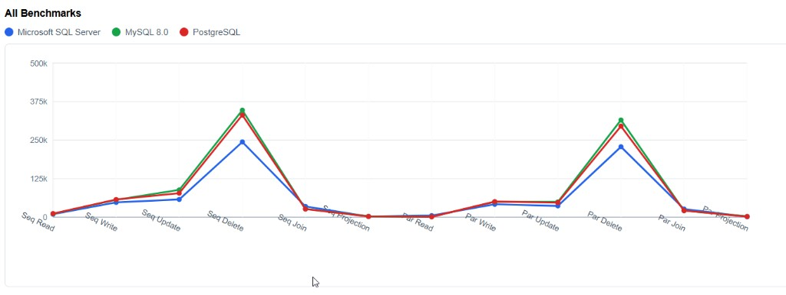
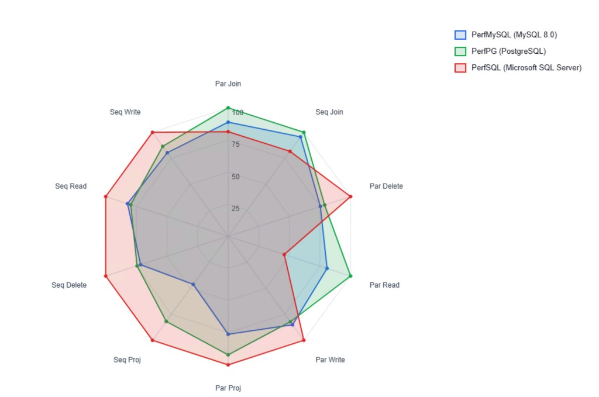

# PerfDBBenchmark: 2026 R1 results (previous edition, archived)

> **This is the previous edition, kept for reference only.** These results were published in March 2026 (git commit 9fb66d2, 2026-03-19) for **Acumatica 2026 R1, build 26.100.0168**. They have been replaced by the 2026 R2 edition on the [main page](../../README.md). The way of measuring has changed since then, so **do not compare these numbers with the 2026 R2 results**, and do not use them to choose a database.

## Why these numbers are not comparable with 2026 R2

The 2026 R2 edition found and fixed several problems in how these tests measured. In plain words, the 2026 R1 runs:

- **timed data setup together with the measured operation:** creating the test records, preparing the records to delete and setting up the parallel workers all ran inside the stopwatch;
- **re-read cached query results instead of the database:** Acumatica remembers the answers to queries it has just run, so many repeated "reads" never reached the database;
- **ran about two parallel workers while reporting twelve:** the work was packed into about two batches, so the "parallel" tests were far less parallel than their labels said;
- **used different database memory settings:** the three databases were not given the same amount of memory for their caches;
- **ran each test once** (its 5 iterations were timed together as a single number), with no warm-up and always in the same order (PostgreSQL, then MySQL, then SQL Server), so luck, cold caches and running position were part of every number;
- **used different amounts of work per save** (some tests saved every 200 records, one saved every record of a pass at once) and a multi-table list whose "pages" were mostly empty;
- **declared a winner on any difference**, even 1%.

The parameters were also different: 15,000 records, 5 iterations, batch size 250 and 12 "parallel threads" here, against 10,000 records, 1 warm-up and 3 measured passes, chunks of 250 and exactly 8 workers in 2026 R2. The instances ran on an earlier Acumatica build (26.100.0168, under `E:\Instances2\26.100.0168`); the database versions and settings were not published with these results. (The build is taken from the instance folder; the memory settings mentioned above are those found on this machine before the 2026 R2 alignment.)

The 12 tests still exist in 2026 R2, fixed, under new names, in the family "Platform basics: bulk record work". The table of old and new names is in the main README, section [What changed in this edition](../../README.md#4-the-original-12-tests-fixed-and-measured-again-re-baseline).

---

<!-- The section below is copied verbatim from README.md as published for 2026 R1 (git commit 9fb66d2); only the two image paths were changed: they now point to the same images in docs/images/, relative to this page. -->

## Benchmark Results

Test parameters: **15,000 records**, **5 iterations**, **batch size 250**, **12 parallel threads**.

### All Operations Overview

This line chart plots elapsed time in milliseconds for all 12 benchmark categories across the three database engines. The Y-axis shows time in milliseconds -- **lower is better**. The scale values represent thousands of milliseconds: 125k = 125,000 ms (2 min 5 sec), 250k = 250,000 ms (4 min 10 sec), 375k = 375,000 ms (6 min 15 sec), 500k = 500,000 ms (8 min 20 sec).

The two prominent peaks correspond to **Delete** operations (both sequential and parallel), which are consistently the most expensive across every engine. SQL Server (blue) sits below MySQL and PostgreSQL on Delete-heavy workloads. Read and Projection operations cluster tightly near the baseline for all three engines, indicating minimal difference on lightweight queries.

### Spider Chart (Normalized Comparison)

A radar chart normalizing every benchmark category to a 0-100 **speed score**. Each axis shows a normalized speed score for one benchmark. **100 = fastest database for that benchmark**. Compare databases per axis: the further from the center, the faster.

**How to read it:**
- **Blue** = Microsoft SQL Server, **Red** = PostgreSQL, **Green** = MySQL 8.0
- SQL Server (blue) reaches the outer edge on most CRUD axes (Read, Write, Update, Delete), confirming it is the fastest for transactional operations
- SQL Server collapses toward the center on **Parallel Read** (score ~23), where PostgreSQL and MySQL are dramatically faster (~1.2s vs 5.35s)
- PostgreSQL (red) and MySQL (green) reach 100 on **Complex BQL Join** axes, meaning they outperform SQL Server on multi-table analytical joins
- On **PXProjection** axes, all three engines cluster near the outer edge, meaning projection performance is similar across all databases

### Benchmark Matrix

Full results from the latest benchmark run (15,000 records, 5 iterations, 12 threads):

| Benchmark | MySQL 8.0 | PostgreSQL | SQL Server | Winner |
|---|---|---|---|---|
| Sequential Read | 11.29s | 11.75s | **9.76s** | SQL Server |
| Sequential Write | 56.65s | 57.50s | **48.09s** | SQL Server |
| Sequential Update | 1:28 (88s) | 1:17 (77s) | **57.77s** | SQL Server |
| Sequential Delete | 5:47 (347s) | 5:31 (331s) | **4:04 (244s)** | SQL Server |
| Complex BQL Join (Sequential) | 26.87s | **26.46s** | 35.08s | PostgreSQL |
| PXProjection Analysis (Sequential) | 3.03s | **2.28s** | 2.33s | PostgreSQL |
| Parallel Read | 1.45s | **1.23s** | 5.35s | PostgreSQL |
| Parallel Write | 49.97s | 50.66s | **41.99s** | SQL Server |
| Parallel Update | 49.75s | 47.20s | **36.71s** | SQL Server |
| Parallel Delete | 5:15 (315s) | 4:55 (295s) | **3:48 (228s)** | SQL Server |
| Complex BQL Join (Parallel) | 21.45s | **21.24s** | 26.65s | PostgreSQL |
| PXProjection Analysis (Parallel) | 2.57s | 1.93s | **1.58s** | SQL Server |

**Summary:** SQL Server wins 8 of 12 benchmarks (all CRUD operations plus Parallel PXProjection). PostgreSQL wins 4 (both Complex BQL Joins, Sequential PXProjection, and Parallel Read). MySQL 8.0 tracks PostgreSQL closely on every benchmark but does not take first place in any category.

---

## Appendix: how the 2026 R1 tests were described at the time

<!-- Copied verbatim from the 2026 R1 README (git commit 9fb66d2). These descriptions belong to the old method; the 2026 R2 tests are described in the main README and in docs/TECHNICAL.md. -->

## Benchmark Types Explained

| Benchmark | Category | What It Measures |
|---|---|---|
| Sequential Read | Read | Single-threaded BQL select of seeded records by batch/sequence range |
| Parallel Read | Read | Same reads split across Acumatica processing workers |
| Sequential Write | Write | Single-threaded INSERT of new records through the Acumatica cache in batches of 200 |
| Parallel Write | Write | Same inserts split across processing workers |
| Sequential Update | Update | Single-threaded SELECT + UPDATE of existing records, modifying `PayloadText` and `PayloadValue` |
| Parallel Update | Update | Same updates split across processing workers |
| Sequential Delete | Delete | Single-threaded SELECT + DELETE of seeded records through the cache |
| Parallel Delete | Delete | Same deletes split across processing workers |
| Complex BQL Join (Sequential) | Complex BQL Join | Five-table analytical join over stock Acumatica Inventory tables, single-threaded |
| Complex BQL Join (Parallel) | Complex BQL Join | Same join executed in parallel windows |
| PXProjection Analysis (Sequential) | PXProjection | Read-only projected view flattening the same five-table join, single-threaded |
| PXProjection Analysis (Parallel) | PXProjection | Same projection query executed in parallel windows |

---

Created by AcuPower LTD for performance analysis. Company website: [acupowererp.com](https://acupowererp.com)
